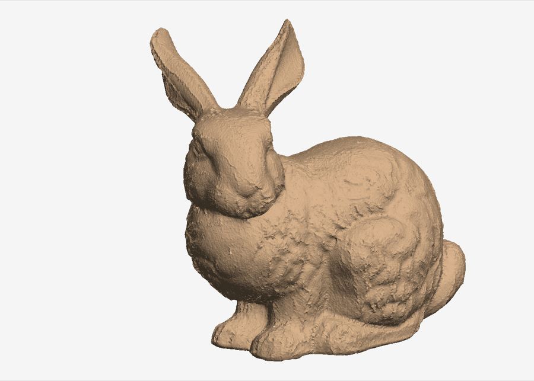
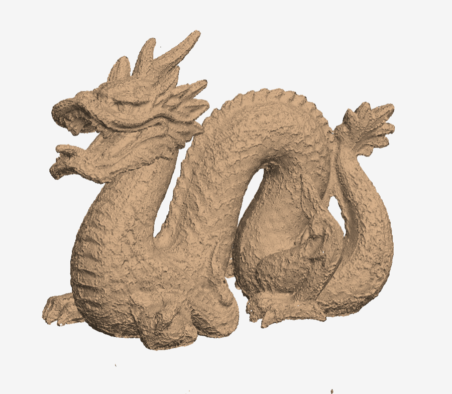
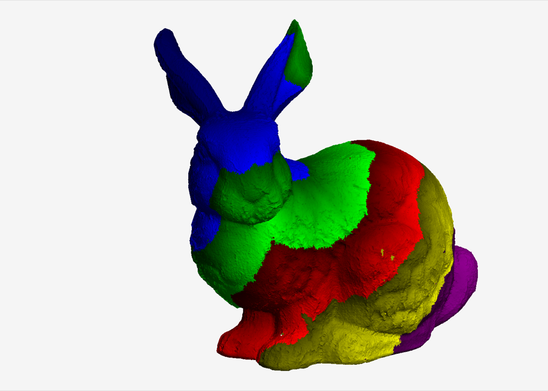
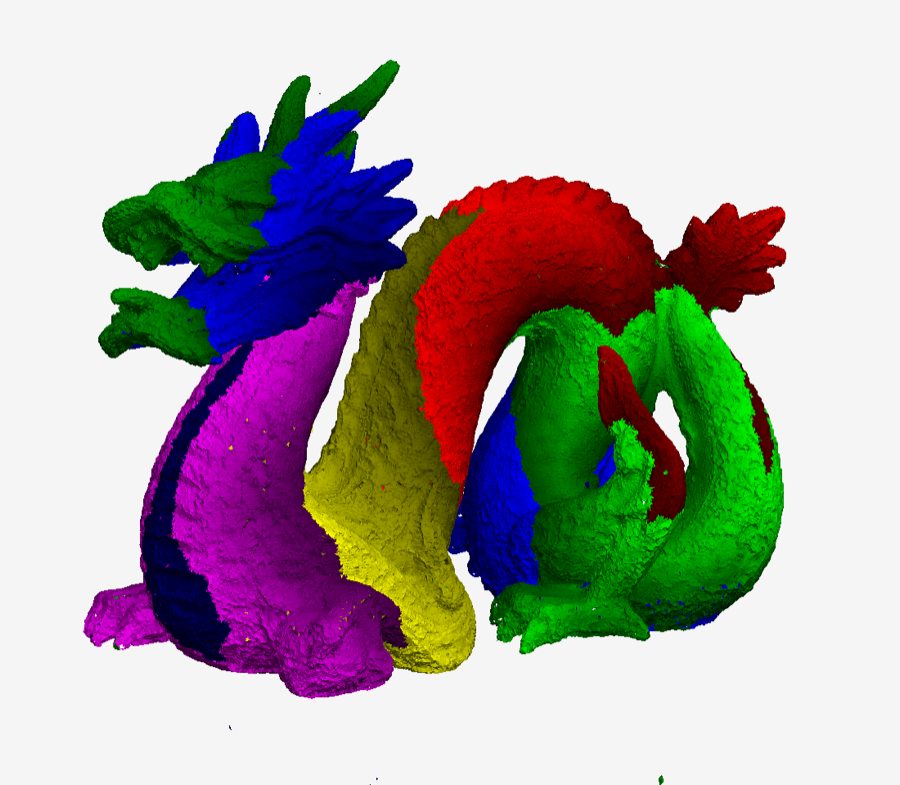

# BPA.jl

A Julia implementation of the Ball-Pivoting Algorithm for surface reconstruction:

> F. Bernardini, J. Mittleman, H. Rushmeier, C. Silva, G. Taubin.
> *The Ball-Pivoting Algorithm for Surface Reconstruction.*
> IEEE Transactions on Visualization and Computer Graphics 5(4), 349–359, 1999.

Given points sampled on a surface, each with an outward-oriented normal, and a ball radius
ρ, the algorithm builds a triangle mesh that interpolates the points: starting from a seed
triangle, a ball of radius ρ pivots around each boundary edge of the mesh until it touches
another point, and the edge plus that point form a new triangle.

This implementation started from the paper alone. Its first version was generated by
Claude Fable 5.1 (Anthropic), working in Claude Code from the PDF with no reference to other
BPA implementations; the code, tests, command-line tool and documentation of that session
were validated on synthetic surfaces and on the Stanford bunny and dragon scans. It has
evolved since, in later sessions in which the repository's author asked for improvements and
experiments and the findings were fed back into the code:

- **Cross-check against other implementations.** The output was compared with Open3D and
  MeshLab's VCG filter on the same inputs (synthetic sphere, plane, tori and knot, and the
  Stanford bunny and dragon scans), auditing every triangle of every output for an empty
  ball and every mesh for orientability and manifoldness. The comparison found a pivot bug:
  the ball skipped the third vertex of the triangle it started from and could roll past the
  point where that vertex re-enters the ball, accepting a triangle whose ball was not empty.
  It is fixed, with a regression test, and on every case of the check all of BPA.jl's
  triangles now admit an empty ball, and its meshes are orientable and manifold. The
  harness is in [`compare/`](compare/README.md), where other implementations can be plugged
  in, and the findings are in [`compare/REPORT.md`](compare/REPORT.md).
- **Pivot normal test.** A pivot triangle was tested against all three vertex normals with
  a strict inequality; on the merged bunny scans this left ten times as many holes as
  needed, because it refused scan vertices without a normal and the steep triangles that
  join overlapping scans. It is now tested against the normal of the point the ball lands
  on only, as explained under [What is implemented](#what-is-implemented).
- **Looking at results.** Progressive output is coloured by creation order, plain OFF
  output is readable by trimesh2's `mesh_view`, and `tools/render.jl` renders a mesh with
  its boundary in red and counts the surface layers behind each pixel, so the holes and
  duplicated sheets that the summary numbers only hint at become visible.
- **Performance.** A profile of the merged bunny scans led to a pivot that orders its
  candidates without trigonometry, grid cells whose points are contiguous in memory, a
  bounded seed search and per-vertex edge chains in place of the front's hash tables. The ten bunny scans reconstruct in 1.2 s instead of 2.3 s and the 62
  dragon scans in 5 s instead of 22 s, with the same triangles. An option to drop stray
  fragments is off by default. The changes and their measurements are in
  [`docs/algorithm.md`](docs/algorithm.md). On the same machine Open3D takes 27 s on the
  ten bunny scans and 11 minutes on the dragon, MeshLab 3 minutes and 4 hours, mainly
  because their pivots rescan the neighbourhood of every candidate; the gap grows with the
  number of points per ball. The full comparison, including what each tool gets right, is
  in [`compare/REPORT.md`](compare/REPORT.md).

The choices made where the paper leaves room are listed under
[What is implemented](#what-is-implemented). The scope is the in-core algorithm on clean or
moderately overlapping data: the out-of-core part of the paper is not implemented, and there
is no registration or conformance step for overlapping range scans, so the raw Stanford scans
fragment at the paper's small radii (see `results/README.md`).

Contents

- [Installation](#installation)
- [Quick start](#quick-start)
- [Command-line examples](#command-line-examples)
- [Reading the output](#reading-the-output)
- [Library examples](#library-examples)
- [Choosing the radius](#choosing-the-radius)
- [Data, results and scripts](#data-results-and-scripts)
- [Documentation](#documentation)
- [What is implemented](#what-is-implemented)
- [Tests and performance](#tests-and-performance)
- [License](#license)

## Installation

Julia 1.10 or newer. From the package directory, install the one dependency
(StaticArrays) once:

```
cd BPA.jl
julia --project=. -e 'using Pkg; Pkg.instantiate()'
```

The command-line script `bpa.jl` activates this environment itself, so it can be run as
`julia bpa.jl ...` from the package directory without `--project`.

## Quick start

Reconstruct the torus in `data/` with a ball of radius 0.1:

```
$ julia bpa.jl -r 0.1 -i data/torus-120-80.off
input: data/torus-120-80.off (9600 points)
triangles: 19200 in 0.04 s
points used: 9600 of 9600
seeds: 1, pivots: 19203, boundary edges: 0
rejected: no hit 0, normal 0, interior vertex 4, manifold 0
wrote /Users/.../BPA.jl/results/torus-120-80_bpa.off
```

Every point was used, one seed sufficed, and there are no boundary edges: the result is a
closed torus of 19,200 triangles (twice the number of points, as for any closed surface).
The output went to `results/`, which is the default when `-o` is not given.

## Command-line examples

**Choose the output format by extension.** `.off`, `.ply` and `.obj` are written; OFF and
PLY carry the normals, and `-o` may point anywhere:

```
julia bpa.jl -r 0.05 -i data/knot-300-100.off -o results/knot-300-100_r0.05.ply
julia bpa.jl -r 0.05 -i data/knot-300-100.off -o /tmp/knot.obj
```

**A surface that touches itself.** The trefoil knot's tube nearly self-intersects, and the
algorithm's normal test refuses to bridge the two sheets, leaving small holes there:

```
$ julia bpa.jl -r 0.03 -i data/knot-300-100.off
input: data/knot-300-100.off (30000 points)
triangles: 58400 in 0.07 s
points used: 29208 of 30000
seeds: 1, pivots: 58508, boundary edges: 62
rejected: no hit 4, normal 65, interior vertex 37, manifold 3
wrote /Users/.../BPA.jl/results/knot-300-100_bpa.off
```

**A real range scan** (Stanford bunny, one of ten scans, units are metres):

```
$ julia bpa.jl -i data/bunny/data/bun000.off -r 0.00125
input: data/bunny/data/bun000.off (40256 points)
triangles: 78152 in 0.1 s
points used: 39759 of 40256
seeds: 11, pivots: 79566, boundary edges: 1418
rejected: no hit 972, normal 448, interior vertex 3, manifold 2
wrote /Users/.../BPA.jl/results/bun000_bpa.off
```

**Letting the tool pick a radius.** Without `-r`, the radius is 1.5 times the median
nearest-neighbour distance. For this scan that is a little small (more seeds and boundary
edges than above), which the summary makes visible:

```
$ julia bpa.jl -i data/bunny/data/bun000.off
input: data/bunny/data/bun000.off (40256 points)
estimated sample spacing: 0.000516 -> radius 0.000774
triangles: 75382 in 0.12 s
points used: 39553 of 40256
seeds: 157, pivots: 79046, boundary edges: 3816
rejected: no hit 3416, normal 394, interior vertex 7, manifold 4
```

**Several radii** (Section 4.6 of the paper) and **sampling a mesh**. `--sample N` draws N
random points on the faces of a mesh input instead of using its vertices, which gives an
uneven sampling; a second, larger radius then fills what the first one left. With `-v`
each pass reports what it did:

```
$ julia bpa.jl -i data/torus-120-80.off --sample 20000 -r 0.06,0.12 -o results/torus-sampled.obj -v
input: data/torus-120-80.off (20000 points)
pass 1: rho = 0.06, reactivated 0 edges, 40000 new triangles, 0 boundary edges, 0.15 s
pass 2: rho = 0.12, reactivated 0 edges, 0 new triangles, 0 boundary edges, 0.0 s
triangles: 40000 in 0.16 s
points used: 20000 of 20000
...
triangles per pass: [40000, 0], reactivated edges: [0, 0]
```

**Watching the front advance.** `-p N` writes the partial mesh every N triangles next to
the output, coloured by creation order: each block of N triangles gets the next colour of
blue, green, red, yellow, magenta, brightening within the block. `--save-colored` also
writes the final mesh with these colours as `<output>_colored.<ext>`, with the block size
of `-p N` or, without `-p`, about a tenth of the expected triangle count. Coloured `.off`
files are COFF (per-vertex colours, no normals), `.ply` files carry face colours. The
coloured bunny and dragon under [Tests and performance](#tests-and-performance) are such
files, rendered with `tools/render.jl`:

```
$ julia bpa.jl -r 0.1 -i data/torus-120-80.off -p 5000 -o /tmp/snap/torus.off
saved /tmp/snap/torus_00005000.off
saved /tmp/snap/torus_00010000.off
saved /tmp/snap/torus_00015000.off
...
$ julia bpa.jl -r 0.1 -i data/torus-120-80.off --save-colored -o results/torus.off
...
wrote results/torus.off
wrote results/torus_colored.off (one colour per 1920 triangles)
```

**Merging registered range scans.** The Stanford bunny comes as ten scans, each an OFF
mesh with a `.xf` file holding the 4×4 matrix that maps it into the common frame. A list
file (`-f`, one scan name per line, `#` comments) or an explicit list (`-l`) names the
scans; each is read from the scan directory (`-d`, default: the list file's directory),
transformed by its `.xf` when one exists (positions by the full matrix, normals by its
rotation part), and merged on the fly:

```
$ julia bpa.jl -r 0.00125 -f data/bunny/data/bunny_scans.txt -o results/bunny_bpa.ply
scans from /Users/.../BPA.jl/data/bunny/data:
  bun000         40256 points  (transformed by bun000.xf)
  bun045         40097 points  (transformed by bun045.xf)
  ...
  top3           36023 points  (transformed by top3.xf)
merged 10 scans: 362272 points
triangles: 323934 in 1.2 s
points used: 162289 of 362272  (many points unreached: try a larger radius, or several radii)
seeds: 17, pivots: 325596, boundary edges: 806
rejected: no hit 255, normal 1335, interior vertex 85, manifold 4
wrote results/bunny_bpa.ply
```

Fewer than half the points are used here because overlapping scans put several samples
within a fraction of the ball radius of each other, and the ball rolls over the top layer.
That is the situation described in Section 3 of the paper; with the paper's much smaller
radii (`-r 0.0003,0.0005,0.002`) the raw, unconformed scans fragment into many components.

The dragon works the same way, from 62 scans and 1.8 million points (the list files sit one
directory above the scans, hence `-d`):

```
julia bpa.jl -r 0.0007 -f data/dragon/dragon_scans_clean.txt -d data/dragon/scans -o results/dragon_r0.7mm.off
```

**Only the largest components.** `--max-seeds N` stops after N seed triangles, so
`--max-seeds 1` keeps just the component grown from the first seed:

```
julia bpa.jl -r 0.00125 -l bun000,bun045,bun090,bun180 -d data/bunny/data --max-seeds 1
```

**Dropping stray fragments.** A seed whose front dies at once leaves a component of a few
triangles, usually seated on a second layer of an overlapping scan. `--min-component N`
removes every component with fewer than N triangles at the end; on the merged bunny that is
16 of the 17 components, and a fifth of the boundary edges with them:

```
$ julia bpa.jl -r 0.00125 -f data/bunny/data/bunny_scans.txt --min-component 10
...
triangles: 323910 in 1.2 s
seeds: 17, pivots: 325596, boundary edges: 750
rejected: no hit 255, normal 1335, interior vertex 85, manifold 4
dropped: 16 components of fewer than 10 triangles (24 triangles)
```

**A point cloud with normals** can be given as `.xyz` (`x y z nx ny nz` per line), ASCII
`.ply` with `nx ny nz` properties, or NOFF (`.off` with six numbers per vertex).
`--write-points FILE` saves the cloud the tool actually reconstructed, which is a way to
obtain such a file from a mesh or a merged scan list:

```
julia bpa.jl -i data/torus-120-80.off -r 0.1 --write-points results/torus-points.xyz
julia bpa.jl -i results/torus-points.xyz -r 0.1
```

All options:

| option | meaning |
| --- | --- |
| `-i, --input FILE` | `.off` (NOFF point cloud with normals, or a mesh whose vertex normals are computed from its faces), `.xyz` (`x y z nx ny nz`), or ASCII `.ply` with normals |
| `-l, --list NAMES` | comma-separated scan names, read as `DIR/<name>.off` and transformed by `DIR/<name>.xf` when present, then merged |
| `-f, --list-file FILE` | the same, names read from a file (one per line, `#` comments) |
| `-d, --scan-dir DIR` | directory of the scans (default: the list file's directory, or `.`) |
| `-o, --output FILE` | `.off`, `.obj` or `.ply`; default `results/<input or list basename>_bpa.off` in the package directory |
| `-r, --radius R[,R,...]` | ball radius or increasing list for several passes; omitted or `-1`: 1.5 × the median nearest-neighbour distance |
| `-p, --progress N` | write the partial mesh every N triangles as `<output>_<count>.<ext>`, coloured by creation order (one colour per block of N) |
| `--save-colored` | also write the final mesh coloured by creation order as `<output>_colored.<ext>` (block size N with `-p N`, otherwise about a tenth of the expected triangle count) |
| `--max-seeds N` | stop after N seed triangles (`-1`: unlimited) |
| `--seed-neighbors N` | when searching for a seed triangle, pair only the N nearest neighbours of the candidate point (default 100; `-1` pairs every point within 2ρ, as the paper describes) |
| `--min-component N` | drop connected components with fewer than N triangles at the end (default 0: keep everything) |
| `--sample N` | for mesh inputs, sample N points on the surface instead of using the vertices |
| `--seed S` | random seed for sampling and the spacing estimate |
| `--write-points FILE` | save the point cloud that was reconstructed as `.xyz` |
| `-v, --verbose` | one line per pass |
| `-h, --help` | usage |

## Reading the output

- **points used**: points that ended up in a triangle. Points the ball never touches are
  typically noise below the surface (Fig. 4a of the paper) or lie in regions the ball
  cannot enter. A warning is printed when fewer than 95% were used, usually a sign that the
  radius is too small for the sample spacing.
- **seeds**: connected pieces the algorithm had to start. A clean, well-sampled object
  needs one per connected component.
- **boundary edges**: mesh edges with a single triangle. Zero means a closed surface.
- **rejected**: why pivots failed. *no hit*: the ball made a full turn without touching a
  point, or came back to the third vertex of the triangle it started from before touching
  anything else (too small a radius, a true boundary, or nothing beyond the edge but points
  under the surface). *normal*: the normal of the first point hit points against the
  triangle it would make (noise, or the back of a nearby surface sheet).
  *interior vertex*: the point hit already has a complete fan of triangles. *manifold*: the
  triangle would give an edge three triangles or a non-orientable configuration. Each
  rejection leaves a boundary edge, so these counts explain where holes come from.
- **dropped**: with `--min-component N`, the components and triangles removed at the end;
  the boundary edge count above it is that of the remaining mesh.

## Library examples

**Reconstruct a point cloud you generate.** Positions and normals can be vectors of
3-vectors (here `SVector`), or `3×N` / `N×3` matrices:

```julia
using BPA, StaticArrays

# 5000 points on the unit sphere; the normal of a point on a unit sphere is the point itself
n = 5000
P = map(0:n-1) do k
    y = 1 - 2 * (k + 0.5) / n
    s = sqrt(1 - y^2)
    θ = π * (3 - sqrt(5)) * k
    SVector(s * cos(θ), y, s * sin(θ))
end
spacing = sqrt(4π / n)                      # mean distance between neighbouring samples

mesh = reconstruct(P, P, 1.5 * spacing)     # reconstruct(positions, normals, rho)
mesh.triangles                              # Vector{SVector{3,Int}}, 1-based indices into P
mesh.stats                                  # seeds, pivots, rejections, per-pass counts
write_obj("sphere.obj", mesh)
```

This is `examples/sphere.jl`; the result is a closed sphere of `2n - 4` triangles.

**Files in and out, several radii:**

```julia
using BPA

cloud = read_xyz("scan.xyz")                # or read_ply("scan.ply")
mesh  = reconstruct(cloud, [0.3, 0.5, 1.0]; verbose = true)
write_ply("scan.ply", mesh)
write_off("scan.off", mesh)
```

**From a mesh without normals.** `read_off` returns positions, faces and (for NOFF files)
normals; `vertex_normals` and `sample_surface` turn a mesh into a cloud:

```julia
positions, faces, _ = read_off("data/torus-120-80.off")
cloud = PointCloud(positions, faces)                         # area-weighted vertex normals
cloud = sample_surface(positions, faces, 20000)              # or random surface samples
rho   = 1.5 * estimate_spacing(cloud)                        # median nearest-neighbour distance
mesh  = reconstruct(cloud, rho)
```

**Progress callback and the other options**, the hooks behind `-p`, `--max-seeds` and
the flags above:

```julia
mesh = reconstruct(cloud, rho;
                   max_seeds = 1,                            # only the first component
                   seed_neighbors = -1,                      # the paper's unbounded seed search
                   min_component = 10,                       # drop fragments under 10 triangles
                   on_progress = (tris, stats) -> println(length(tris), " triangles"),
                   progress_every = 10_000)
mesh.stats.dropped_components, mesh.stats.dropped_triangles
```

**Registered scans from Julia.** The pieces behind `-l`/`-f` are ordinary functions:

```julia
using BPA: read_xf, transform
positions, faces, _ = read_off("data/bunny/data/bun045.off")
scan = transform(PointCloud(positions, faces), read_xf("data/bunny/data/bun045.xf"))
```

**Checking a result.** `check_mesh` computes Euler characteristic, orientability,
manifoldness, boundary loops and components of any triangle list:

```julia
c = check_mesh(mesh.triangles)
c.chi, c.orientable, c.edge_manifold, c.boundary_edges, c.components
```

Triangles are oriented counter-clockwise when seen from the side the normals point to.

## Choosing the radius

ρ must be larger than the spacing between neighbouring samples (so the ball can walk from
point to point without falling through) and smaller than the features to be captured (so it
does not bridge across concavities). A radius of 1.2 to 2 times the typical sample spacing
is a good starting point; for unevenly sampled data give a list of increasing radii, and
each pass fills the holes the previous one left where it can (Section 4.6 of the paper).

The automatic radius is based on the nearest-neighbour distance, which underestimates the
spacing of anisotropic samplings (a lattice much finer in one direction than the other, as
the torus and knot meshes are). Use the *points used* line as the guide: if many points
were unreached, pass a larger radius, or a list of radii.

## Data, results and scripts

| path | contents |
| --- | --- |
| `data/torus-120-80.off` | trimesh2 `mesh_make torus 120 80`: 9,600 vertices, use `-r 0.1` |
| `data/knot-300-100.off` | trimesh2 `mesh_make knot 300 100`: 30,000 vertices, use `-r 0.03` to `0.05` |
| `data/bunny/data/` | the 10 Stanford bunny range scans as `.off` meshes with `.xf` alignment matrices, `bun.conf`, `combined.ply`, and the scan lists `bunny_scans.txt` / `bunny_main.txt` |
| `data/bunny/reconstruction/` | Stanford's zippered reference reconstruction, useful for checking alignment |
| `data/dragon/scans/` | the 71 Stanford dragon range scans as `.off` meshes with `.xf` matrices, the five `.conf` files, `dragon_combined.ply` |
| `data/dragon/` | Stanford's vripped reconstruction (`dragon_vrip.ply`/`.off` and lower resolutions) and the scan lists: `dragon_scans.txt` (all 71), `dragon_scans_clean.txt` (62 surface scans, without the backdrop and clear-space carvers), `dragon_subset.txt` (10 scans) |
| `results/` | default output directory of `bpa.jl`; regenerable, see `results/README.md` |
| `scripts/` | shell scripts that generate the meshes and download and convert the Stanford scans; they need trimesh2 (see `scripts/README.md`) |
| `tools/` | `render.jl`: shaded, depth-complexity and signed renderings of a mesh or a merged scan list, for finding holes and duplicate layers (see `tools/README.md`) |
| `compare/` | the cross-check harness: runs BPA.jl, Open3D, MeshLab and any implementation you register on the same inputs, audits every output and renders them side by side (see `compare/README.md`; findings in `compare/REPORT.md`) |
| `examples/` | `sphere.jl` and `make_torus_off.jl` (a torus without trimesh2, with a different minor radius than the trimesh2 one) |

## Documentation

- Every exported and internal function has a docstring (`?BPA.ball_pivot` etc. in the REPL).
- [`tools/README.md`](tools/README.md) explains how to read the depth and signed images of
  `tools/render.jl`.
- [`compare/README.md`](compare/README.md) explains the comparison harness and how to add an
  implementation to it; [`compare/REPORT.md`](compare/REPORT.md) is the comparison itself.
- [`docs/algorithm.md`](docs/algorithm.md) explains the design: data flow, orientation
  conventions, the data structures and their invariants, the pivot geometry, the join/glue
  cases, why the output is an orientable manifold, complexity, and a table mapping every
  construct of the paper to the code.

## What is implemented

| Paper section | Implementation |
| --- | --- |
| 4.1 Spatial queries | `src/grid.jl`: regular voxel grid of side 2ρ, bucket-sorted point list with the positions copied into the same order so that a voxel's points are contiguous in memory, 27-voxel neighbourhood queries (sparse fallback when the grid would be much larger than the point set) |
| 4.2 Seed selection | `src/seed.jl`: one candidate per voxel (the point furthest along the voxel's average normal), voxels containing used points are skipped, neighbour pairs tried by distance, outward empty-ball test |
| 4.3 Ball pivoting | `src/pivot.jl`, `src/geometry.jl`: closed-form first contact along the circular trajectory of the ball centre, computed without trigonometry as the 2-D position of the centre and ordered by half-plane and cross product; deterministic handling of simultaneous hits (regular lattices) |
| 4.4 Join and glue | `src/front.jl`: front as linked loops of directed edges; `join!` and `glue!` covering the four cases of Fig. 7; manifold and orientation tests before a triangle is added |
| 4.6 Multiple passes | `src/reconstruct.jl`: boundary edges are re-activated for each larger radius when their triangle admits an empty ball of that radius |
| 4.5 Out-of-core | Not implemented (the `FROZEN` edge status exists but is never used) |

Decisions where the paper leaves room:

- **First hit wins.** The point touched first by the pivoting ball is the only candidate.
  If the resulting triangle fails the normal-consistency or manifoldness test, the edge is
  marked as boundary (lines 3 and 8–9 of the algorithm in Fig. 5) rather than trying the next
  point along the trajectory. The alternative, rolling past incompatible points, was
  measured and not kept: with the chosen ball re-checked for emptiness it saves 12 of 806
  boundary edges on the merged bunny for 10% more time (`docs/algorithm.md`, Section 7). Points hit at exactly the same angle are all "first"; among
  them the one giving a valid triangle wins. The third vertex of the triangle the ball
  starts from is a candidate like any other: the ball leaves it at once but comes back to it
  after about half a turn on a flat, well-sampled surface, and if that happens before any
  other point is touched the pivot fails. Skipping that vertex, as several implementations
  do, lets the ball roll on with the vertex inside it and produces triangles whose ball is
  not empty.
- **Normal test.** A seed triangle must have a normal with positive dot product with all
  three of its vertex normals (the paper's seed test). A pivot triangle is tested only
  against the normal of the point the ball landed on, and a zero dot product passes: the
  front edge already fixes the winding, so the test only has to catch the ball rolling onto
  the back of a nearby sheet. Testing the two edge vertices as well, strictly, rejects the
  steep triangles that join overlapping range scans and every point without a normal (a scan
  vertex that belongs to no face), and leaves ten times as many holes on the merged bunny.
- **Seed triangles** may reuse points already in the mesh, as long as the result stays a
  manifold; a seed edge coinciding with an existing front edge of opposite orientation is
  glued immediately. The pair search around a seed candidate is bounded to its nearest
  100 neighbours (`--seed-neighbors`): almost all of the paper's unbounded search is spent
  on candidates under an already reconstructed sheet, where every pair fails, and the bound
  reproduces the unbounded output on every dataset in `data/`.
- **Small components** are kept, as in the paper, unless `--min-component` is given.

## Tests and performance

```
julia --project=BPA.jl -e 'using Pkg; Pkg.test()'
```

The tests check the geometric primitives against brute force, the trigonometry-free
first contact against the angle formulation on random pivots, the glue cases of Fig. 7 on
hand-built fronts, the OFF/PLY/XYZ readers and writers, the command-line tool, and full
reconstructions of a sphere (closed, orientable, manifold, χ = 2, all points used), a torus
(χ = 0), a plane patch (χ = 1, one clean boundary loop), exact lattices (cospherical
quads), a plane sampled at two densities where one radius leaves the sparse half
uncovered and two radii cover it, a pivot whose ball returns to the starting triangle's
third vertex before reaching anything else, the bounded seed search and component filter
against the paper's behaviour, and the comparison harness on the sphere.

Single-threaded, on a MacBook Air with an Apple M5 (4 performance and 6 efficiency cores)
and 32 GB of memory, Julia 1.12.7. Uniformly sampled unit sphere, single radius:

| points | triangles | time |
| --- | --- | --- |
| 200 000 | 400 000 | 0.47 s |
| 1 000 000 | 2 000 000 | 2.2 s |

Range scans, merged, single radius (the time of the reconstruction alone, as each tool
reports it; the Open3D and MeshLab columns are from the comparison in `compare/`, on the
same machine):

| input | points | triangles | BPA.jl | Open3D | MeshLab |
| --- | --- | --- | --- | --- | --- |
| bunny, 10 scans, ρ = 1.25 mm | 362 272 | 323 934 | 1.2 s | 27 s | 166 s |
| dragon, 62 scans, ρ = 0.7 mm | 1 826 038 | 649 518 | 5.1 s | 11.2 min | 4.1 h |

The two reconstructions, rendered with `tools/render.jl`. Below them, the same meshes
coloured by creation order (`--save-colored`): each block of triangles, 72 454 on the bunny
and 100 000 on the dragon, takes the next colour of blue, green, red, yellow and magenta,
brightening within the block, so the sweep of the front over the surface is visible. The
bunny grew from one seed on the head to the tail; the dragon needed 101 seeds, and its
first block starts on the turntable fragments the scans contain.

| bunny, 10 scans | dragon, 62 scans |
| --- | --- |
|  |  |
|  |  |

Running time is linear in the number of points, as expected for bounded sampling density.
Before the performance work described in `docs/algorithm.md` the same runs took 2.3 s and
22 s and produced the same triangles.

## License

MIT, see [LICENSE](LICENSE). The Stanford bunny and dragon scans that the scripts download
are provided by the Stanford Computer Graphics Laboratory under their own terms and are not
part of this repository.
