# BPA cross-check

Each output is checked on its own: every triangle should admit an empty rho-ball on its outward side (`valid`; the side its vertex normals point to, or either side when they do not all agree), and the mesh should be orientable and manifold. `ball_not_empty_tie` counts triangles whose ball contains a point within 1e-5 rho of its surface (cospherical ties, not errors). Then each triangle set is compared with the reference tool's as unordered vertex triples. The render rows come from `tools/render.jl`: the share of covered pixels behind which an odd number of triangles lie (a hole seen through, for a closed surface), and the share where front-facing and back-facing triangles do not cancel (holes and flipped patches).

## sphere2000

2000-point Fibonacci sphere, rho = 1.5 x mean spacing. Expected: closed, chi = 2, 3996 triangles, every point used.

input: `-i /Users/csilva/src/BPA.jl/compare/results/inputs/sphere2000.off`, rho = 0.119, 2000 points

|  | BPA.jl | Open3D | MeshLab | Digne | Digne -p | Gruber | Gruber reseeded | bpa_rs | Schmehla | Giaccari | bpa fork |
|---|---|---|---|---|---|---|---|---|---|---|---|
| triangles | 3996 | 3996 | 3994 | 3996 | 3996 | 3996 | 3996 | 3996 | 3996 | 3996 | 3996 |
| reconstruction time (s) | 0.01 | 0.012 | 0.01 | 0.018 | 0.008 | 0.005 | 0.005 | 0.005 | 0.054 | 0.002 | 0.004 |
| vertices used | 2000 | 2000 | 1999 | 2000 | 2000 | 2000 | 2000 | 2000 | 2000 | 2000 | 2000 |
| boundary edges | 0 | 0 | 0 | 0 | 0 | 0 | 0 | 0 | 0 | 0 | 0 |
| boundary loops | 0 | 0 | 0 | 0 | 0 | 0 | 0 | 0 | 0 | 0 | 0 |
| components | 1 | 1 | 1 | 1 | 1 | 1 | 1 | 1 | 1 | 1 | 1 |
| largest component (triangles) | 3996 | 3996 | 3994 | 3996 | 3996 | 3996 | 3996 | 3996 | 3996 | 3996 | 3996 |
| Euler characteristic | 2 | 2 | 2 | 2 | 2 | 2 | 2 | 2 | 2 | 2 | 2 |
| orientable | yes | yes | yes | yes | yes | yes | yes | yes | yes | yes | yes |
| edge-manifold | yes | yes | yes | yes | yes | yes | yes | yes | yes | yes | yes |
| vertex-manifold | yes | yes | yes | yes | yes | yes | yes | yes | yes | yes | yes |
| duplicate triangles | 0 | 0 | 0 | 0 | 0 | 0 | 0 | 0 | 0 | 0 | 0 |
| valid | 3996 | 3996 | 3991 | 3996 | 3996 | 3996 | 3996 | 3996 | 3996 | 3996 | 3996 |
| valid_reversed_winding | 0 | 0 | 0 | 0 | 0 | 0 | 0 | 0 | 0 | 0 | 0 |
| ball_not_empty_tie | 0 | 0 | 0 | 0 | 0 | 0 | 0 | 0 | 0 | 0 | 0 |
| ball_not_empty | 0 | 0 | 3 | 0 | 0 | 0 | 0 | 0 | 0 | 0 | 0 |
| circumradius_too_large | 0 | 0 | 0 | 0 | 0 | 0 | 0 | 0 | 0 | 0 | 0 |
| degenerate | 0 | 0 | 0 | 0 | 0 | 0 | 0 | 0 | 0 | 0 | 0 |
| deepest intrusion / rho | 0.00e+00 | 0.00e+00 | 2.26e-01 | 0.00e+00 | 0.00e+00 | 0.00e+00 | 0.00e+00 | 0.00e+00 | 0.00e+00 | 0.00e+00 | 0.00e+00 |
| render: odd-parity pixels (holes seen through) | 0.00% | 0.00% | 0.00% | 0.00% | 0.00% | 0.00% | 0.00% | 0.00% | 0.00% | 0.00% | 0.00% |
| render: pixels with front ≠ back | 0.00% | 0.00% | 0.00% | 0.00% | 0.00% | 0.00% | 0.00% | 0.00% | 0.00% | 0.00% | 0.00% |

triangle sets against BPA.jl:

|  | common | same winding | only in BPA.jl | only in the other | edges of only-in-BPA.jl triangles present in the other (0/1/2/3) | edges of only-in-other triangles present in BPA.jl (0/1/2/3) |
|---|---|---|---|---|---|---|
| Open3D | 3996 | 3996 | 0 | 0 | 0/0/0/0 | 0/0/0/0 |
| MeshLab | 3991 | 3991 | 5 | 3 | 0/5/0/0 | 0/1/2/0 |
| Digne | 3996 | 3996 | 0 | 0 | 0/0/0/0 | 0/0/0/0 |
| Digne -p | 3996 | 3996 | 0 | 0 | 0/0/0/0 | 0/0/0/0 |
| Gruber | 3996 | 3996 | 0 | 0 | 0/0/0/0 | 0/0/0/0 |
| Gruber reseeded | 3996 | 3996 | 0 | 0 | 0/0/0/0 | 0/0/0/0 |
| bpa_rs | 3996 | 3996 | 0 | 0 | 0/0/0/0 | 0/0/0/0 |
| Schmehla | 3996 | 3996 | 0 | 0 | 0/0/0/0 | 0/0/0/0 |
| Giaccari | 3996 | 3996 | 0 | 0 | 0/0/0/0 | 0/0/0/0 |
| bpa fork | 3996 | 3996 | 0 | 0 | 0/0/0/0 | 0/0/0/0 |

renderings (`sphere2000/render/`, view 30.0°):

|  | BPA.jl | Open3D | MeshLab | Digne | Digne -p | Gruber | Gruber reseeded | bpa_rs | Schmehla | Giaccari | bpa fork |
|---|---|---|---|---|---|---|---|---|---|---|---|
| shaded, boundary edges in red |  |  |  |  |  |  |  |  |  |  |  |
| triangles behind each pixel: warm = odd (a hole is seen through), cool = even |  |  |  | 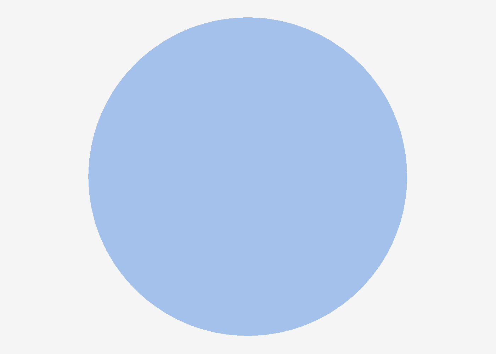 |  |  |  |  |  |  |  |
| front-facing minus back-facing: grey 0, blue +, red − |  |  |  |  |  |  |  |  |  |  |  |

## plane40

40 x 40 jittered grid on a plane. Expected: a disk, chi = 1, one clean boundary loop, every point used.

input: `-i /Users/csilva/src/BPA.jl/compare/results/inputs/plane40.off`, rho = 0.15, 1600 points

|  | BPA.jl | Open3D | MeshLab | Digne | Digne -p | Gruber | Gruber reseeded | bpa_rs | Schmehla | Giaccari | bpa fork |
|---|---|---|---|---|---|---|---|---|---|---|---|
| triangles | 3042 | 3042 | 3041 | 3042 | 3042 | 3042 | 3042 | 3042 | 3042 | n/a | 3042 |
| reconstruction time (s) | 0.0 | 0.008 | 0.007 | 0.011 | 0.004 | 0.003 | 0.003 | 0.003 | 0.082 | n/a | 0.002 |
| vertices used | 1600 | 1600 | 1599 | 1600 | 1600 | 1600 | 1600 | 1600 | 1600 | n/a | 1600 |
| boundary edges | 156 | 156 | 155 | 156 | 156 | 156 | 156 | 156 | 156 | n/a | 156 |
| boundary loops | 1 | 1 | 1 | 1 | 1 | 1 | 1 | 1 | 1 | n/a | 1 |
| components | 1 | 1 | 1 | 1 | 1 | 1 | 1 | 1 | 1 | n/a | 1 |
| largest component (triangles) | 3042 | 3042 | 3041 | 3042 | 3042 | 3042 | 3042 | 3042 | 3042 | n/a | 3042 |
| Euler characteristic | 1 | 1 | 1 | 1 | 1 | 1 | 1 | 1 | 1 | n/a | 1 |
| orientable | yes | yes | yes | yes | yes | yes | yes | yes | yes | n/a | yes |
| edge-manifold | yes | yes | yes | yes | yes | yes | yes | yes | yes | n/a | yes |
| vertex-manifold | yes | yes | yes | yes | yes | yes | yes | yes | yes | n/a | yes |
| duplicate triangles | 0 | 0 | 0 | 0 | 0 | 0 | 0 | 0 | 0 | n/a | 0 |
| valid | 3042 | 3042 | 0 | 3042 | 3042 | 3042 | 3042 | 3042 | 3042 | n/a | 3042 |
| valid_reversed_winding | 0 | 0 | 3040 | 0 | 0 | 0 | 0 | 0 | 0 | n/a | 0 |
| ball_not_empty_tie | 0 | 0 | 0 | 0 | 0 | 0 | 0 | 0 | 0 | n/a | 0 |
| ball_not_empty | 0 | 0 | 1 | 0 | 0 | 0 | 0 | 0 | 0 | n/a | 0 |
| circumradius_too_large | 0 | 0 | 0 | 0 | 0 | 0 | 0 | 0 | 0 | n/a | 0 |
| degenerate | 0 | 0 | 0 | 0 | 0 | 0 | 0 | 0 | 0 | n/a | 0 |
| deepest intrusion / rho | 0.00e+00 | 0.00e+00 | 6.62e-04 | 0.00e+00 | 0.00e+00 | 0.00e+00 | 0.00e+00 | 0.00e+00 | 0.00e+00 | n/a | 0.00e+00 |
| render: odd-parity pixels (holes seen through) | 100.00% | 100.00% | 100.00% | 100.00% | 100.00% | 100.00% | 100.00% | 100.00% | 100.00% | n/a | 100.00% |
| render: pixels with front ≠ back | 100.00% | 100.00% | 100.00% | 100.00% | 100.00% | 100.00% | 100.00% | 100.00% | 100.00% | n/a | 100.00% |

triangle sets against BPA.jl:

|  | common | same winding | only in BPA.jl | only in the other | edges of only-in-BPA.jl triangles present in the other (0/1/2/3) | edges of only-in-other triangles present in BPA.jl (0/1/2/3) |
|---|---|---|---|---|---|---|
| Open3D | 3042 | 3042 | 0 | 0 | 0/0/0/0 | 0/0/0/0 |
| MeshLab | 3040 | 0 | 2 | 1 | 0/2/0/0 | 0/0/1/0 |
| Digne | 3042 | 3042 | 0 | 0 | 0/0/0/0 | 0/0/0/0 |
| Digne -p | 3042 | 3042 | 0 | 0 | 0/0/0/0 | 0/0/0/0 |
| Gruber | 3042 | 3042 | 0 | 0 | 0/0/0/0 | 0/0/0/0 |
| Gruber reseeded | 3042 | 3042 | 0 | 0 | 0/0/0/0 | 0/0/0/0 |
| bpa_rs | 3042 | 3042 | 0 | 0 | 0/0/0/0 | 0/0/0/0 |
| Schmehla | 3042 | 3042 | 0 | 0 | 0/0/0/0 | 0/0/0/0 |
| bpa fork | 3042 | 3042 | 0 | 0 | 0/0/0/0 | 0/0/0/0 |

renderings (`plane40/render/`, view 20.0°):

|  | BPA.jl | Open3D | MeshLab | Digne | Digne -p | Gruber | Gruber reseeded | bpa_rs | Schmehla | Giaccari | bpa fork |
|---|---|---|---|---|---|---|---|---|---|---|---|
| shaded, boundary edges in red |  |  |  |  |  | 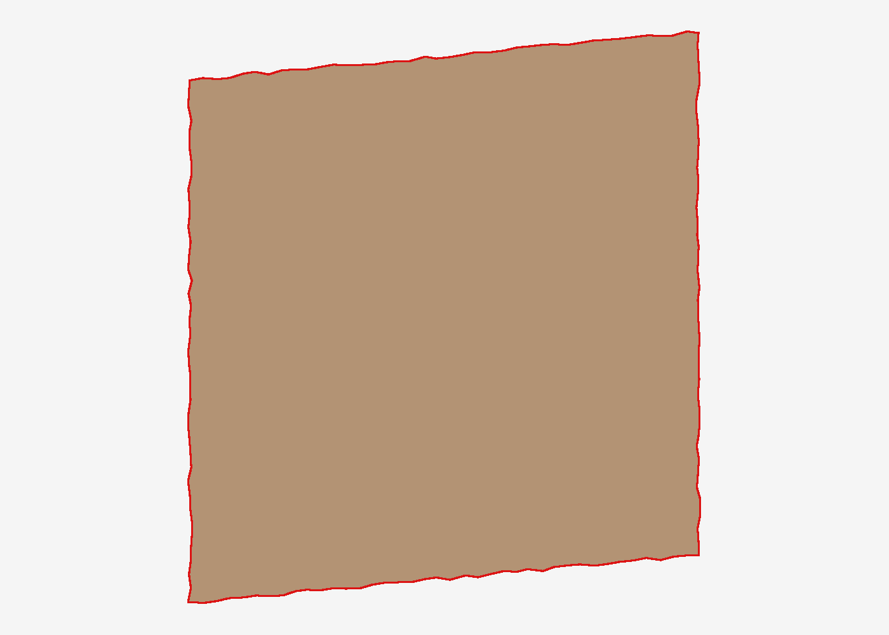 |  |  |  |  |  |
| triangles behind each pixel: warm = odd (a hole is seen through), cool = even |  |  |  |  |  |  |  |  |  |  |  |
| front-facing minus back-facing: grey 0, blue +, red − |  |  |  |  | 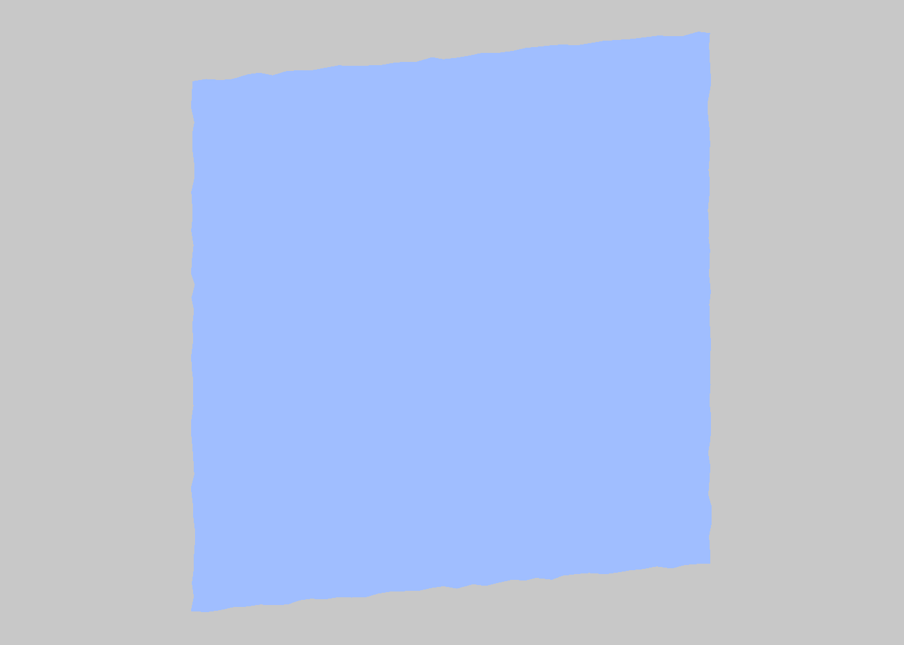 |  |  |  |  |  |  |

## torus_r0.10

trimesh2 torus, a regular 120 x 80 lattice (spacing 0.0196), rho = 0.10: many cospherical quads, so the diagonal is a free choice. Expected: closed, chi = 0, 19200 triangles.

input: `-i /Users/csilva/src/BPA.jl/data/torus-120-80.off`, rho = 0.1, 9600 points

|  | BPA.jl | Open3D | MeshLab | Digne | Digne -p | Gruber | Gruber reseeded | bpa_rs | Schmehla | Giaccari | bpa fork |
|---|---|---|---|---|---|---|---|---|---|---|---|
| triangles | 19200 | 19200 | 9600 | 19200 | 19200 | 19083 | 19065 | 19138 | n/a | 19200 | 19200 |
| reconstruction time (s) | 0.06 | 0.207 | 0.019 | 0.423 | 0.087 | 0.063 | 0.061 | 0.077 | n/a | 0.014 | 0.044 |
| vertices used | 9600 | 9600 | 4800 | 9600 | 9600 | 9600 | 9600 | 9600 | n/a | 9600 | 9600 |
| boundary edges | 0 | 0 | 0 | 0 | 0 | 177 | 201 | 98 | n/a | 0 | 0 |
| boundary loops | 0 | 0 | 0 | 0 | 0 | 30 | 33 | 18 | n/a | 0 | 0 |
| components | 1 | 1 | 1 | 1 | 1 | 1 | 1 | 1 | n/a | 1 | 1 |
| largest component (triangles) | 19200 | 19200 | 9600 | 19200 | 19200 | 19083 | 19065 | 19138 | n/a | 19200 | 19200 |
| Euler characteristic | 0 | 0 | 0 | 0 | 0 | -30 | -33 | -18 | n/a | 0 | 0 |
| orientable | yes | yes | yes | yes | yes | yes | yes | yes | n/a | yes | yes |
| edge-manifold | yes | yes | yes | yes | yes | yes | yes | yes | n/a | yes | yes |
| vertex-manifold | yes | yes | yes | yes | yes | yes | yes | yes | n/a | yes | yes |
| duplicate triangles | 0 | 0 | 0 | 0 | 0 | 0 | 0 | 0 | n/a | 0 | 0 |
| valid | 18698 | 19200 | 0 | 19200 | 19200 | 16745 | 16737 | 16815 | n/a | 14195 | 18764 |
| valid_reversed_winding | 0 | 0 | 0 | 0 | 0 | 0 | 0 | 0 | n/a | 0 | 0 |
| ball_not_empty_tie | 502 | 0 | 0 | 0 | 0 | 2338 | 2328 | 2323 | n/a | 5001 | 436 |
| ball_not_empty | 0 | 0 | 9600 | 0 | 0 | 0 | 0 | 0 | n/a | 2 | 0 |
| circumradius_too_large | 0 | 0 | 0 | 0 | 0 | 0 | 0 | 0 | n/a | 2 | 0 |
| degenerate | 0 | 0 | 0 | 0 | 0 | 0 | 0 | 0 | n/a | 0 | 0 |
| deepest intrusion / rho | 5.51e-08 | 0.00e+00 | 2.71e-02 | 0.00e+00 | 0.00e+00 | 5.51e-06 | 1.20e-06 | 5.51e-06 | n/a | 2.71e-02 | 5.28e-08 |
| render: odd-parity pixels (holes seen through) | 0.00% | 0.00% | 0.00% | 0.00% | 0.00% | 1.37% | 1.59% | 0.69% | n/a | 0.00% | 0.00% |
| render: pixels with front ≠ back | 0.00% | 0.00% | 0.00% | 0.00% | 0.00% | 1.37% | 1.59% | 0.69% | n/a | 0.00% | 0.00% |

triangle sets against BPA.jl:

|  | common | same winding | only in BPA.jl | only in the other | edges of only-in-BPA.jl triangles present in the other (0/1/2/3) | edges of only-in-other triangles present in BPA.jl (0/1/2/3) |
|---|---|---|---|---|---|---|
| Open3D | 18670 | 18670 | 530 | 530 | 0/0/530/0 | 0/0/530/0 |
| MeshLab | 0 | 0 | 19200 | 9600 | 9250/9950/0/0 | 3052/3146/3402/0 |
| Digne | 18670 | 18670 | 530 | 530 | 0/0/530/0 | 0/0/530/0 |
| Digne -p | 18670 | 18670 | 530 | 530 | 0/0/530/0 | 0/0/530/0 |
| Gruber | 16719 | 16719 | 2481 | 2364 | 4/93/2384/0 | 0/0/2364/0 |
| Gruber reseeded | 16722 | 16722 | 2478 | 2343 | 6/106/2366/0 | 0/0/2343/0 |
| bpa_rs | 16799 | 16799 | 2401 | 2339 | 4/43/2354/0 | 0/0/2339/0 |
| Giaccari | 14085 | 14085 | 5115 | 5115 | 0/3/5112/0 | 1/1/5113/0 |
| bpa fork | 18614 | 18614 | 586 | 586 | 0/0/586/0 | 0/0/586/0 |

renderings (`torus_r0.10/render/`, view 40.0°):

|  | BPA.jl | Open3D | MeshLab | Digne | Digne -p | Gruber | Gruber reseeded | bpa_rs | Schmehla | Giaccari | bpa fork |
|---|---|---|---|---|---|---|---|---|---|---|---|
| shaded, boundary edges in red |  |  |  |  |  | 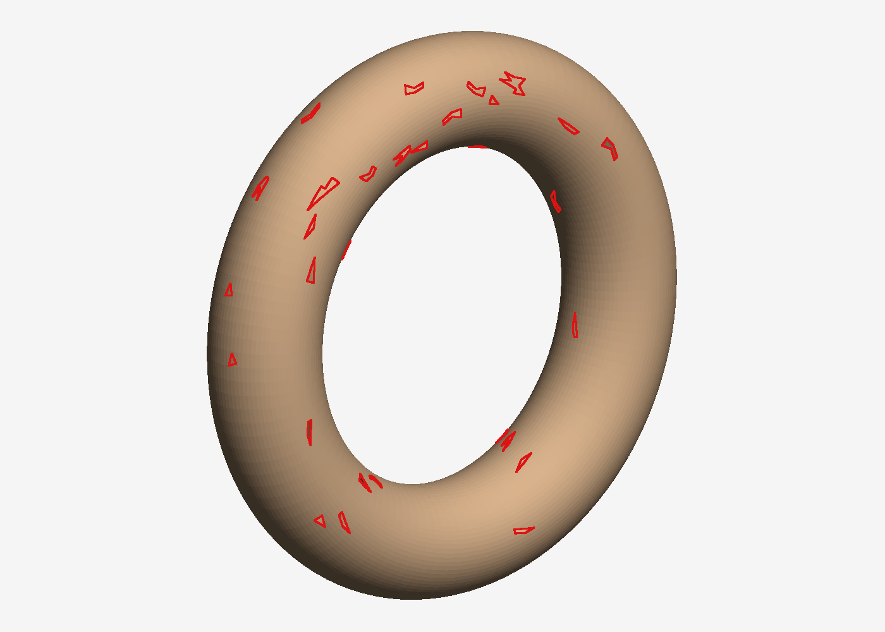 | 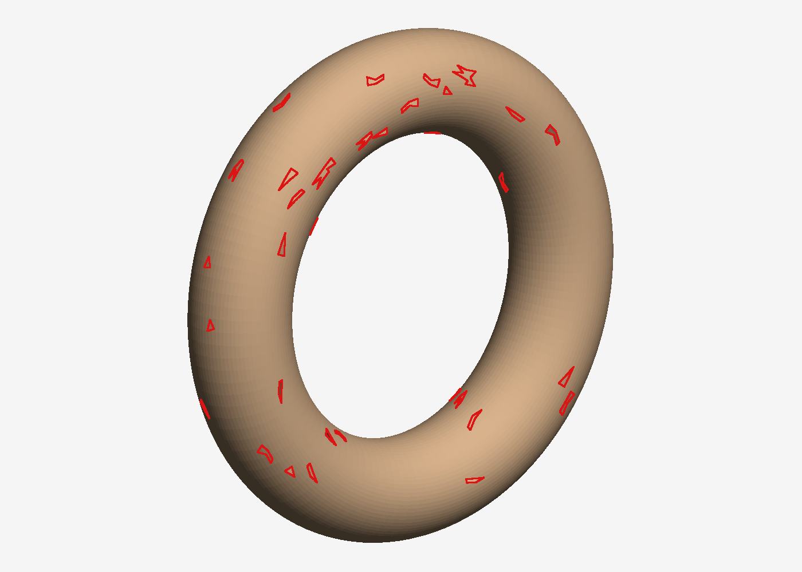 |  |  |  |  |
| triangles behind each pixel: warm = odd (a hole is seen through), cool = even |  |  |  |  |  |  | 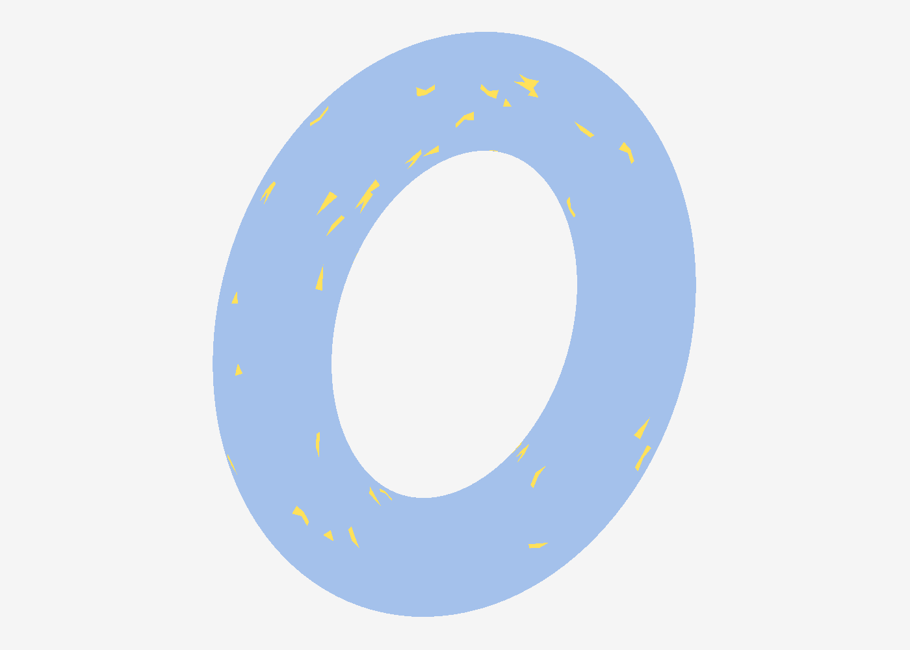 | 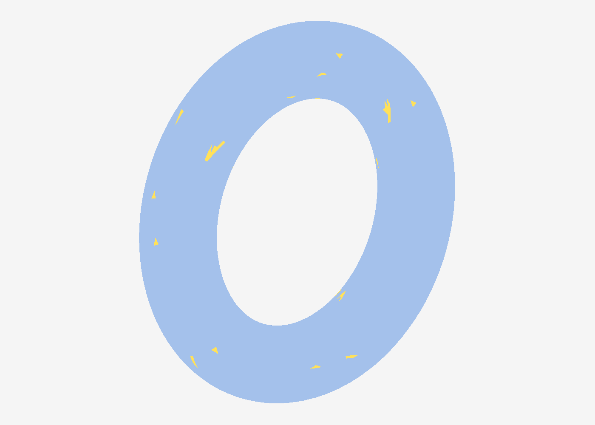 |  |  |  |
| front-facing minus back-facing: grey 0, blue +, red − |  |  |  |  |  | 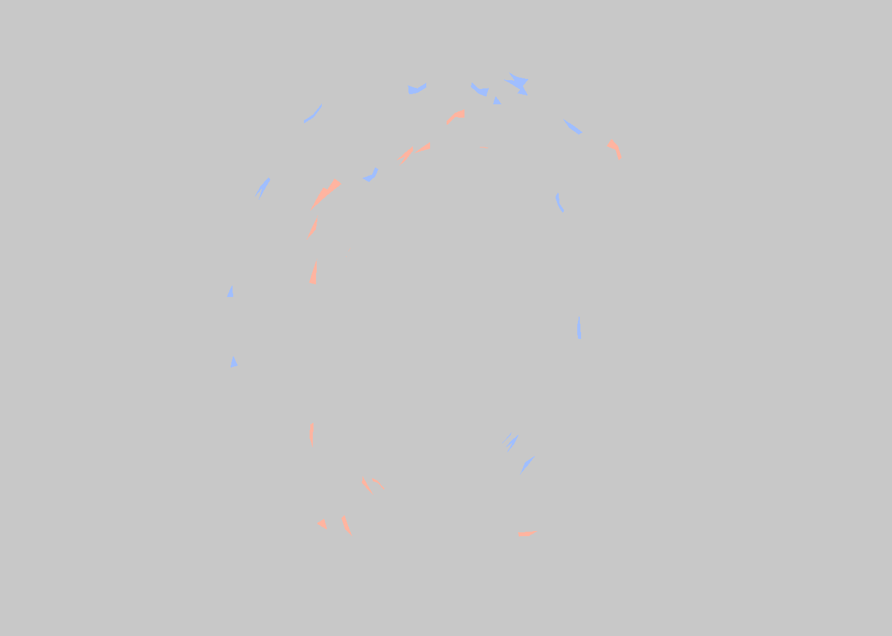 | 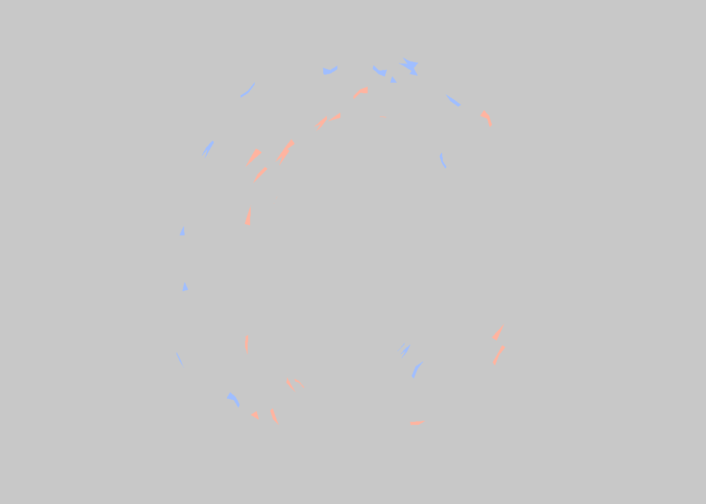 | 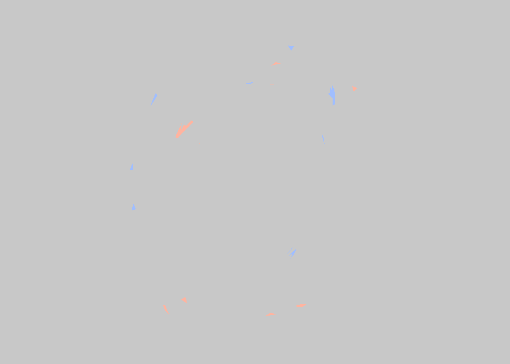 |  |  |  |

## torus_r0.05

the same regular torus at rho = 0.05, the smallest radius that still closes it.

input: `-i /Users/csilva/src/BPA.jl/data/torus-120-80.off`, rho = 0.05, 9600 points

|  | BPA.jl | Open3D | MeshLab | Digne | Digne -p | Gruber | Gruber reseeded | bpa_rs | Schmehla | Giaccari | bpa fork |
|---|---|---|---|---|---|---|---|---|---|---|---|
| triangles | 19200 | 19200 | 19196 | 19200 | 19200 | 19036 | 19060 | 19094 | 19200 | 19200 | 19200 |
| reconstruction time (s) | 0.03 | 0.061 | 0.043 | 0.096 | 0.025 | 0.024 | 0.025 | 0.028 | 1.008 | 0.014 | 0.019 |
| vertices used | 9600 | 9600 | 9599 | 9600 | 9600 | 9598 | 9600 | 9600 | 9600 | 9600 | 9600 |
| boundary edges | 0 | 0 | 4 | 0 | 0 | 234 | 208 | 162 | 0 | 0 | 0 |
| boundary loops | 0 | 0 | 1 | 0 | 0 | 37 | 34 | 28 | 0 | 0 | 0 |
| components | 1 | 1 | 1 | 1 | 1 | 1 | 1 | 1 | 1 | 1 | 1 |
| largest component (triangles) | 19200 | 19200 | 19196 | 19200 | 19200 | 19036 | 19060 | 19094 | 19200 | 19200 | 19200 |
| Euler characteristic | 0 | 0 | -1 | 0 | 0 | -37 | -34 | -28 | 0 | 0 | 0 |
| orientable | yes | yes | yes | yes | yes | yes | yes | yes | yes | yes | yes |
| edge-manifold | yes | yes | yes | yes | yes | yes | yes | yes | yes | yes | yes |
| vertex-manifold | yes | yes | yes | yes | yes | yes | yes | yes | yes | yes | yes |
| duplicate triangles | 0 | 0 | 0 | 0 | 0 | 0 | 0 | 0 | 0 | 0 | 0 |
| valid | 18828 | 19200 | 19194 | 19200 | 19200 | 16901 | 16885 | 16924 | 17232 | 16636 | 18862 |
| valid_reversed_winding | 0 | 0 | 0 | 0 | 0 | 0 | 0 | 0 | 0 | 0 | 0 |
| ball_not_empty_tie | 372 | 0 | 0 | 0 | 0 | 2135 | 2175 | 2170 | 1968 | 2564 | 338 |
| ball_not_empty | 0 | 0 | 2 | 0 | 0 | 0 | 0 | 0 | 0 | 0 | 0 |
| circumradius_too_large | 0 | 0 | 0 | 0 | 0 | 0 | 0 | 0 | 0 | 0 | 0 |
| degenerate | 0 | 0 | 0 | 0 | 0 | 0 | 0 | 0 | 0 | 0 | 0 |
| deepest intrusion / rho | 9.16e-08 | 0.00e+00 | 9.17e-02 | 0.00e+00 | 0.00e+00 | 2.37e-06 | 2.37e-06 | 1.84e-06 | 2.13e-06 | 5.08e-07 | 8.46e-08 |
| render: odd-parity pixels (holes seen through) | 0.00% | 0.00% | 0.03% | 0.00% | 0.00% | 1.80% | 1.56% | 1.18% | 0.00% | 0.00% | 0.00% |
| render: pixels with front ≠ back | 0.00% | 0.00% | 0.03% | 0.00% | 0.00% | 1.80% | 1.56% | 1.18% | 0.00% | 0.00% | 0.00% |

triangle sets against BPA.jl:

|  | common | same winding | only in BPA.jl | only in the other | edges of only-in-BPA.jl triangles present in the other (0/1/2/3) | edges of only-in-other triangles present in BPA.jl (0/1/2/3) |
|---|---|---|---|---|---|---|
| Open3D | 18822 | 18822 | 378 | 378 | 0/0/378/0 | 0/0/378/0 |
| MeshLab | 18816 | 18816 | 384 | 380 | 0/4/380/0 | 0/0/380/0 |
| Digne | 18822 | 18822 | 378 | 378 | 0/0/378/0 | 0/0/378/0 |
| Digne -p | 18822 | 18822 | 378 | 378 | 0/0/378/0 | 0/0/378/0 |
| Gruber | 16888 | 16888 | 2312 | 2148 | 13/122/2177/0 | 0/0/2148/0 |
| Gruber reseeded | 16876 | 16876 | 2324 | 2184 | 8/100/2216/0 | 0/0/2184/0 |
| bpa_rs | 16925 | 16925 | 2275 | 2169 | 1/89/2185/0 | 0/0/2169/0 |
| Schmehla | 17192 | 17192 | 2008 | 2008 | 0/0/2008/0 | 0/0/2008/0 |
| Giaccari | 16548 | 16548 | 2652 | 2652 | 0/0/2652/0 | 0/0/2652/0 |
| bpa fork | 18750 | 18750 | 450 | 450 | 0/0/450/0 | 0/0/450/0 |

renderings (`torus_r0.05/render/`, view 40.0°):

|  | BPA.jl | Open3D | MeshLab | Digne | Digne -p | Gruber | Gruber reseeded | bpa_rs | Schmehla | Giaccari | bpa fork |
|---|---|---|---|---|---|---|---|---|---|---|---|
| shaded, boundary edges in red |  |  |  |  |  | 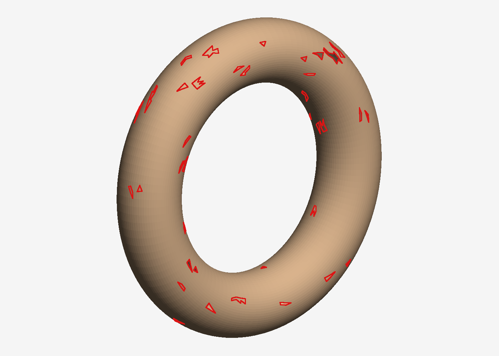 | 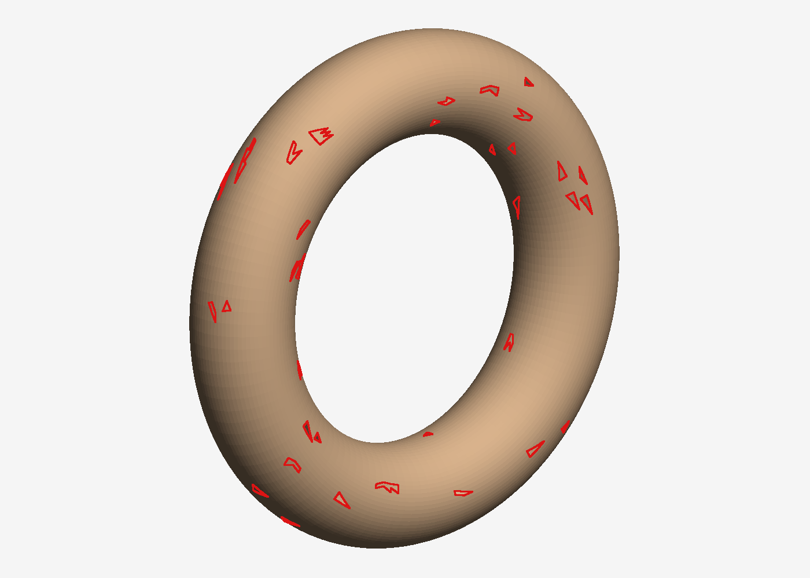 | 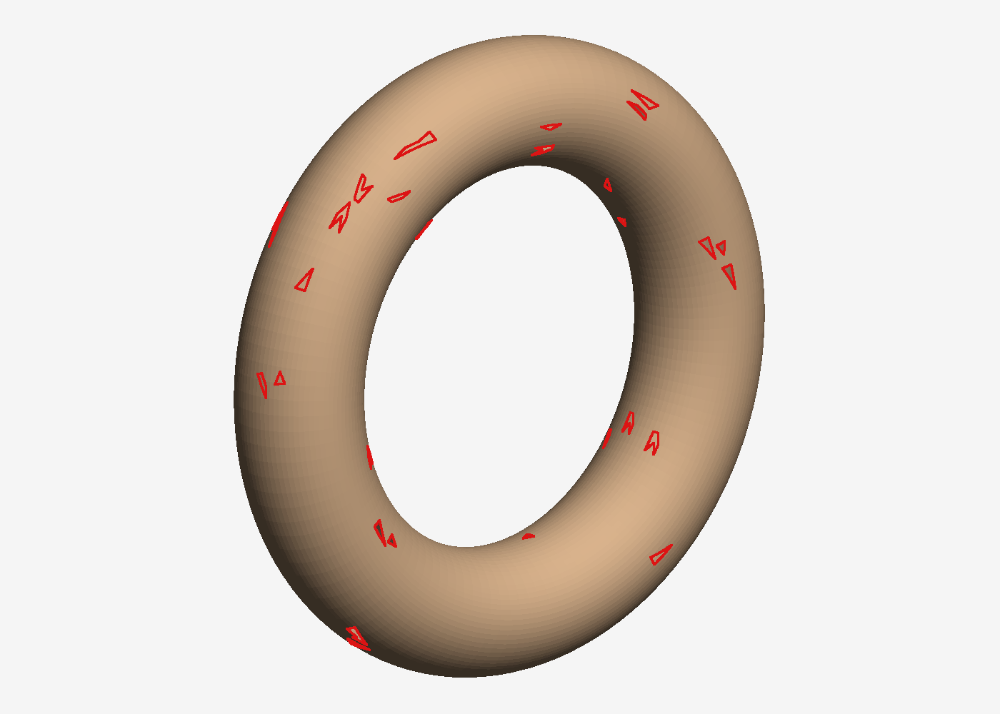 | 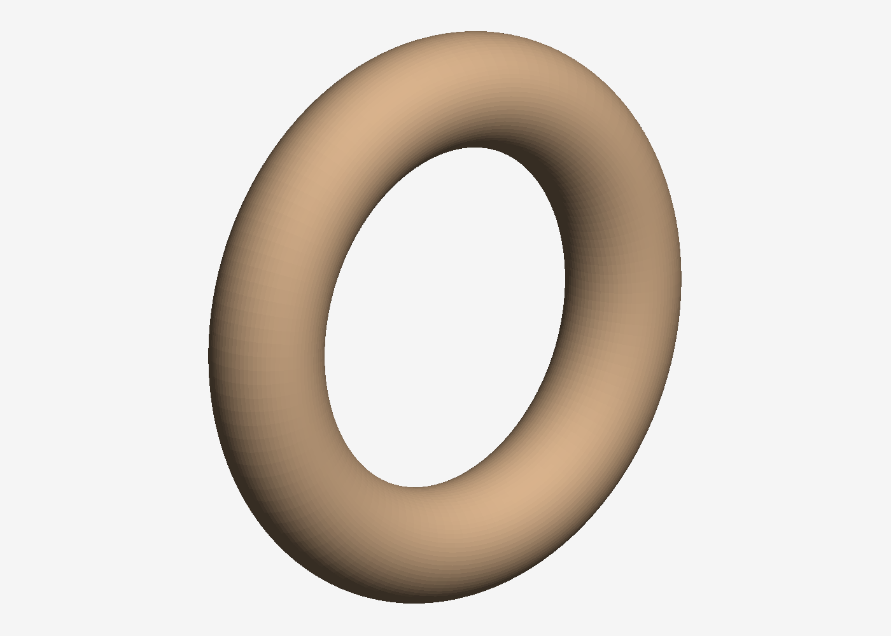 |  |  |
| triangles behind each pixel: warm = odd (a hole is seen through), cool = even |  |  |  |  |  | 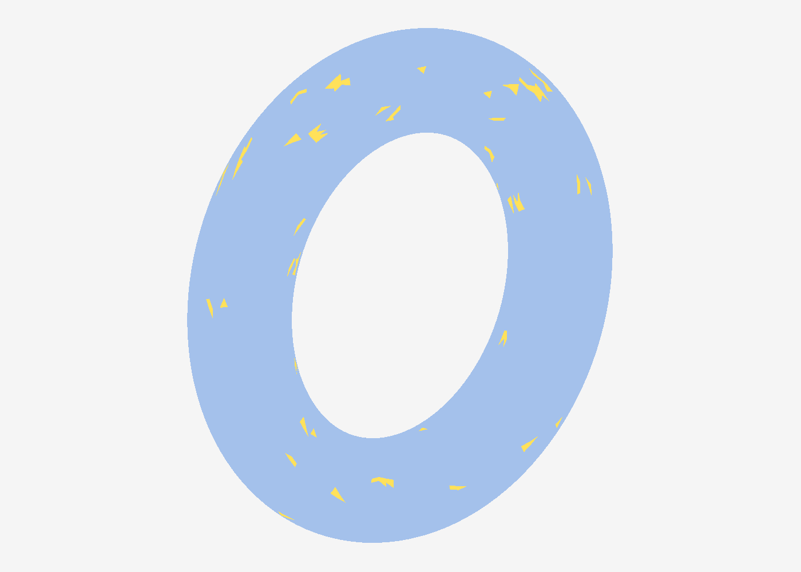 | 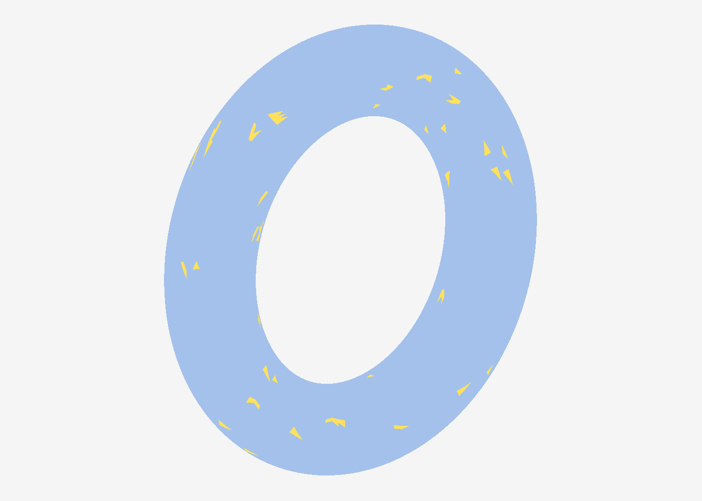 | 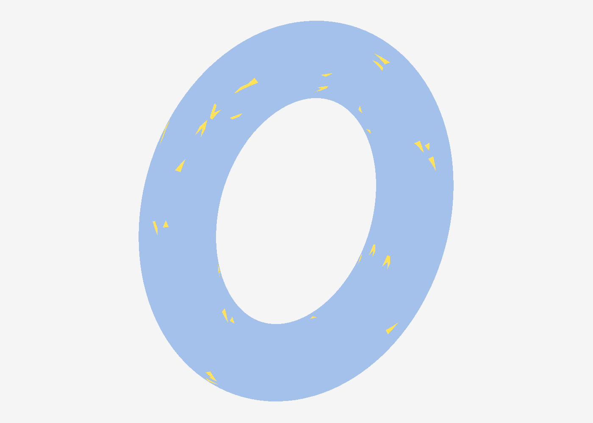 |  |  |  |
| front-facing minus back-facing: grey 0, blue +, red − |  |  |  |  |  | 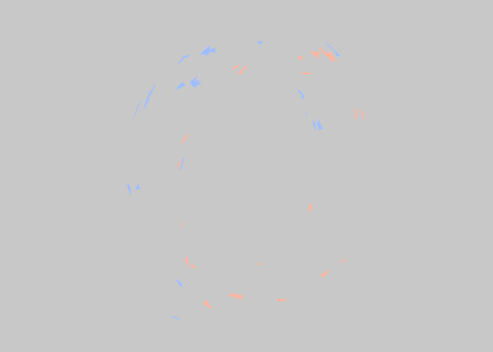 | 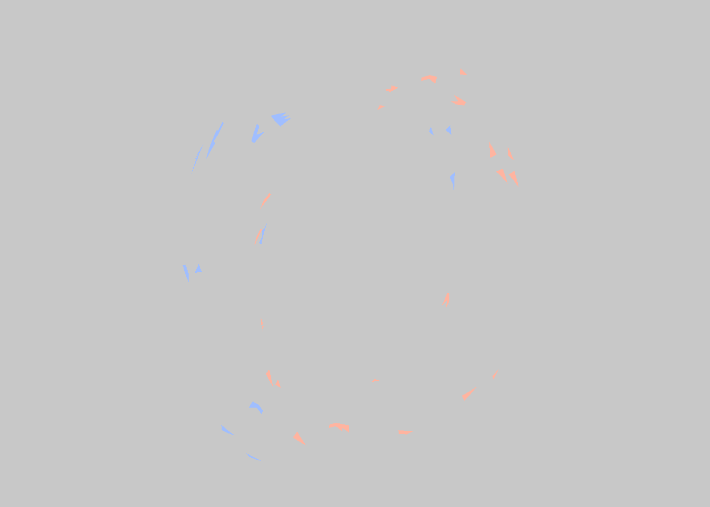 | 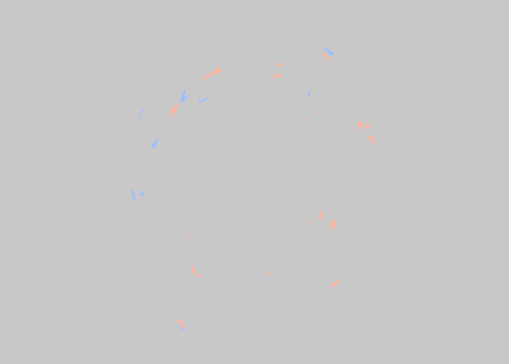 |  |  |  |

## torus_jitter

parametric torus (R = 1, r = 0.4) on a 120 x 80 grid jittered by 30 % of the spacing, so no four points are cospherical and the answer is unique. rho = 0.06 (2 x the median spacing). Expected: closed, chi = 0, 19200 triangles.

input: `-i /Users/csilva/src/BPA.jl/compare/results/inputs/torus_jitter.off`, rho = 0.06, 9600 points

|  | BPA.jl | Open3D | MeshLab | Digne | Digne -p | Gruber | Gruber reseeded | bpa_rs | Schmehla | Giaccari | bpa fork |
|---|---|---|---|---|---|---|---|---|---|---|---|
| triangles | 19200 | 19200 | 19196 | 19200 | 19200 | 19200 | 19200 | 19200 | 19200 | 19200 | 19200 |
| reconstruction time (s) | 0.03 | 0.067 | 0.046 | 0.094 | 0.022 | 0.024 | 0.023 | 0.028 | 0.96 | 0.011 | 0.02 |
| vertices used | 9600 | 9600 | 9598 | 9600 | 9600 | 9600 | 9600 | 9600 | 9600 | 9600 | 9600 |
| boundary edges | 0 | 0 | 0 | 0 | 0 | 0 | 0 | 0 | 0 | 0 | 0 |
| boundary loops | 0 | 0 | 0 | 0 | 0 | 0 | 0 | 0 | 0 | 0 | 0 |
| components | 1 | 1 | 1 | 1 | 1 | 1 | 1 | 1 | 1 | 1 | 1 |
| largest component (triangles) | 19200 | 19200 | 19196 | 19200 | 19200 | 19200 | 19200 | 19200 | 19200 | 19200 | 19200 |
| Euler characteristic | 0 | 0 | 0 | 0 | 0 | 0 | 0 | 0 | 0 | 0 | 0 |
| orientable | yes | yes | yes | yes | yes | yes | yes | yes | yes | yes | yes |
| edge-manifold | yes | yes | yes | yes | yes | yes | yes | yes | yes | yes | yes |
| vertex-manifold | yes | yes | yes | yes | yes | yes | yes | yes | yes | yes | yes |
| duplicate triangles | 0 | 0 | 0 | 0 | 0 | 0 | 0 | 0 | 0 | 0 | 0 |
| valid | 19200 | 19200 | 19189 | 19200 | 19200 | 19200 | 19200 | 19200 | 19200 | 19200 | 19200 |
| valid_reversed_winding | 0 | 0 | 0 | 0 | 0 | 0 | 0 | 0 | 0 | 0 | 0 |
| ball_not_empty_tie | 0 | 0 | 0 | 0 | 0 | 0 | 0 | 0 | 0 | 0 | 0 |
| ball_not_empty | 0 | 0 | 7 | 0 | 0 | 0 | 0 | 0 | 0 | 0 | 0 |
| circumradius_too_large | 0 | 0 | 0 | 0 | 0 | 0 | 0 | 0 | 0 | 0 | 0 |
| degenerate | 0 | 0 | 0 | 0 | 0 | 0 | 0 | 0 | 0 | 0 | 0 |
| deepest intrusion / rho | 0.00e+00 | 0.00e+00 | 2.90e-01 | 0.00e+00 | 0.00e+00 | 0.00e+00 | 0.00e+00 | 0.00e+00 | 0.00e+00 | 0.00e+00 | 0.00e+00 |
| render: odd-parity pixels (holes seen through) | 0.00% | 0.00% | 0.00% | 0.00% | 0.00% | 0.00% | 0.00% | 0.00% | 0.00% | 0.00% | 0.00% |
| render: pixels with front ≠ back | 0.00% | 0.00% | 0.00% | 0.00% | 0.00% | 0.00% | 0.00% | 0.00% | 0.00% | 0.00% | 0.00% |

triangle sets against BPA.jl:

|  | common | same winding | only in BPA.jl | only in the other | edges of only-in-BPA.jl triangles present in the other (0/1/2/3) | edges of only-in-other triangles present in BPA.jl (0/1/2/3) |
|---|---|---|---|---|---|---|
| Open3D | 19200 | 19200 | 0 | 0 | 0/0/0/0 | 0/0/0/0 |
| MeshLab | 19189 | 19189 | 11 | 7 | 0/11/0/0 | 1/1/5/0 |
| Digne | 19200 | 19200 | 0 | 0 | 0/0/0/0 | 0/0/0/0 |
| Digne -p | 19200 | 19200 | 0 | 0 | 0/0/0/0 | 0/0/0/0 |
| Gruber | 19200 | 19200 | 0 | 0 | 0/0/0/0 | 0/0/0/0 |
| Gruber reseeded | 19200 | 19200 | 0 | 0 | 0/0/0/0 | 0/0/0/0 |
| bpa_rs | 19200 | 19200 | 0 | 0 | 0/0/0/0 | 0/0/0/0 |
| Schmehla | 19200 | 19200 | 0 | 0 | 0/0/0/0 | 0/0/0/0 |
| Giaccari | 19200 | 19200 | 0 | 0 | 0/0/0/0 | 0/0/0/0 |
| bpa fork | 19200 | 19200 | 0 | 0 | 0/0/0/0 | 0/0/0/0 |

renderings (`torus_jitter/render/`, view 40.0°):

|  | BPA.jl | Open3D | MeshLab | Digne | Digne -p | Gruber | Gruber reseeded | bpa_rs | Schmehla | Giaccari | bpa fork |
|---|---|---|---|---|---|---|---|---|---|---|---|
| shaded, boundary edges in red |  |  |  |  |  |  |  |  | 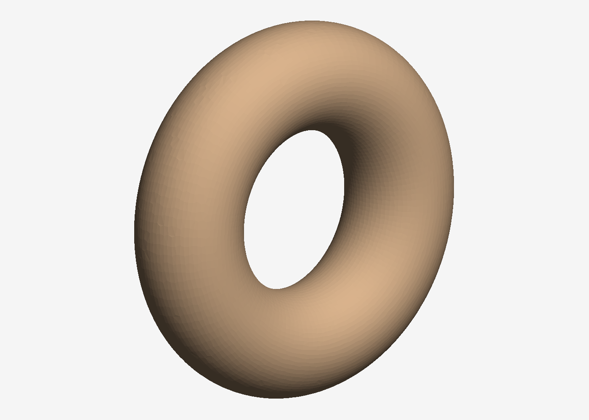 |  |  |
| triangles behind each pixel: warm = odd (a hole is seen through), cool = even |  |  |  |  |  |  |  |  |  |  | 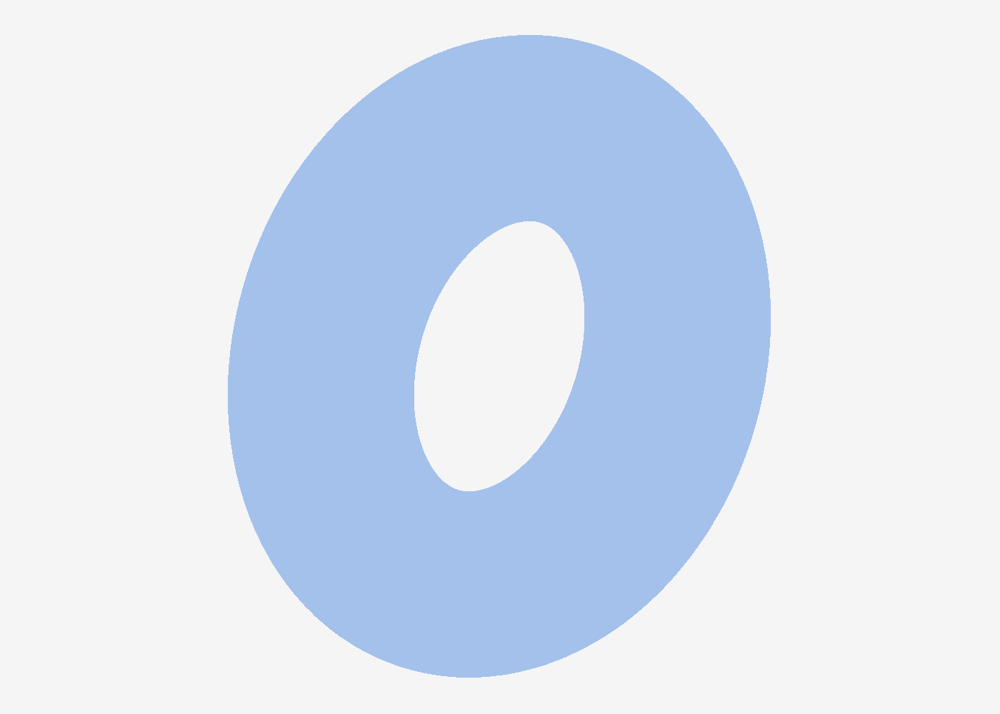 |
| front-facing minus back-facing: grey 0, blue +, red − |  |  |  |  |  |  |  |  |  |  |  |

## torus_sampled20k

20000 points sampled uniformly by area on the trimesh2 torus (uneven spacing, normals from the faces), rho = 0.05 (5 x the median nearest-neighbour distance). Expected: closed, chi = 0, 40000 triangles.

input: `-i /Users/csilva/src/BPA.jl/compare/results/inputs/torus_sampled20k.off`, rho = 0.05, 20000 points

|  | BPA.jl | Open3D | MeshLab | Digne | Digne -p | Gruber | Gruber reseeded | bpa_rs | Schmehla | Giaccari | bpa fork |
|---|---|---|---|---|---|---|---|---|---|---|---|
| triangles | 40000 | 40000 | 30279 | 40000 | 40000 | 40000 | 40000 | 40000 | 40000 | 39962 | 40000 |
| reconstruction time (s) | 0.1 | 0.274 | 0.077 | 0.417 | 0.071 | 0.092 | 0.091 | 0.11 | 0.724 | 0.027 | 0.072 |
| vertices used | 20000 | 20000 | 15197 | 20000 | 20000 | 20000 | 20000 | 20000 | 20000 | 19981 | 20000 |
| boundary edges | 0 | 0 | 425 | 0 | 0 | 0 | 0 | 0 | 0 | 0 | 0 |
| boundary loops | 0 | 0 | 94 | 0 | 0 | 0 | 0 | 0 | 0 | 0 | 0 |
| components | 1 | 1 | 1 | 1 | 1 | 1 | 1 | 1 | 1 | 1 | 1 |
| largest component (triangles) | 40000 | 40000 | 30279 | 40000 | 40000 | 40000 | 40000 | 40000 | 40000 | 39962 | 40000 |
| Euler characteristic | 0 | 0 | -155 | 0 | 0 | 0 | 0 | 0 | 0 | 0 | 0 |
| orientable | yes | yes | yes | yes | yes | yes | yes | yes | yes | yes | yes |
| edge-manifold | yes | yes | yes | yes | yes | yes | yes | yes | yes | yes | yes |
| vertex-manifold | yes | yes | no | yes | yes | yes | yes | yes | yes | yes | yes |
| duplicate triangles | 0 | 0 | 0 | 0 | 0 | 0 | 0 | 0 | 0 | 0 | 0 |
| valid | 40000 | 40000 | 18941 | 40000 | 40000 | 40000 | 40000 | 39998 | 40000 | 39890 | 40000 |
| valid_reversed_winding | 0 | 0 | 0 | 0 | 0 | 0 | 0 | 0 | 0 | 0 | 0 |
| ball_not_empty_tie | 0 | 0 | 0 | 0 | 0 | 0 | 0 | 1 | 0 | 4 | 0 |
| ball_not_empty | 0 | 0 | 11338 | 0 | 0 | 0 | 0 | 1 | 0 | 68 | 0 |
| circumradius_too_large | 0 | 0 | 0 | 0 | 0 | 0 | 0 | 0 | 0 | 0 | 0 |
| degenerate | 0 | 0 | 0 | 0 | 0 | 0 | 0 | 0 | 0 | 0 | 0 |
| deepest intrusion / rho | 0.00e+00 | 0.00e+00 | 7.62e-01 | 0.00e+00 | 0.00e+00 | 0.00e+00 | 0.00e+00 | 2.42e-05 | 0.00e+00 | 4.78e-03 | 0.00e+00 |
| render: odd-parity pixels (holes seen through) | 0.00% | 0.00% | 2.41% | 0.00% | 0.00% | 0.00% | 0.00% | 0.00% | 0.00% | 0.00% | 0.00% |
| render: pixels with front ≠ back | 0.00% | 0.00% | 2.41% | 0.00% | 0.00% | 0.00% | 0.00% | 0.00% | 0.00% | 0.00% | 0.00% |

triangle sets against BPA.jl:

|  | common | same winding | only in BPA.jl | only in the other | edges of only-in-BPA.jl triangles present in the other (0/1/2/3) | edges of only-in-other triangles present in BPA.jl (0/1/2/3) |
|---|---|---|---|---|---|---|
| Open3D | 40000 | 40000 | 0 | 0 | 0/0/0/0 | 0/0/0/0 |
| MeshLab | 18941 | 18941 | 21059 | 11338 | 4263/16568/211/17 | 755/4440/6044/99 |
| Digne | 40000 | 40000 | 0 | 0 | 0/0/0/0 | 0/0/0/0 |
| Digne -p | 40000 | 40000 | 0 | 0 | 0/0/0/0 | 0/0/0/0 |
| Gruber | 40000 | 40000 | 0 | 0 | 0/0/0/0 | 0/0/0/0 |
| Gruber reseeded | 40000 | 40000 | 0 | 0 | 0/0/0/0 | 0/0/0/0 |
| bpa_rs | 39998 | 39998 | 2 | 2 | 0/0/2/0 | 0/0/2/0 |
| Schmehla | 40000 | 40000 | 0 | 0 | 0/0/0/0 | 0/0/0/0 |
| Giaccari | 39890 | 39890 | 110 | 72 | 0/106/4/0 | 0/31/40/1 |
| bpa fork | 40000 | 40000 | 0 | 0 | 0/0/0/0 | 0/0/0/0 |

renderings (`torus_sampled20k/render/`, view 40.0°):

|  | BPA.jl | Open3D | MeshLab | Digne | Digne -p | Gruber | Gruber reseeded | bpa_rs | Schmehla | Giaccari | bpa fork |
|---|---|---|---|---|---|---|---|---|---|---|---|
| shaded, boundary edges in red |  |  |  |  |  |  |  |  |  | 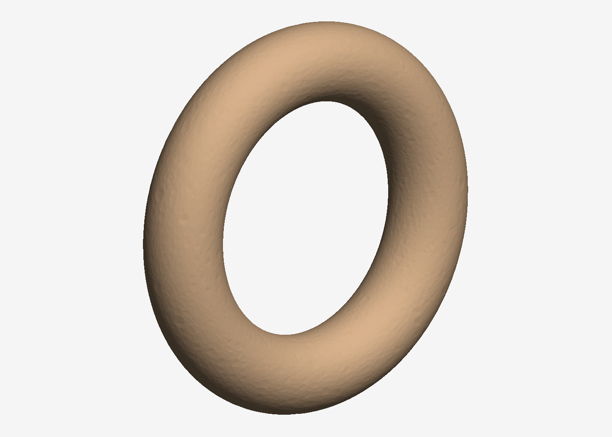 |  |
| triangles behind each pixel: warm = odd (a hole is seen through), cool = even |  |  |  |  |  |  |  |  |  |  |  |
| front-facing minus back-facing: grey 0, blue +, red − |  |  |  |  |  |  |  |  |  |  |  |

## knot_r0.0188

trefoil knot, 30000 points, rho = 1.5 x the estimated spacing, deliberately too small for this anisotropic lattice: many boundaries, so the tools' seeding and stopping behaviour shows.

input: `-i /Users/csilva/src/BPA.jl/data/knot-300-100.off`, rho = 0.0188, 30000 points

|  | BPA.jl | Open3D | MeshLab | Digne | Digne -p | Gruber | Gruber reseeded | bpa_rs | Schmehla | Giaccari | bpa fork |
|---|---|---|---|---|---|---|---|---|---|---|---|
| triangles | 36132 | 35952 | 36462 | 35944 | 35945 | 35889 | 35952 | 35889 | 0 | 35940 | 36070 |
| reconstruction time (s) | 0.11 | 0.081 | 0.121 | 0.111 | 0.052 | 0.029 | 0.033 | 0.04 | 0.155 | 0.028 | 0.028 |
| vertices used | 18615 | 18591 | 18780 | 18594 | 18596 | 18546 | 18654 | 18546 | 0 | 18633 | 18595 |
| boundary edges | 1176 | 1308 | 1340 | 1314 | 1319 | 1230 | 1329 | 1230 | 0 | 1334 | 1212 |
| boundary loops | 19 | 19 | 2 | 19 | 19 | 5 | 30 | 5 | 0 | 8 | 24 |
| components | 4 | 19 | 1 | 19 | 19 | 1 | 27 | 1 | 0 | 3 | 5 |
| largest component (triangles) | 36123 | 35934 | 36462 | 35926 | 35927 | 35889 | 35889 | 35889 | 0 | 35933 | 36066 |
| Euler characteristic | -39 | -39 | -121 | -35 | -36 | -12 | 15 | -12 | 0 | -4 | -46 |
| orientable | yes | no | yes | yes | yes | no | no | no | yes | yes | yes |
| edge-manifold | yes | yes | yes | yes | yes | no | no | no | yes | yes | yes |
| vertex-manifold | no | no | no | no | no | no | no | no | yes | yes | no |
| duplicate triangles | 0 | 0 | 0 | 0 | 0 | 0 | 0 | 0 | 0 | 0 | 0 |
| valid | 36132 | 35952 | 36235 | 35944 | 35945 | 35883 | 35943 | 35883 | 0 | 28337 | 36070 |
| valid_reversed_winding | 0 | 0 | 22 | 0 | 0 | 0 | 0 | 0 | 0 | 7488 | 0 |
| ball_not_empty_tie | 0 | 0 | 0 | 0 | 0 | 0 | 0 | 0 | 0 | 0 | 0 |
| ball_not_empty | 0 | 0 | 205 | 0 | 0 | 6 | 9 | 6 | 0 | 113 | 0 |
| circumradius_too_large | 0 | 0 | 0 | 0 | 0 | 0 | 0 | 0 | 0 | 2 | 0 |
| degenerate | 0 | 0 | 0 | 0 | 0 | 0 | 0 | 0 | 0 | 0 | 0 |
| deepest intrusion / rho | 0.00e+00 | 0.00e+00 | 7.38e-01 | 0.00e+00 | 0.00e+00 | 5.41e-02 | 3.19e-01 | 5.41e-02 | 0.00e+00 | 6.73e-01 | 0.00e+00 |
| render: odd-parity pixels (holes seen through) | 60.97% | 61.07% | 60.94% | 61.06% | 61.06% | 61.18% | 61.18% | 61.18% | n/a | 60.65% | 61.01% |
| render: pixels with front ≠ back | 62.23% | 62.41% | 62.34% | 62.41% | 62.40% | 62.51% | 62.53% | 62.51% | n/a | 62.02% | 62.27% |

triangle sets against BPA.jl:

|  | common | same winding | only in BPA.jl | only in the other | edges of only-in-BPA.jl triangles present in the other (0/1/2/3) | edges of only-in-other triangles present in BPA.jl (0/1/2/3) |
|---|---|---|---|---|---|---|
| Open3D | 35862 | 35862 | 270 | 90 | 81/132/31/26 | 21/42/18/9 |
| MeshLab | 35914 | 35907 | 218 | 548 | 46/95/64/13 | 376/106/60/6 |
| Digne | 35853 | 35853 | 279 | 91 | 84/140/29/26 | 26/38/18/9 |
| Digne -p | 35852 | 35852 | 280 | 93 | 84/140/29/27 | 27/39/18/9 |
| Gruber | 35809 | 35809 | 323 | 80 | 142/129/49/3 | 10/39/24/7 |
| Gruber reseeded | 35818 | 35818 | 314 | 134 | 126/134/49/5 | 59/43/25/7 |
| bpa_rs | 35809 | 35809 | 323 | 80 | 142/129/49/3 | 10/39/24/7 |
| Schmehla | 0 | 0 | 36132 | 0 | 36132/0/0/0 | 0/0/0/0 |
| Giaccari | 35453 | 27989 | 679 | 487 | 290/365/24/0 | 329/106/41/11 |
| bpa fork | 35967 | 35967 | 165 | 103 | 73/54/37/1 | 30/51/18/4 |

renderings (`knot_r0.0188/render/`, view 30.0°):

|  | BPA.jl | Open3D | MeshLab | Digne | Digne -p | Gruber | Gruber reseeded | bpa_rs | Schmehla | Giaccari | bpa fork |
|---|---|---|---|---|---|---|---|---|---|---|---|
| shaded, boundary edges in red |  |  |  |  |  |  |  |  |  | 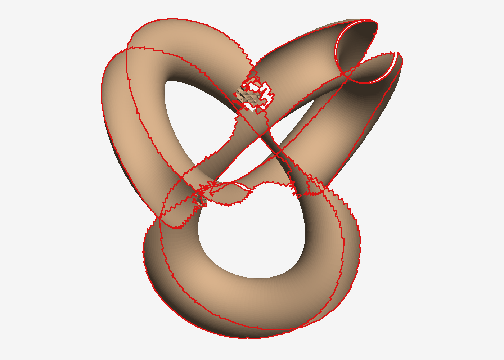 |  |
| triangles behind each pixel: warm = odd (a hole is seen through), cool = even |  |  |  |  |  |  | 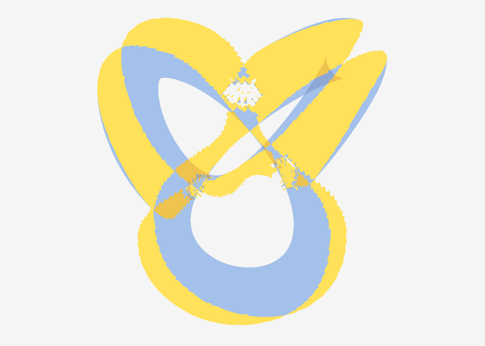 |  |  | 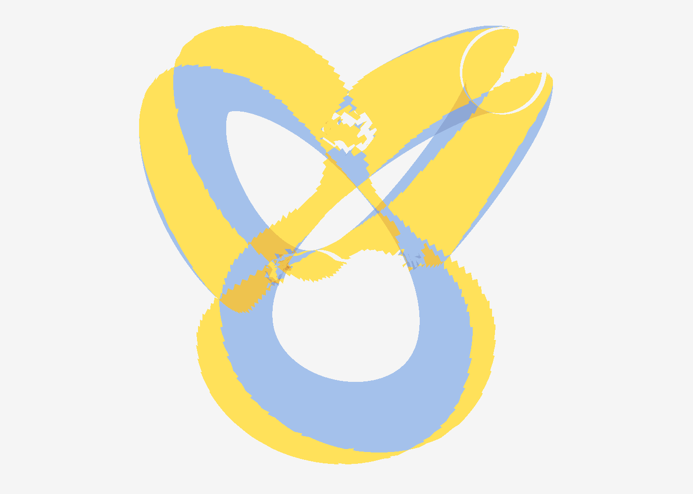 |  |
| front-facing minus back-facing: grey 0, blue +, red − |  |  |  |  |  |  |  |  |  | 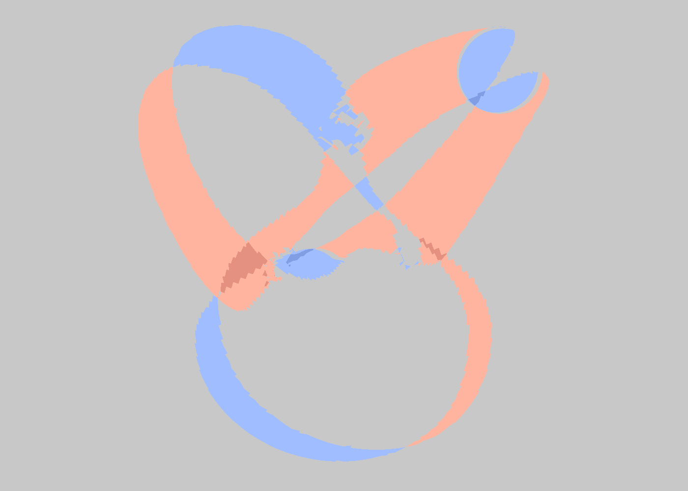 | 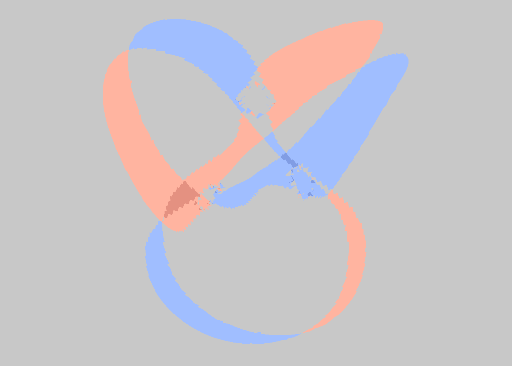 |

## knot_r0.03

the same knot at rho = 0.03, the radius the package recommends: nearly closed, with small holes where the tube almost touches itself.

input: `-i /Users/csilva/src/BPA.jl/data/knot-300-100.off`, rho = 0.03, 30000 points

|  | BPA.jl | Open3D | MeshLab | Digne | Digne -p | Gruber | Gruber reseeded | bpa_rs | Schmehla | Giaccari | bpa fork |
|---|---|---|---|---|---|---|---|---|---|---|---|
| triangles | 58400 | 58326 | 59570 | 58326 | 58325 | 58370 | 58389 | 58370 | 58401 | 58432 | 58418 |
| reconstruction time (s) | 0.16 | 0.209 | 0.222 | 0.33 | 0.132 | 0.075 | 0.07 | 0.082 | 6.508 | 0.045 | 0.059 |
| vertices used | 29208 | 29202 | 29993 | 29202 | 29202 | 29208 | 29265 | 29208 | 29208 | 29213 | 29208 |
| boundary edges | 62 | 214 | 1770 | 210 | 217 | 112 | 169 | 112 | 63 | 12 | 58 |
| boundary loops | 16 | 35 | 7 | 35 | 35 | 18 | 37 | 18 | 15 | 3 | 17 |
| components | 1 | 1 | 1 | 1 | 1 | 1 | 20 | 1 | 1 | 1 | 1 |
| largest component (triangles) | 58400 | 58326 | 59570 | 58326 | 58325 | 58370 | 58370 | 58370 | 58401 | 58432 | 58418 |
| Euler characteristic | -23 | -68 | -677 | -66 | -69 | -33 | -14 | -33 | -21 | -9 | -30 |
| orientable | yes | yes | yes | yes | yes | yes | yes | yes | no | yes | yes |
| edge-manifold | yes | yes | yes | yes | yes | yes | yes | yes | no | yes | yes |
| vertex-manifold | no | no | no | no | no | no | no | no | no | yes | no |
| duplicate triangles | 0 | 0 | 0 | 0 | 0 | 0 | 0 | 0 | 0 | 0 | 0 |
| valid | 58400 | 58326 | 53170 | 58326 | 58325 | 58366 | 58366 | 58366 | 58398 | 58419 | 58418 |
| valid_reversed_winding | 0 | 0 | 4506 | 0 | 0 | 0 | 0 | 0 | 3 | 0 | 0 |
| ball_not_empty_tie | 0 | 0 | 0 | 0 | 0 | 0 | 0 | 0 | 0 | 0 | 0 |
| ball_not_empty | 0 | 0 | 1894 | 0 | 0 | 4 | 23 | 4 | 0 | 13 | 0 |
| circumradius_too_large | 0 | 0 | 0 | 0 | 0 | 0 | 0 | 0 | 0 | 0 | 0 |
| degenerate | 0 | 0 | 0 | 0 | 0 | 0 | 0 | 0 | 0 | 0 | 0 |
| deepest intrusion / rho | 0.00e+00 | 0.00e+00 | 9.15e-01 | 0.00e+00 | 0.00e+00 | 1.31e-03 | 8.56e-01 | 1.31e-03 | 0.00e+00 | 1.85e-02 | 0.00e+00 |
| render: odd-parity pixels (holes seen through) | 0.22% | 0.56% | 3.33% | 0.54% | 0.54% | 0.39% | 0.49% | 0.39% | 0.27% | 0.06% | 0.08% |
| render: pixels with front ≠ back | 0.22% | 0.57% | 16.40% | 0.55% | 0.55% | 0.39% | 0.49% | 0.39% | 0.27% | 0.06% | 0.08% |

triangle sets against BPA.jl:

|  | common | same winding | only in BPA.jl | only in the other | edges of only-in-BPA.jl triangles present in the other (0/1/2/3) | edges of only-in-other triangles present in BPA.jl (0/1/2/3) |
|---|---|---|---|---|---|---|
| Open3D | 58292 | 58292 | 108 | 34 | 6/41/30/31 | 0/21/13/0 |
| MeshLab | 57629 | 53128 | 771 | 1941 | 11/306/167/287 | 1602/265/74/0 |
| Digne | 58293 | 58293 | 107 | 33 | 6/42/30/29 | 0/21/12/0 |
| Digne -p | 58294 | 58294 | 106 | 31 | 6/41/27/32 | 0/21/10/0 |
| Gruber | 58328 | 58328 | 72 | 42 | 5/35/22/10 | 0/24/16/2 |
| Gruber reseeded | 58328 | 58328 | 72 | 61 | 5/35/22/10 | 19/24/16/2 |
| bpa_rs | 58328 | 58328 | 72 | 42 | 5/35/22/10 | 0/24/16/2 |
| Schmehla | 58363 | 58361 | 37 | 38 | 0/21/16/0 | 0/18/18/2 |
| Giaccari | 58363 | 58363 | 37 | 69 | 0/15/21/1 | 4/35/29/1 |
| bpa fork | 58378 | 58378 | 22 | 40 | 0/5/9/8 | 0/24/16/0 |

renderings (`knot_r0.03/render/`, view 30.0°):

|  | BPA.jl | Open3D | MeshLab | Digne | Digne -p | Gruber | Gruber reseeded | bpa_rs | Schmehla | Giaccari | bpa fork |
|---|---|---|---|---|---|---|---|---|---|---|---|
| shaded, boundary edges in red |  |  |  |  |  |  | 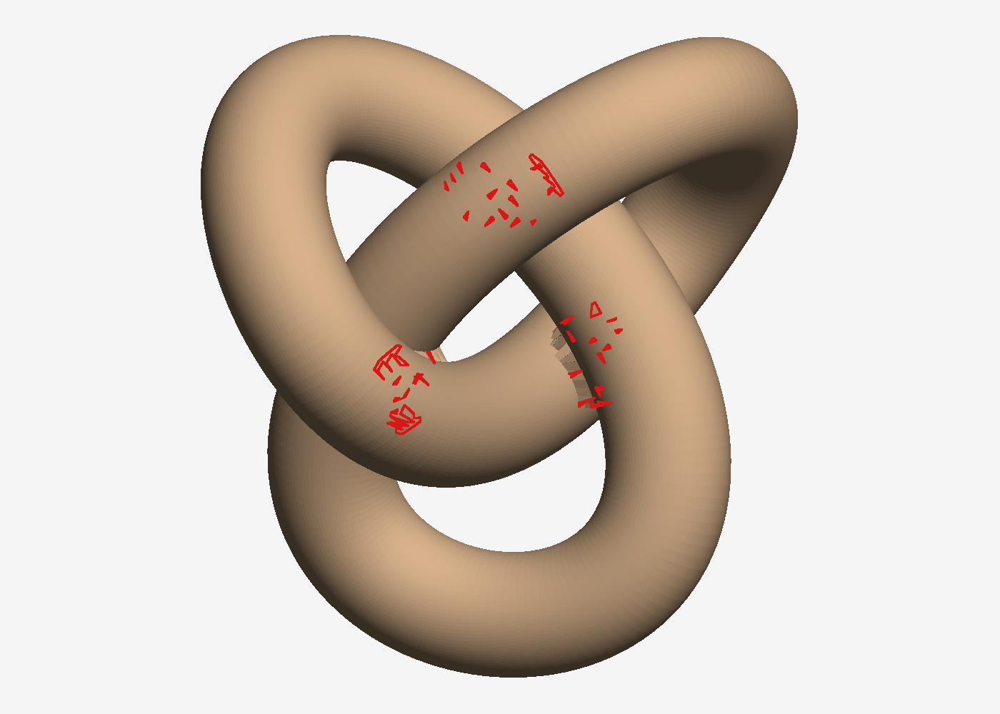 |  |  |  |  |
| triangles behind each pixel: warm = odd (a hole is seen through), cool = even |  |  |  | 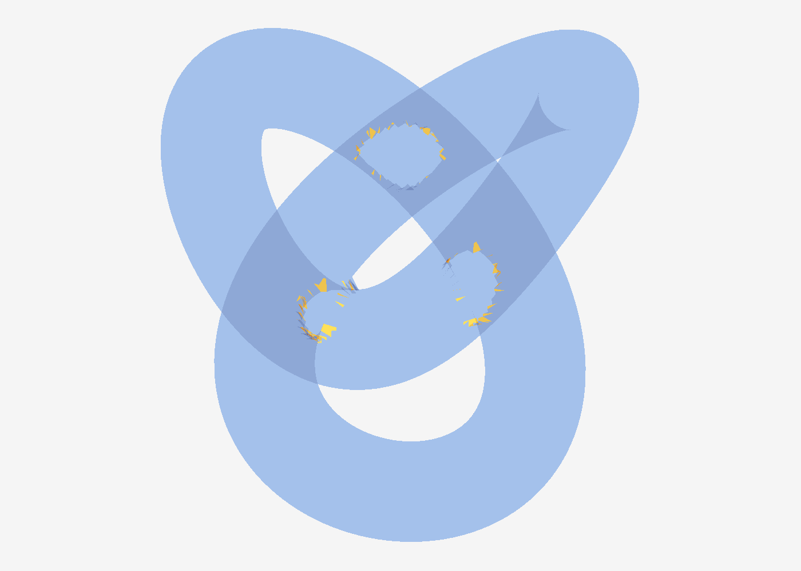 |  | 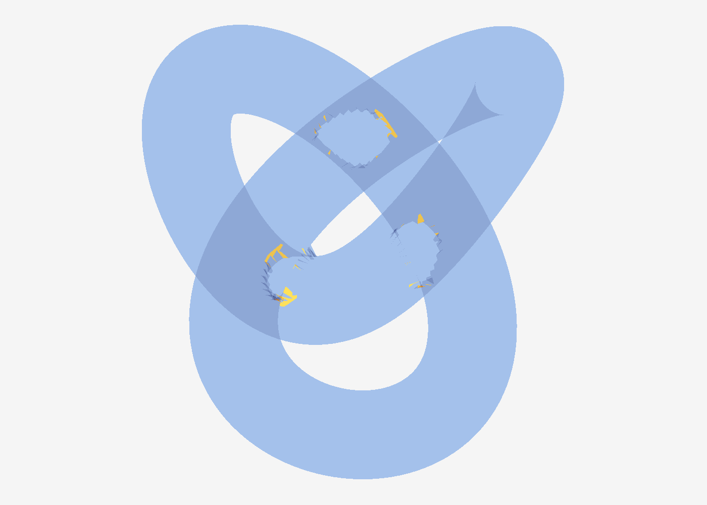 |  |  | 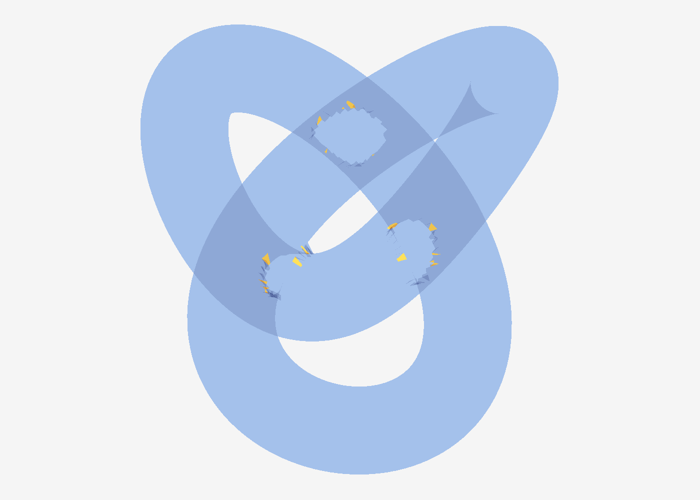 |  |  |
| front-facing minus back-facing: grey 0, blue +, red − |  |  |  | 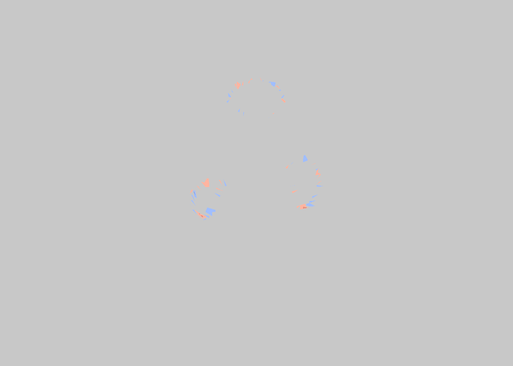 | 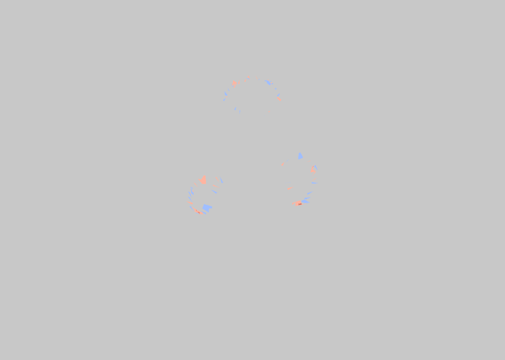 |  | 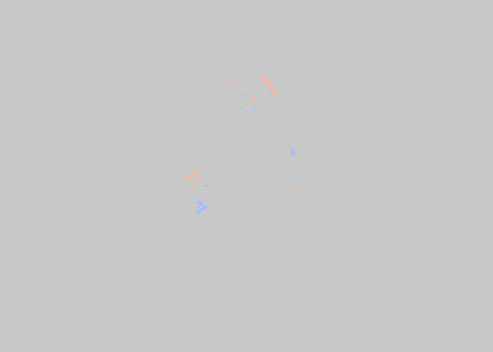 | 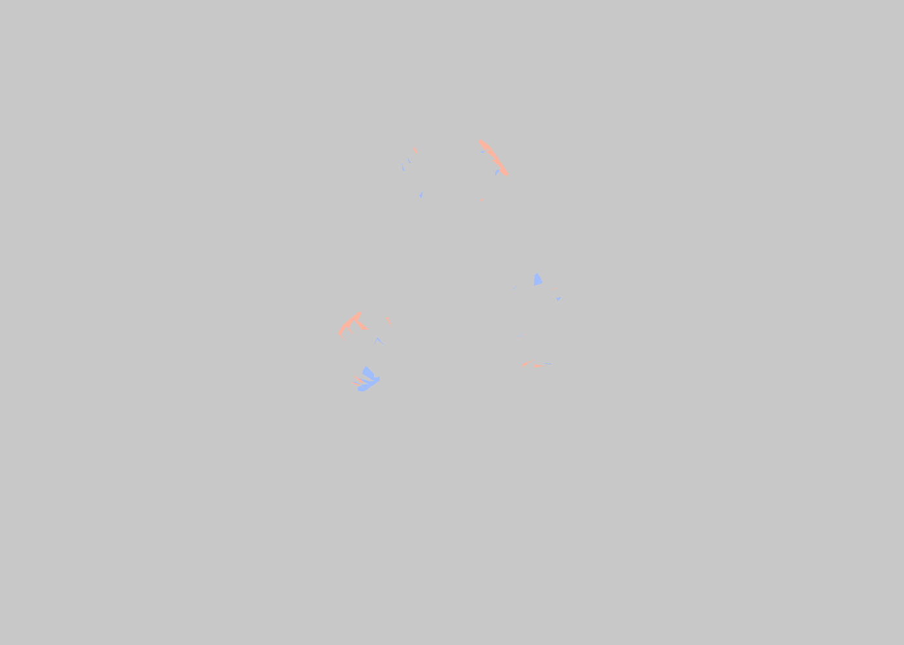 | 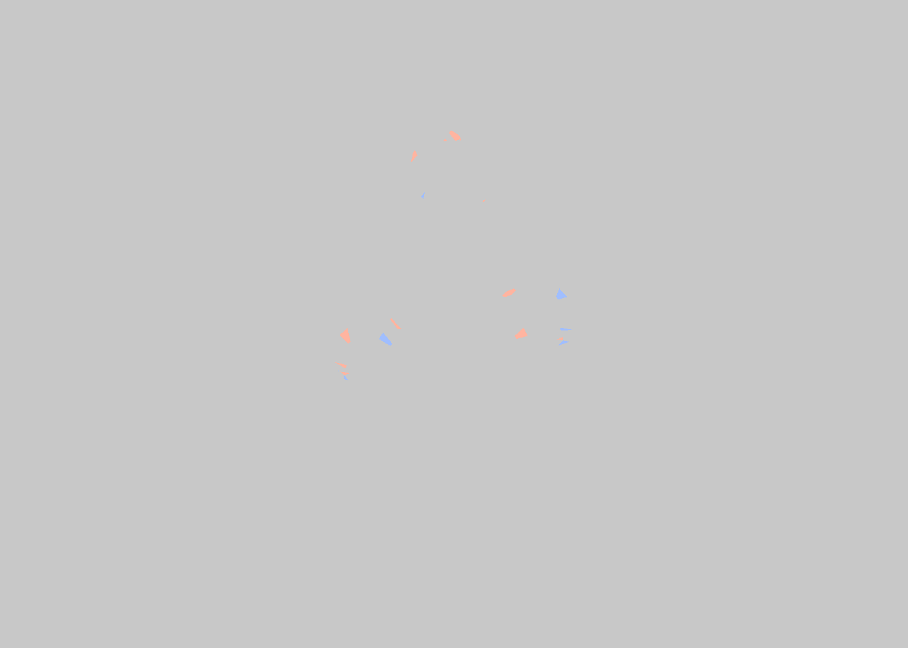 |  |  |

## plane_uneven

jittered plane, 50 x 100 points at 1 mm spacing on the left half and 25 x 50 at 2 mm on the right (6250 points), radii 1.5 mm then 3 mm. Expected: one disk, chi = 1, one boundary loop, every point used; a tool without multi-radius passes shows n/a.

input: `-i /Users/csilva/src/BPA.jl/compare/results/inputs/plane_uneven.off`, rho = 0.0015,0.003, 6250 points

|  | BPA.jl | Open3D | MeshLab | Digne | Digne -p | Gruber | Gruber reseeded | bpa_rs | Schmehla | Giaccari | bpa fork |
|---|---|---|---|---|---|---|---|---|---|---|---|
| triangles | 12214 | 12214 | n/a | 12214 | 12213 | n/a | n/a | n/a | n/a | n/a | 12214 |
| triangles per pass (one radius, then each further one) | 11982 + 232 | 11982 + 232 | n/a | 11982 + 232 | 11982 + 231 | n/a | n/a | n/a | n/a | n/a | 11982 + 232 |
| reconstruction time (s) | 0.01 | 0.032 | n/a | 0.047 | 0.023 | n/a | n/a | n/a | n/a | n/a | 0.009 |
| vertices used | 6250 | 6250 | n/a | 6250 | 6250 | n/a | n/a | n/a | n/a | n/a | 6250 |
| boundary edges | 284 | 284 | n/a | 284 | 287 | n/a | n/a | n/a | n/a | n/a | 284 |
| boundary loops | 1 | 1 | n/a | 1 | 2 | n/a | n/a | n/a | n/a | n/a | 1 |
| components | 1 | 1 | n/a | 1 | 1 | n/a | n/a | n/a | n/a | n/a | 1 |
| largest component (triangles) | 12214 | 12214 | n/a | 12214 | 12213 | n/a | n/a | n/a | n/a | n/a | 12214 |
| Euler characteristic | 1 | 1 | n/a | 1 | 0 | n/a | n/a | n/a | n/a | n/a | 1 |
| orientable | yes | yes | n/a | yes | yes | n/a | n/a | n/a | n/a | n/a | yes |
| edge-manifold | yes | yes | n/a | yes | yes | n/a | n/a | n/a | n/a | n/a | yes |
| vertex-manifold | yes | yes | n/a | yes | yes | n/a | n/a | n/a | n/a | n/a | yes |
| duplicate triangles | 0 | 0 | n/a | 0 | 0 | n/a | n/a | n/a | n/a | n/a | 0 |
| valid | 12214 | 12214 | n/a | 12214 | 12213 | n/a | n/a | n/a | n/a | n/a | 12214 |
| valid_reversed_winding | 0 | 0 | n/a | 0 | 0 | n/a | n/a | n/a | n/a | n/a | 0 |
| ball_not_empty_tie | 0 | 0 | n/a | 0 | 0 | n/a | n/a | n/a | n/a | n/a | 0 |
| ball_not_empty | 0 | 0 | n/a | 0 | 0 | n/a | n/a | n/a | n/a | n/a | 0 |
| circumradius_too_large | 0 | 0 | n/a | 0 | 0 | n/a | n/a | n/a | n/a | n/a | 0 |
| degenerate | 0 | 0 | n/a | 0 | 0 | n/a | n/a | n/a | n/a | n/a | 0 |
| deepest intrusion / rho | 0.00e+00 | 0.00e+00 | n/a | 0.00e+00 | 0.00e+00 | n/a | n/a | n/a | n/a | n/a | 0.00e+00 |
| render: odd-parity pixels (holes seen through) | 100.00% | 100.00% | n/a | 100.00% | 100.00% | n/a | n/a | n/a | n/a | n/a | 100.00% |
| render: pixels with front ≠ back | 100.00% | 100.00% | n/a | 100.00% | 100.00% | n/a | n/a | n/a | n/a | n/a | 100.00% |

triangle sets against BPA.jl:

|  | common | same winding | only in BPA.jl | only in the other | edges of only-in-BPA.jl triangles present in the other (0/1/2/3) | edges of only-in-other triangles present in BPA.jl (0/1/2/3) |
|---|---|---|---|---|---|---|
| Open3D | 12214 | 12214 | 0 | 0 | 0/0/0/0 | 0/0/0/0 |
| Digne | 12214 | 12214 | 0 | 0 | 0/0/0/0 | 0/0/0/0 |
| Digne -p | 12213 | 12213 | 1 | 0 | 0/0/0/1 | 0/0/0/0 |
| bpa fork | 12214 | 12214 | 0 | 0 | 0/0/0/0 | 0/0/0/0 |

renderings (`plane_uneven/render/`, view 30.0°):

|  | BPA.jl | Open3D | MeshLab | Digne | Digne -p | Gruber | Gruber reseeded | bpa_rs | Schmehla | Giaccari | bpa fork |
|---|---|---|---|---|---|---|---|---|---|---|---|
| shaded, boundary edges in red |  |  |  |  | 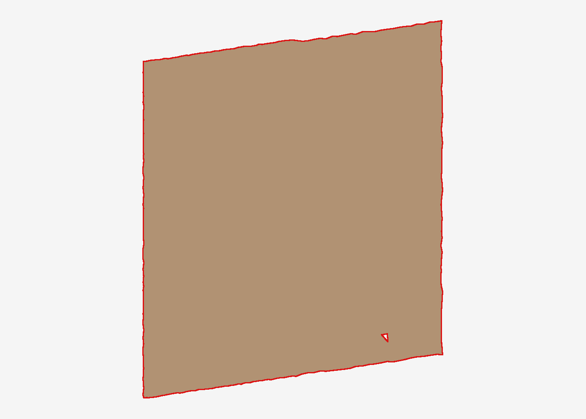 |  |  |  |  |  | 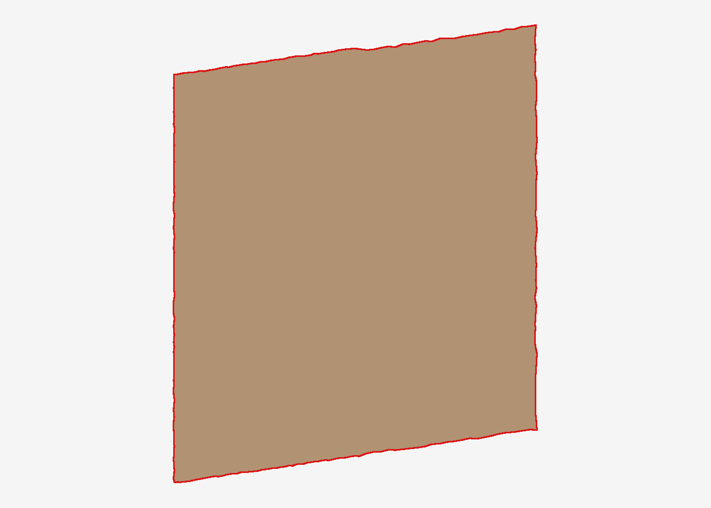 |
| triangles behind each pixel: warm = odd (a hole is seen through), cool = even |  |  |  | 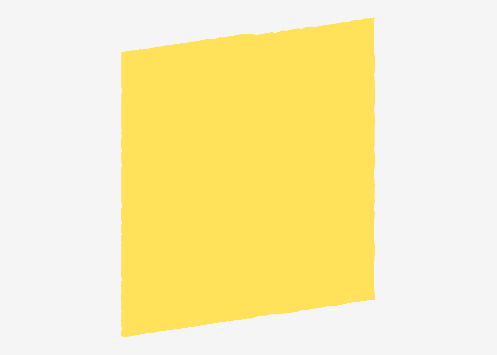 |  |  |  |  |  |  |  |
| front-facing minus back-facing: grey 0, blue +, red − |  |  |  | 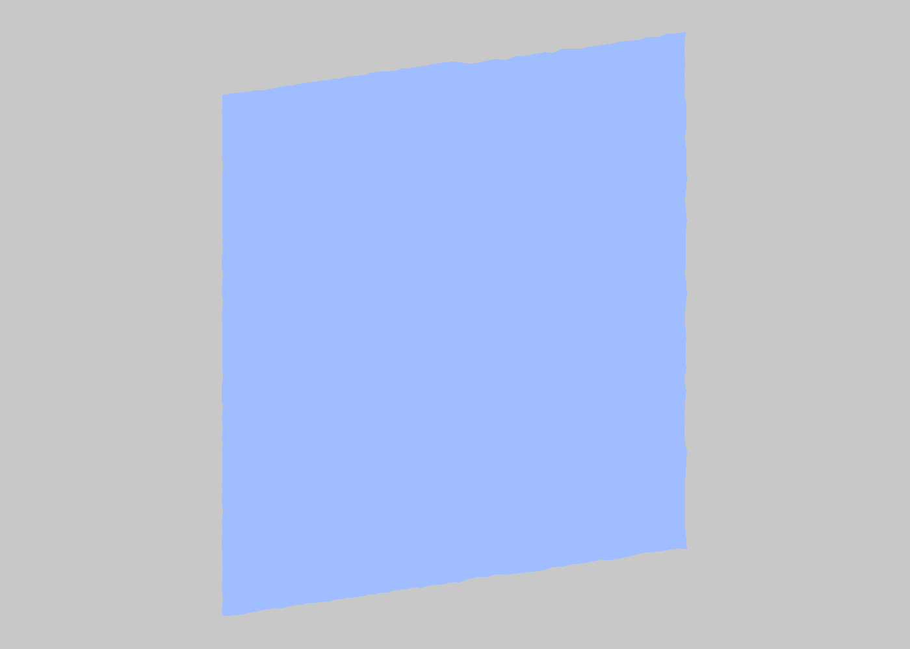 |  |  |  |  |  |  |  |
| coloured by the pass that built the triangle: blue rho = 0.0015, green 0.003 |  | 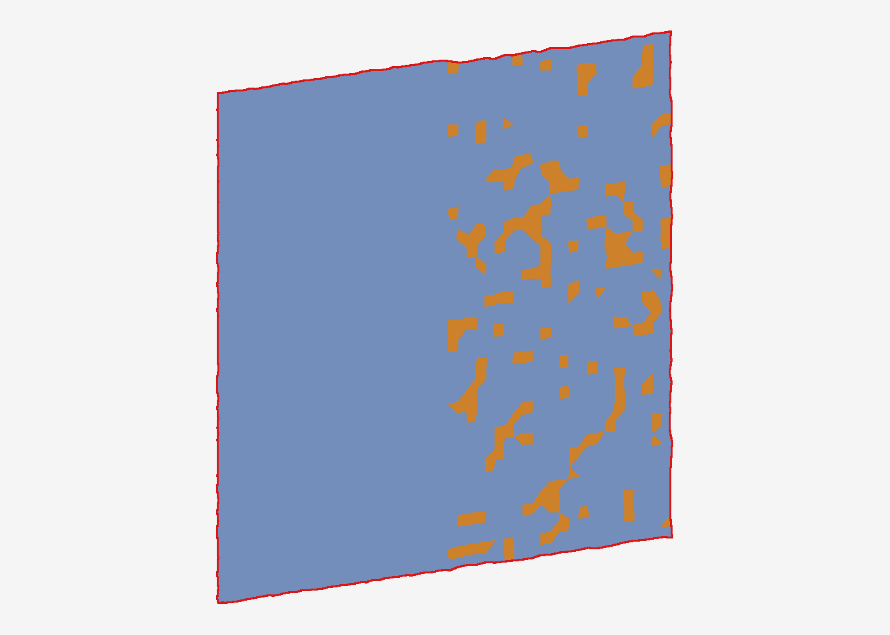 |  |  |  |  |  |  |  |  |  |

## sphere_uneven

Fibonacci sphere of radius 25 mm, 1 mm spacing above the equator and every fourth point below it (2 mm; 4909 points), radii 1.5 mm then 3 mm. Expected: closed, chi = 2, every point used, 2V - 4 triangles.

input: `-i /Users/csilva/src/BPA.jl/compare/results/inputs/sphere_uneven.off`, rho = 0.0015,0.003, 4909 points

|  | BPA.jl | Open3D | MeshLab | Digne | Digne -p | Gruber | Gruber reseeded | bpa_rs | Schmehla | Giaccari | bpa fork |
|---|---|---|---|---|---|---|---|---|---|---|---|
| triangles | 9814 | 9814 | n/a | 9814 | 9814 | n/a | n/a | n/a | n/a | n/a | 9814 |
| triangles per pass (one radius, then each further one) | 8300 + 1514 | 8300 + 1514 | n/a | 8300 + 1514 | 8300 + 1514 | n/a | n/a | n/a | n/a | n/a | 8300 + 1514 |
| reconstruction time (s) | 0.02 | 0.031 | n/a | 0.048 | 0.03 | n/a | n/a | n/a | n/a | n/a | 0.01 |
| vertices used | 4909 | 4909 | n/a | 4909 | 4909 | n/a | n/a | n/a | n/a | n/a | 4909 |
| boundary edges | 0 | 0 | n/a | 0 | 0 | n/a | n/a | n/a | n/a | n/a | 0 |
| boundary loops | 0 | 0 | n/a | 0 | 0 | n/a | n/a | n/a | n/a | n/a | 0 |
| components | 1 | 1 | n/a | 1 | 1 | n/a | n/a | n/a | n/a | n/a | 1 |
| largest component (triangles) | 9814 | 9814 | n/a | 9814 | 9814 | n/a | n/a | n/a | n/a | n/a | 9814 |
| Euler characteristic | 2 | 2 | n/a | 2 | 2 | n/a | n/a | n/a | n/a | n/a | 2 |
| orientable | yes | yes | n/a | yes | yes | n/a | n/a | n/a | n/a | n/a | yes |
| edge-manifold | yes | yes | n/a | yes | yes | n/a | n/a | n/a | n/a | n/a | yes |
| vertex-manifold | yes | yes | n/a | yes | yes | n/a | n/a | n/a | n/a | n/a | yes |
| duplicate triangles | 0 | 0 | n/a | 0 | 0 | n/a | n/a | n/a | n/a | n/a | 0 |
| valid | 9814 | 9814 | n/a | 9814 | 9814 | n/a | n/a | n/a | n/a | n/a | 9814 |
| valid_reversed_winding | 0 | 0 | n/a | 0 | 0 | n/a | n/a | n/a | n/a | n/a | 0 |
| ball_not_empty_tie | 0 | 0 | n/a | 0 | 0 | n/a | n/a | n/a | n/a | n/a | 0 |
| ball_not_empty | 0 | 0 | n/a | 0 | 0 | n/a | n/a | n/a | n/a | n/a | 0 |
| circumradius_too_large | 0 | 0 | n/a | 0 | 0 | n/a | n/a | n/a | n/a | n/a | 0 |
| degenerate | 0 | 0 | n/a | 0 | 0 | n/a | n/a | n/a | n/a | n/a | 0 |
| deepest intrusion / rho | 0.00e+00 | 0.00e+00 | n/a | 0.00e+00 | 0.00e+00 | n/a | n/a | n/a | n/a | n/a | 0.00e+00 |
| render: odd-parity pixels (holes seen through) | 0.00% | 0.00% | n/a | 0.00% | 0.00% | n/a | n/a | n/a | n/a | n/a | 0.00% |
| render: pixels with front ≠ back | 0.00% | 0.00% | n/a | 0.00% | 0.00% | n/a | n/a | n/a | n/a | n/a | 0.00% |

triangle sets against BPA.jl:

|  | common | same winding | only in BPA.jl | only in the other | edges of only-in-BPA.jl triangles present in the other (0/1/2/3) | edges of only-in-other triangles present in BPA.jl (0/1/2/3) |
|---|---|---|---|---|---|---|
| Open3D | 9814 | 9814 | 0 | 0 | 0/0/0/0 | 0/0/0/0 |
| Digne | 9814 | 9814 | 0 | 0 | 0/0/0/0 | 0/0/0/0 |
| Digne -p | 9814 | 9814 | 0 | 0 | 0/0/0/0 | 0/0/0/0 |
| bpa fork | 9814 | 9814 | 0 | 0 | 0/0/0/0 | 0/0/0/0 |

renderings (`sphere_uneven/render/`, view 30.0°):

|  | BPA.jl | Open3D | MeshLab | Digne | Digne -p | Gruber | Gruber reseeded | bpa_rs | Schmehla | Giaccari | bpa fork |
|---|---|---|---|---|---|---|---|---|---|---|---|
| shaded, boundary edges in red |  |  |  |  | 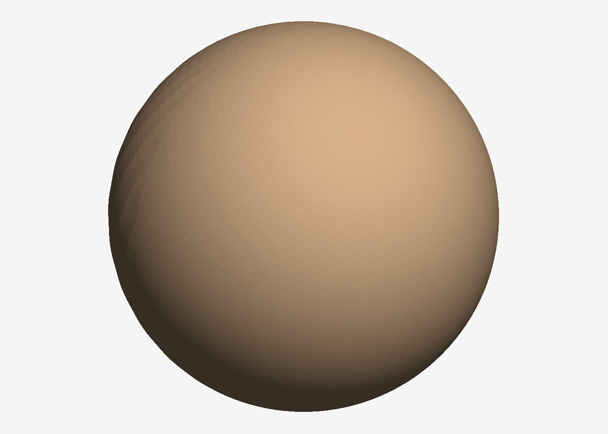 |  |  |  |  |  |  |
| triangles behind each pixel: warm = odd (a hole is seen through), cool = even |  |  |  |  | 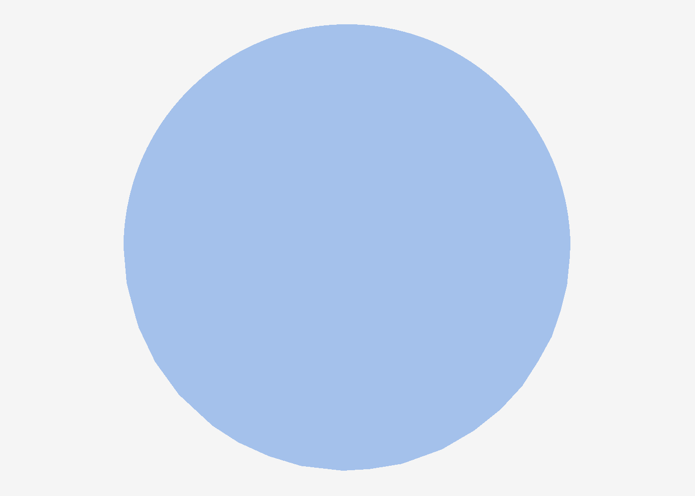 |  |  |  |  |  |  |
| front-facing minus back-facing: grey 0, blue +, red − |  |  |  |  |  |  |  |  |  |  |  |
| coloured by the pass that built the triangle: blue rho = 0.0015, green 0.003 |  |  |  | 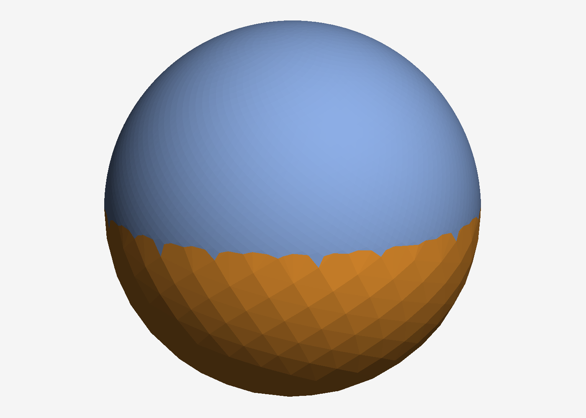 |  |  |  |  |  |  |  |

## torus_uneven

jittered torus (R = 20 mm, r = 8 mm), a 126 x 50 lattice at 1 mm for y >= 0 and 63 x 25 at 2 mm for y < 0 (3942 points), radii 1.5 mm then 3 mm. Expected: closed, chi = 0, every point used.

input: `-i /Users/csilva/src/BPA.jl/compare/results/inputs/torus_uneven.off`, rho = 0.0015,0.003, 3942 points

|  | BPA.jl | Open3D | MeshLab | Digne | Digne -p | Gruber | Gruber reseeded | bpa_rs | Schmehla | Giaccari | bpa fork |
|---|---|---|---|---|---|---|---|---|---|---|---|
| triangles | 7884 | 7878 | n/a | 7878 | 7874 | n/a | n/a | n/a | n/a | n/a | 7884 |
| triangles per pass (one radius, then each further one) | 7364 + 520 | 7360 + 518 | n/a | 7362 + 516 | 7360 + 514 | n/a | n/a | n/a | n/a | n/a | 7360 + 524 |
| reconstruction time (s) | 0.01 | 0.025 | n/a | 0.038 | 0.021 | n/a | n/a | n/a | n/a | n/a | 0.008 |
| vertices used | 3942 | 3942 | n/a | 3942 | 3942 | n/a | n/a | n/a | n/a | n/a | 3942 |
| boundary edges | 0 | 18 | n/a | 18 | 30 | n/a | n/a | n/a | n/a | n/a | 0 |
| boundary loops | 0 | 2 | n/a | 2 | 6 | n/a | n/a | n/a | n/a | n/a | 0 |
| components | 1 | 1 | n/a | 1 | 1 | n/a | n/a | n/a | n/a | n/a | 1 |
| largest component (triangles) | 7884 | 7878 | n/a | 7878 | 7874 | n/a | n/a | n/a | n/a | n/a | 7884 |
| Euler characteristic | 0 | -6 | n/a | -6 | -10 | n/a | n/a | n/a | n/a | n/a | 0 |
| orientable | yes | yes | n/a | yes | yes | n/a | n/a | n/a | n/a | n/a | yes |
| edge-manifold | yes | yes | n/a | yes | yes | n/a | n/a | n/a | n/a | n/a | yes |
| vertex-manifold | yes | no | n/a | no | no | n/a | n/a | n/a | n/a | n/a | yes |
| duplicate triangles | 0 | 0 | n/a | 0 | 0 | n/a | n/a | n/a | n/a | n/a | 0 |
| valid | 7884 | 7878 | n/a | 7878 | 7874 | n/a | n/a | n/a | n/a | n/a | 7884 |
| valid_reversed_winding | 0 | 0 | n/a | 0 | 0 | n/a | n/a | n/a | n/a | n/a | 0 |
| ball_not_empty_tie | 0 | 0 | n/a | 0 | 0 | n/a | n/a | n/a | n/a | n/a | 0 |
| ball_not_empty | 0 | 0 | n/a | 0 | 0 | n/a | n/a | n/a | n/a | n/a | 0 |
| circumradius_too_large | 0 | 0 | n/a | 0 | 0 | n/a | n/a | n/a | n/a | n/a | 0 |
| degenerate | 0 | 0 | n/a | 0 | 0 | n/a | n/a | n/a | n/a | n/a | 0 |
| deepest intrusion / rho | 0.00e+00 | 0.00e+00 | n/a | 0.00e+00 | 0.00e+00 | n/a | n/a | n/a | n/a | n/a | 0.00e+00 |
| render: odd-parity pixels (holes seen through) | 0.00% | 0.50% | n/a | 0.50% | 0.81% | n/a | n/a | n/a | n/a | n/a | 0.00% |
| render: pixels with front ≠ back | 0.00% | 0.50% | n/a | 0.50% | 0.81% | n/a | n/a | n/a | n/a | n/a | 0.00% |

triangle sets against BPA.jl:

|  | common | same winding | only in BPA.jl | only in the other | edges of only-in-BPA.jl triangles present in the other (0/1/2/3) | edges of only-in-other triangles present in BPA.jl (0/1/2/3) |
|---|---|---|---|---|---|---|
| Open3D | 7878 | 7878 | 6 | 0 | 0/0/0/6 | 0/0/0/0 |
| Digne | 7878 | 7878 | 6 | 0 | 0/0/0/6 | 0/0/0/0 |
| Digne -p | 7874 | 7874 | 10 | 0 | 0/0/0/10 | 0/0/0/0 |
| bpa fork | 7884 | 7884 | 0 | 0 | 0/0/0/0 | 0/0/0/0 |

renderings (`torus_uneven/render/`, view 30.0°):

|  | BPA.jl | Open3D | MeshLab | Digne | Digne -p | Gruber | Gruber reseeded | bpa_rs | Schmehla | Giaccari | bpa fork |
|---|---|---|---|---|---|---|---|---|---|---|---|
| shaded, boundary edges in red |  | 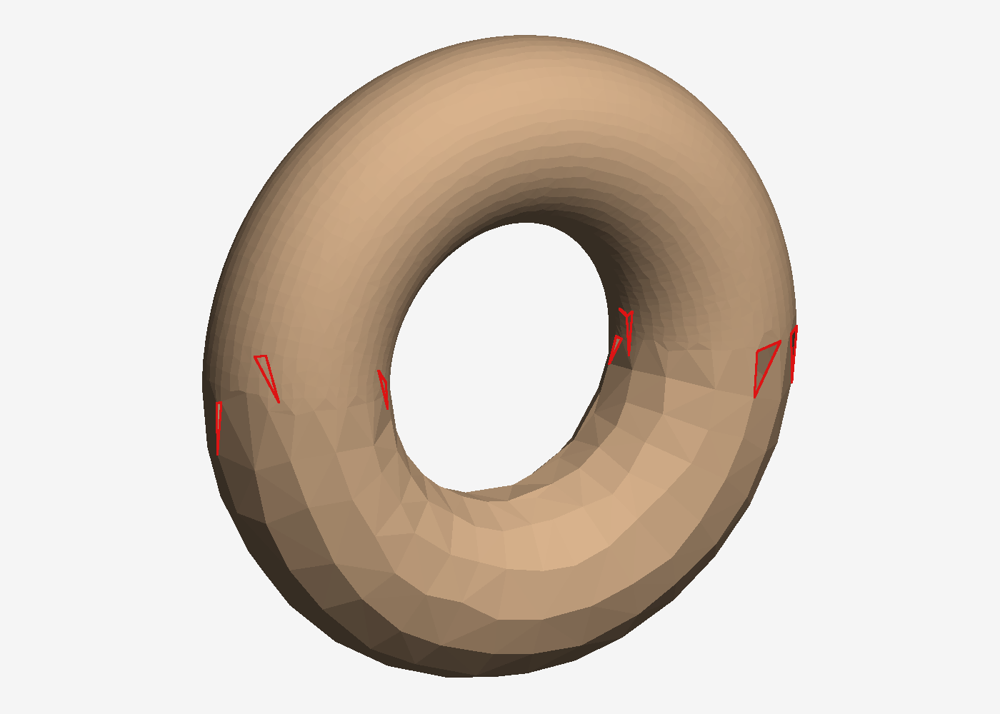 |  |  |  |  |  |  |  |  |  |
| triangles behind each pixel: warm = odd (a hole is seen through), cool = even |  |  |  |  |  |  |  |  |  |  | 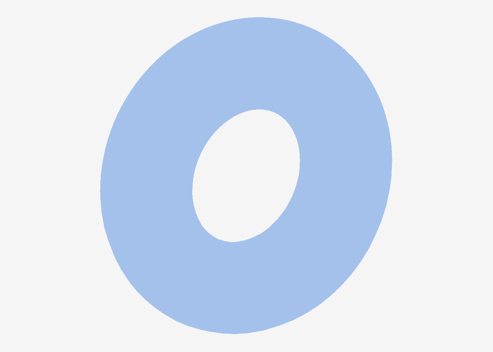 |
| front-facing minus back-facing: grey 0, blue +, red − |  | 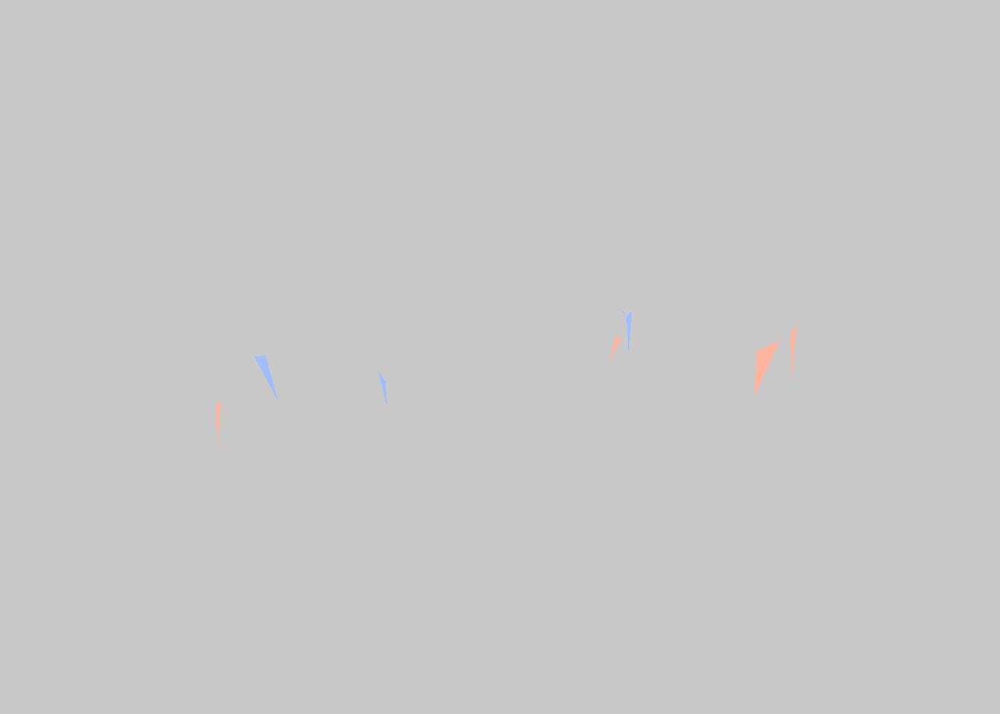 |  |  |  |  |  |  |  |  |  |
| coloured by the pass that built the triangle: blue rho = 0.0015, green 0.003 |  |  |  | 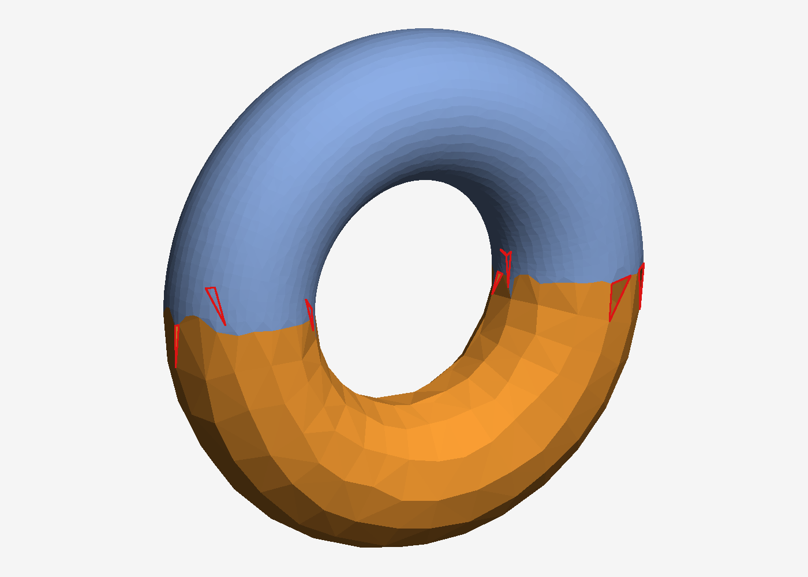 |  |  |  |  |  |  | 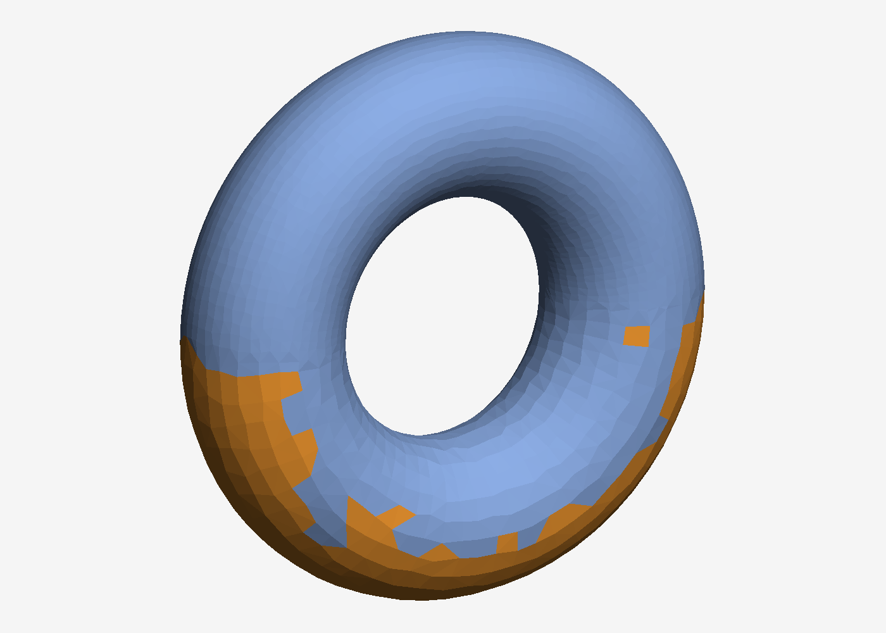 |

## bun000

a single Stanford bunny range scan (40256 points, normals from the scan's own triangles), rho = 1.25 mm: real data without overlapping layers. Expected: one open sheet with the scan's outline as boundary.

input: `-l bun000 -d /Users/csilva/src/BPA.jl/data/bunny/data`, rho = 0.00125, 40256 points

|  | BPA.jl | Open3D | MeshLab | Digne | Digne -p | Gruber | Gruber reseeded | bpa_rs | Schmehla | Giaccari | bpa fork |
|---|---|---|---|---|---|---|---|---|---|---|---|
| triangles | 78152 | 77994 | 78203 | 77941 | 77933 | 1631 | 78093 | 1631 | 134 | 75613 | 78162 |
| reconstruction time (s) | 0.12 | 0.35 | 0.276 | 0.51 | 0.308 | 0.003 | 0.128 | 0.005 | 0.206 | 0.048 | 0.091 |
| vertices used | 39759 | 39748 | 39838 | 39785 | 39785 | 883 | 39773 | 883 | 66 | 38325 | 39780 |
| boundary edges | 1418 | 1692 | 1921 | 2095 | 2137 | 137 | 1459 | 137 | 9 | 1061 | 1440 |
| boundary loops | 26 | 97 | 86 | 146 | 151 | 3 | 37 | 3 | 4 | 10 | 32 |
| components | 9 | 15 | 12 | 14 | 14 | 1 | 17 | 1 | 1 | 1 | 14 |
| largest component (triangles) | 75638 | 75473 | 75716 | 75425 | 75415 | 1631 | 75566 | 1631 | 134 | 75613 | 75637 |
| Euler characteristic | -26 | -95 | -224 | -233 | -250 | -1 | -3 | -1 | 43 | -12 | -21 |
| orientable | yes | no | yes | no | no | yes | yes | yes | no | yes | yes |
| edge-manifold | yes | yes | yes | yes | yes | yes | yes | yes | no | yes | yes |
| vertex-manifold | no | no | no | no | no | yes | yes | yes | no | yes | no |
| duplicate triangles | 0 | 0 | 0 | 0 | 0 | 0 | 0 | 0 | 41 | 0 | 0 |
| valid | 78152 | 77994 | 77754 | 77937 | 77923 | 1631 | 78085 | 1631 | 68 | 75564 | 78162 |
| valid_reversed_winding | 0 | 0 | 0 | 0 | 0 | 0 | 0 | 0 | 46 | 0 | 0 |
| ball_not_empty_tie | 0 | 0 | 0 | 0 | 0 | 0 | 0 | 0 | 0 | 0 | 0 |
| ball_not_empty | 0 | 0 | 449 | 1 | 1 | 0 | 8 | 0 | 20 | 46 | 0 |
| circumradius_too_large | 0 | 0 | 0 | 3 | 9 | 0 | 0 | 0 | 0 | 3 | 0 |
| degenerate | 0 | 0 | 0 | 0 | 0 | 0 | 0 | 0 | 0 | 0 | 0 |
| deepest intrusion / rho | 0.00e+00 | 0.00e+00 | 7.80e-01 | 1.82e-01 | 1.82e-01 | 0.00e+00 | 2.97e-01 | 0.00e+00 | 8.67e-01 | 7.79e-01 | 0.00e+00 |
| render: odd-parity pixels (holes seen through) | 98.92% | 98.92% | 98.58% | 98.91% | 98.91% | 99.47% | 98.93% | 99.47% | 11.82% | 98.88% | 98.91% |
| render: pixels with front ≠ back | 99.22% | 99.25% | 99.21% | 99.22% | 99.22% | 99.56% | 99.23% | 99.56% | 11.82% | 99.17% | 99.21% |

triangle sets against BPA.jl:

|  | common | same winding | only in BPA.jl | only in the other | edges of only-in-BPA.jl triangles present in the other (0/1/2/3) | edges of only-in-other triangles present in BPA.jl (0/1/2/3) |
|---|---|---|---|---|---|---|
| Open3D | 77804 | 77795 | 348 | 190 | 17/64/233/34 | 15/0/175/0 |
| MeshLab | 77580 | 77580 | 572 | 623 | 26/189/304/53 | 183/194/244/2 |
| Digne | 77742 | 77737 | 410 | 199 | 0/6/210/194 | 16/2/181/0 |
| Digne -p | 77725 | 77720 | 427 | 208 | 0/6/216/205 | 16/7/185/0 |
| Gruber | 1631 | 1631 | 76521 | 0 | 76520/1/0/0 | 0/0/0/0 |
| Gruber reseeded | 77867 | 77865 | 285 | 226 | 14/54/217/0 | 14/0/211/1 |
| bpa_rs | 1631 | 1631 | 76521 | 0 | 76520/1/0/0 | 0/0/0/0 |
| Schmehla | 70 | 34 | 78082 | 23 | 78057/13/9/3 | 2/7/14/0 |
| Giaccari | 75358 | 75358 | 2794 | 255 | 2534/58/202/0 | 18/28/205/4 |
| bpa fork | 77974 | 77974 | 178 | 188 | 0/1/177/0 | 11/0/177/0 |

renderings (`bun000/render/`, view 30.0°):

|  | BPA.jl | Open3D | MeshLab | Digne | Digne -p | Gruber | Gruber reseeded | bpa_rs | Schmehla | Giaccari | bpa fork |
|---|---|---|---|---|---|---|---|---|---|---|---|
| shaded, boundary edges in red |  |  |  | 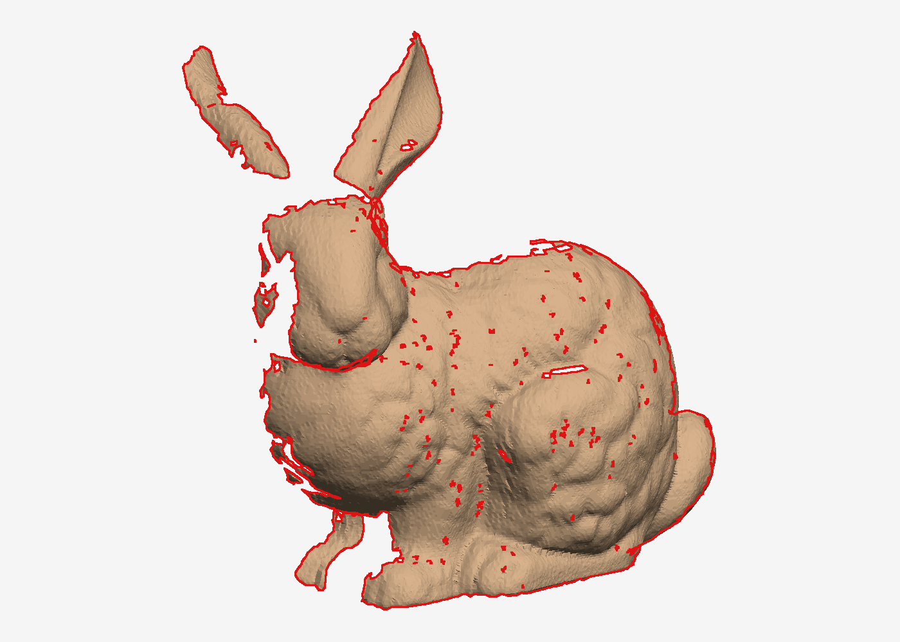 |  |  |  | 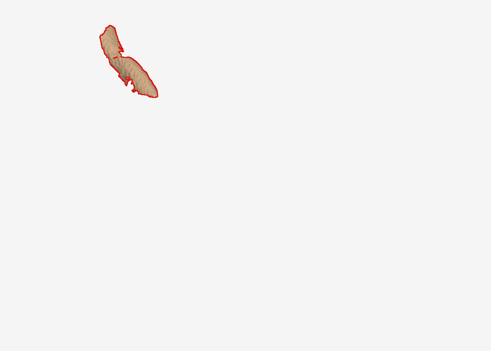 |  | 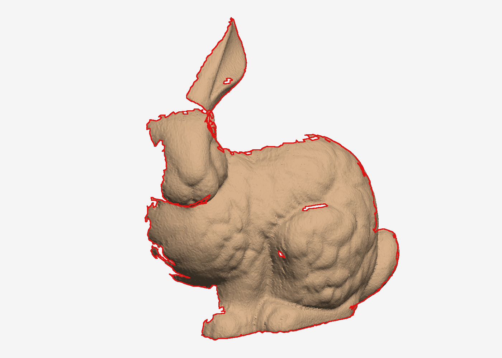 | 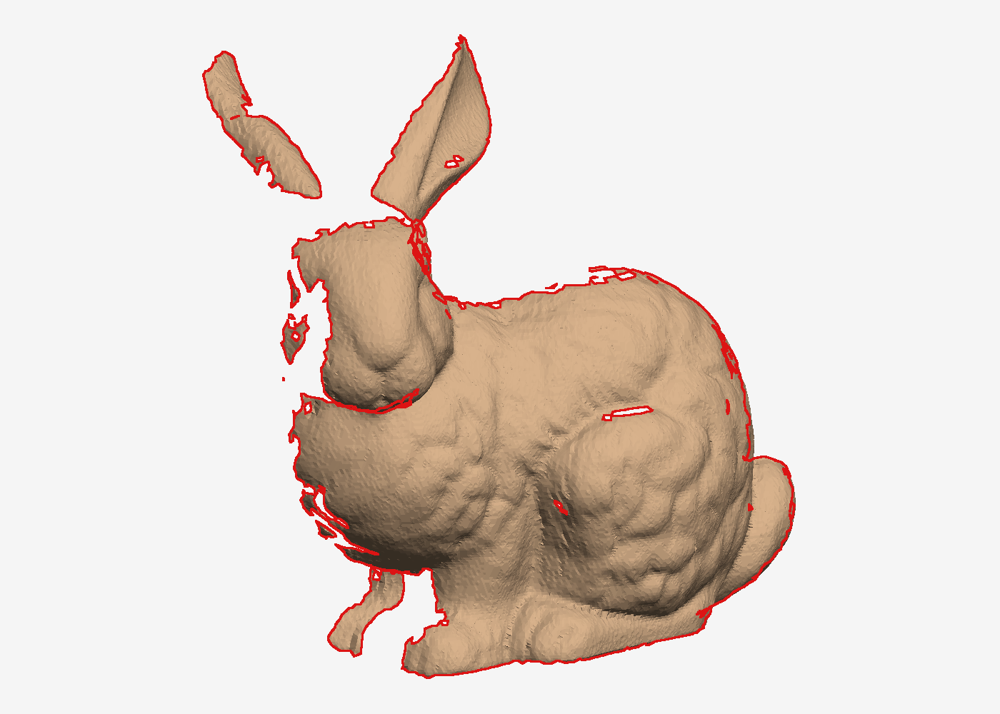 |
| triangles behind each pixel: warm = odd (a hole is seen through), cool = even |  |  |  |  | 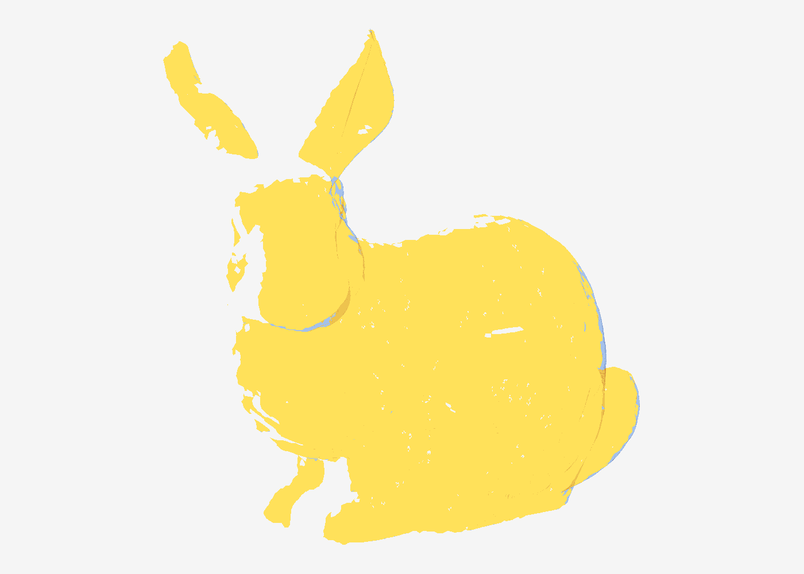 |  |  |  |  | 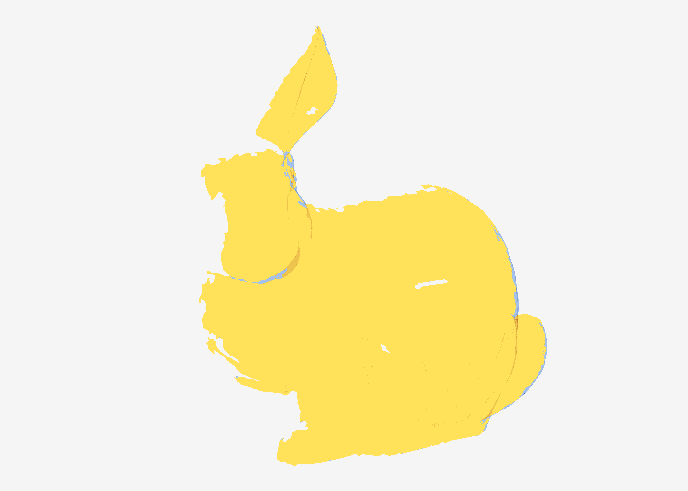 |  |
| front-facing minus back-facing: grey 0, blue +, red − |  |  |  |  |  |  |  | 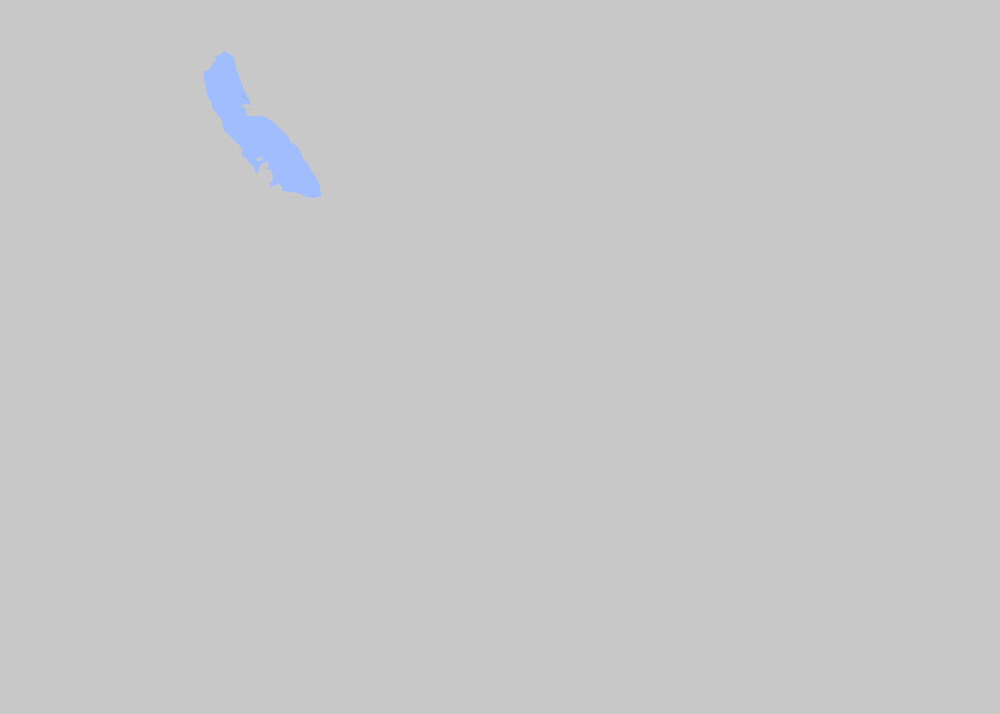 |  | 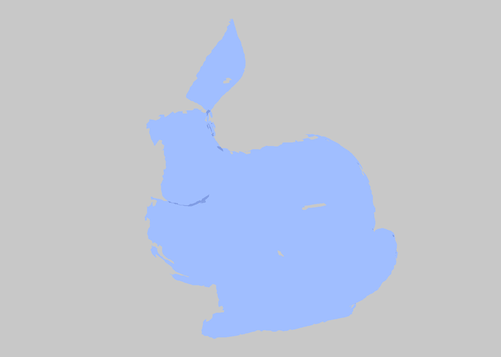 |  |

input scans: 

## bunny4_r0.0008

four registered bunny body scans (150983 points), rho = 0.8 mm, close to the layer separation of the overlapping scans: the hardest case for the empty-ball property.

input: `-l bun000,bun045,bun090,bun180 -d /Users/csilva/src/BPA.jl/data/bunny/data`, rho = 0.0008, 150983 points

|  | BPA.jl | Open3D | MeshLab | Digne | Digne -p | Gruber | Gruber reseeded | bpa_rs | Schmehla | Giaccari | bpa fork |
|---|---|---|---|---|---|---|---|---|---|---|---|
| triangles | 239041 | 237204 | 256474 | 238054 | 238061 | 236662 | 238317 | 236662 | 10 | 244053 | 239022 |
| reconstruction time (s) | 0.47 | 1.158 | 10.239 | 1.751 | 0.569 | 0.337 | 0.335 | 0.384 | 0.754 | 0.209 | 0.297 |
| vertices used | 122478 | 122347 | 133234 | 122802 | 122808 | 120826 | 122464 | 120826 | 11 | 125428 | 122473 |
| boundary edges | 6475 | 8818 | 15692 | 8690 | 8681 | 5455 | 6710 | 5455 | 10 | 7305 | 6432 |
| boundary loops | 357 | 632 | 424 | 727 | 716 | 219 | 400 | 219 | 1 | 229 | 365 |
| components | 109 | 151 | 87 | 241 | 240 | 1 | 183 | 1 | 1 | 29 | 123 |
| largest component (triangles) | 237586 | 235749 | 255142 | 236482 | 236486 | 236662 | 236662 | 236662 | 10 | 243902 | 237554 |
| Euler characteristic | -280 | -664 | -2849 | -570 | -563 | -232 | -49 | -232 | 1 | -251 | -254 |
| orientable | yes | no | yes | yes | yes | no | no | no | yes | yes | yes |
| edge-manifold | yes | yes | yes | yes | yes | no | no | no | yes | yes | yes |
| vertex-manifold | no | no | no | no | no | no | no | no | yes | yes | no |
| duplicate triangles | 0 | 0 | 0 | 0 | 0 | 0 | 0 | 0 | 0 | 0 | 0 |
| valid | 239041 | 237193 | 20356 | 237920 | 237938 | 236572 | 238217 | 236572 | 0 | 235599 | 239022 |
| valid_reversed_winding | 0 | 11 | 83630 | 0 | 0 | 0 | 0 | 0 | 10 | 283 | 0 |
| ball_not_empty_tie | 0 | 0 | 1 | 0 | 0 | 0 | 0 | 0 | 0 | 0 | 0 |
| ball_not_empty | 0 | 0 | 152487 | 5 | 6 | 90 | 95 | 90 | 0 | 8145 | 0 |
| circumradius_too_large | 0 | 0 | 0 | 129 | 117 | 0 | 5 | 0 | 0 | 26 | 0 |
| degenerate | 0 | 0 | 0 | 0 | 0 | 0 | 0 | 0 | 0 | 0 | 0 |
| deepest intrusion / rho | 0.00e+00 | 0.00e+00 | 9.84e-01 | 2.33e-01 | 2.33e-01 | 5.12e-01 | 5.56e-01 | 5.12e-01 | 0.00e+00 | 9.66e-01 | 0.00e+00 |
| render: odd-parity pixels (holes seen through) | 26.28% | 27.59% | 38.13% | 27.03% | 27.01% | 27.65% | 26.81% | 27.65% | 92.31% | 30.18% | 26.29% |
| render: pixels with front ≠ back | 26.93% | 28.27% | 44.51% | 27.68% | 27.67% | 28.41% | 27.47% | 28.41% | 92.31% | 31.98% | 26.94% |

triangle sets against BPA.jl:

|  | common | same winding | only in BPA.jl | only in the other | edges of only-in-BPA.jl triangles present in the other (0/1/2/3) | edges of only-in-other triangles present in BPA.jl (0/1/2/3) |
|---|---|---|---|---|---|---|
| Open3D | 236959 | 236935 | 2082 | 245 | 238/1155/405/284 | 68/30/145/2 |
| MeshLab | 102553 | 18738 | 136488 | 153921 | 42744/58737/34612/395 | 68537/46040/39022/322 |
| Digne | 237697 | 237697 | 1344 | 357 | 100/449/462/333 | 169/28/158/2 |
| Digne -p | 237722 | 237722 | 1319 | 339 | 93/446/447/333 | 167/30/140/2 |
| Gruber | 236407 | 236404 | 2634 | 255 | 1840/511/269/14 | 6/30/192/27 |
| Gruber reseeded | 238016 | 238012 | 1025 | 301 | 160/578/273/14 | 46/35/193/27 |
| bpa_rs | 236407 | 236404 | 2634 | 255 | 1840/511/269/14 | 6/30/192/27 |
| Schmehla | 10 | 0 | 239031 | 0 | 239031/0/0/0 | 0/0/0/0 |
| Giaccari | 235377 | 235096 | 3664 | 8676 | 2210/1087/352/15 | 7584/591/432/69 |
| bpa fork | 238835 | 238826 | 206 | 187 | 40/17/147/2 | 27/10/147/3 |

renderings (`bunny4_r0.0008/render/`, view 30.0°):

|  | BPA.jl | Open3D | MeshLab | Digne | Digne -p | Gruber | Gruber reseeded | bpa_rs | Schmehla | Giaccari | bpa fork |
|---|---|---|---|---|---|---|---|---|---|---|---|
| shaded, boundary edges in red |  |  |  |  |  |  |  | 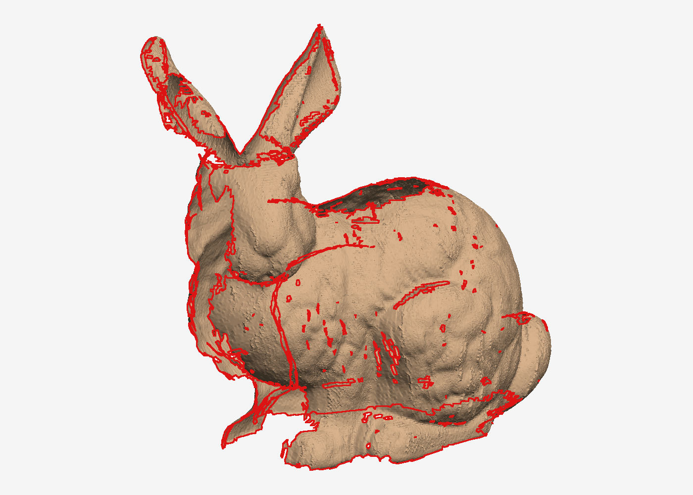 |  | 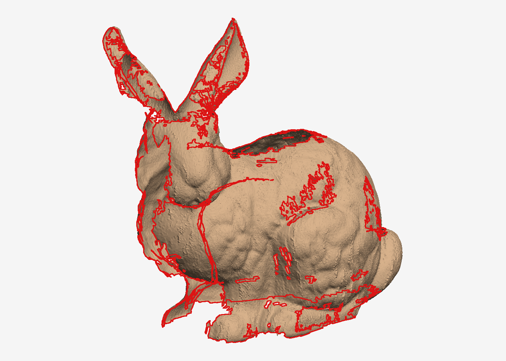 |  |
| triangles behind each pixel: warm = odd (a hole is seen through), cool = even |  |  |  |  | 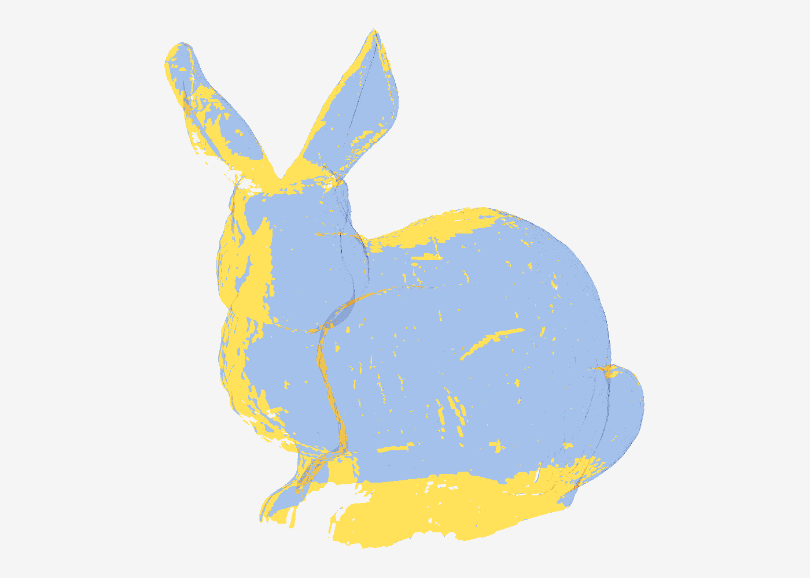 |  |  | 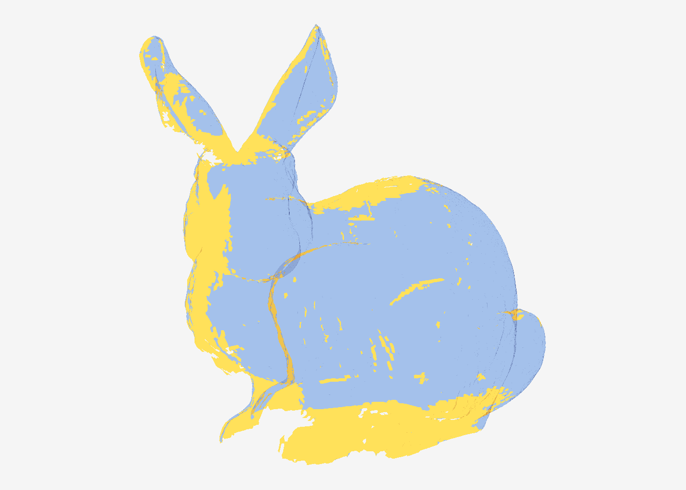 |  | 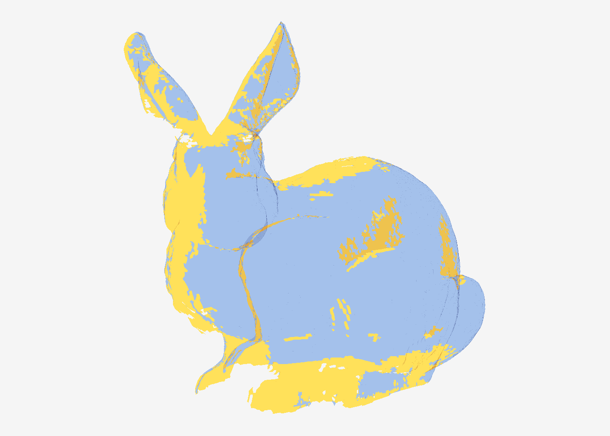 |  |
| front-facing minus back-facing: grey 0, blue +, red − |  |  |  |  |  | 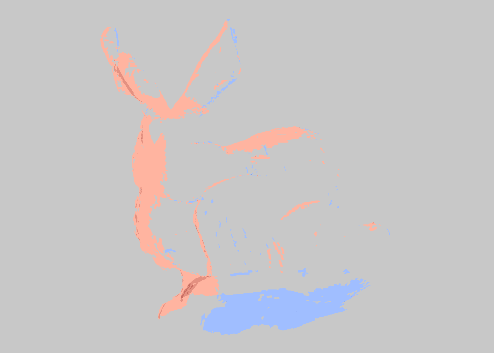 | 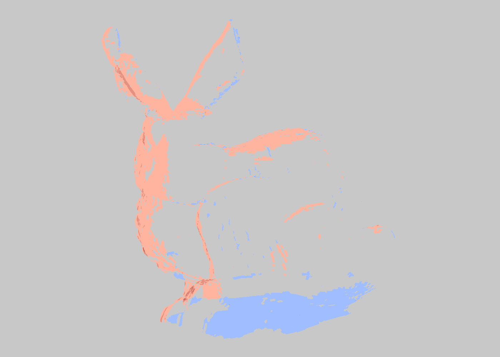 |  |  | 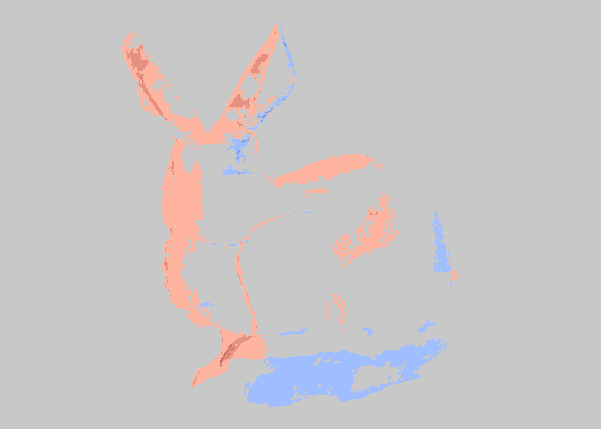 |  |

input scans: 

## bunny4_r0.0015

the same four scans at rho = 1.5 mm, where the ball rides over the overlap layers.

input: `-l bun000,bun045,bun090,bun180 -d /Users/csilva/src/BPA.jl/data/bunny/data`, rho = 0.0015, 150983 points

|  | BPA.jl | Open3D | MeshLab | Digne | Digne -p | Gruber | Gruber reseeded | bpa_rs | Schmehla | Giaccari | bpa fork |
|---|---|---|---|---|---|---|---|---|---|---|---|
| triangles | 202958 | 201124 | 218720 | 202474 | 202440 | 202501 | 202581 | 202517 | 201 | 245099 | 202968 |
| reconstruction time (s) | 0.74 | 7.083 | 15.871 | 14.627 | 5.657 | 0.669 | 0.662 | 0.768 | 0.762 | 0.344 | 0.506 |
| vertices used | 102271 | 102125 | 113527 | 103541 | 103551 | 102199 | 102283 | 102200 | 108 | 129371 | 102285 |
| boundary edges | 1732 | 3918 | 28558 | 4772 | 4932 | 2077 | 2143 | 2055 | 32 | 15259 | 1758 |
| boundary loops | 60 | 315 | 512 | 727 | 736 | 89 | 100 | 85 | 5 | 746 | 62 |
| components | 3 | 30 | 5 | 420 | 417 | 1 | 12 | 1 | 1 | 107 | 4 |
| largest component (triangles) | 202898 | 201009 | 218664 | 201946 | 201917 | 202501 | 202501 | 202517 | 201 | 244464 | 202907 |
| Euler characteristic | -74 | -396 | -10112 | -82 | -135 | -90 | -79 | -86 | 60 | -808 | -78 |
| orientable | yes | no | yes | no | no | yes | yes | yes | no | yes | yes |
| edge-manifold | yes | yes | yes | yes | yes | yes | yes | yes | no | yes | yes |
| vertex-manifold | no | no | no | no | no | no | no | no | no | yes | no |
| duplicate triangles | 0 | 0 | 0 | 0 | 0 | 0 | 0 | 0 | 50 | 0 | 0 |
| valid | 202958 | 201104 | 148442 | 202020 | 201972 | 202480 | 202557 | 202496 | 110 | 195984 | 202968 |
| valid_reversed_winding | 0 | 20 | 4146 | 2 | 2 | 0 | 0 | 0 | 51 | 1232 | 0 |
| ball_not_empty_tie | 0 | 0 | 3 | 0 | 0 | 6 | 6 | 6 | 0 | 1 | 0 |
| ball_not_empty | 0 | 0 | 66129 | 5 | 6 | 15 | 16 | 15 | 40 | 47874 | 0 |
| circumradius_too_large | 0 | 0 | 0 | 447 | 460 | 0 | 2 | 0 | 0 | 8 | 0 |
| degenerate | 0 | 0 | 0 | 0 | 0 | 0 | 0 | 0 | 0 | 0 | 0 |
| deepest intrusion / rho | 0.00e+00 | 0.00e+00 | 9.80e-01 | 1.21e-01 | 1.21e-01 | 1.91e-01 | 2.44e-01 | 1.91e-01 | 6.91e-01 | 9.72e-01 | 0.00e+00 |
| render: odd-parity pixels (holes seen through) | 19.20% | 21.56% | 35.36% | 20.53% | 20.58% | 19.89% | 19.82% | 19.87% | 14.74% | 42.34% | 19.16% |
| render: pixels with front ≠ back | 19.34% | 21.80% | 44.67% | 20.71% | 20.76% | 20.05% | 19.99% | 20.04% | 14.74% | 44.66% | 19.30% |

triangle sets against BPA.jl:

|  | common | same winding | only in BPA.jl | only in the other | edges of only-in-BPA.jl triangles present in the other (0/1/2/3) | edges of only-in-other triangles present in BPA.jl (0/1/2/3) |
|---|---|---|---|---|---|---|
| Open3D | 200634 | 200595 | 2324 | 490 | 169/1275/718/162 | 37/6/447/0 |
| MeshLab | 151975 | 147789 | 50983 | 66745 | 7140/34350/8518/975 | 35428/15275/15062/980 |
| Digne | 201518 | 201502 | 1440 | 956 | 41/371/704/324 | 475/11/470/0 |
| Digne -p | 201452 | 201436 | 1506 | 988 | 31/372/739/364 | 476/22/490/0 |
| Gruber | 202065 | 202060 | 893 | 436 | 99/259/531/4 | 0/6/428/2 |
| Gruber reseeded | 202135 | 202130 | 823 | 446 | 27/261/531/4 | 10/6/428/2 |
| bpa_rs | 202076 | 202070 | 882 | 441 | 99/246/533/4 | 0/6/433/2 |
| Schmehla | 109 | 78 | 202849 | 42 | 202784/50/14/1 | 2/6/33/1 |
| Giaccari | 196230 | 194971 | 6728 | 48869 | 1792/3494/1384/58 | 46580/975/1295/19 |
| bpa fork | 202544 | 202543 | 414 | 424 | 0/1/410/3 | 9/4/411/0 |

renderings (`bunny4_r0.0015/render/`, view 30.0°):

|  | BPA.jl | Open3D | MeshLab | Digne | Digne -p | Gruber | Gruber reseeded | bpa_rs | Schmehla | Giaccari | bpa fork |
|---|---|---|---|---|---|---|---|---|---|---|---|
| shaded, boundary edges in red |  |  |  | 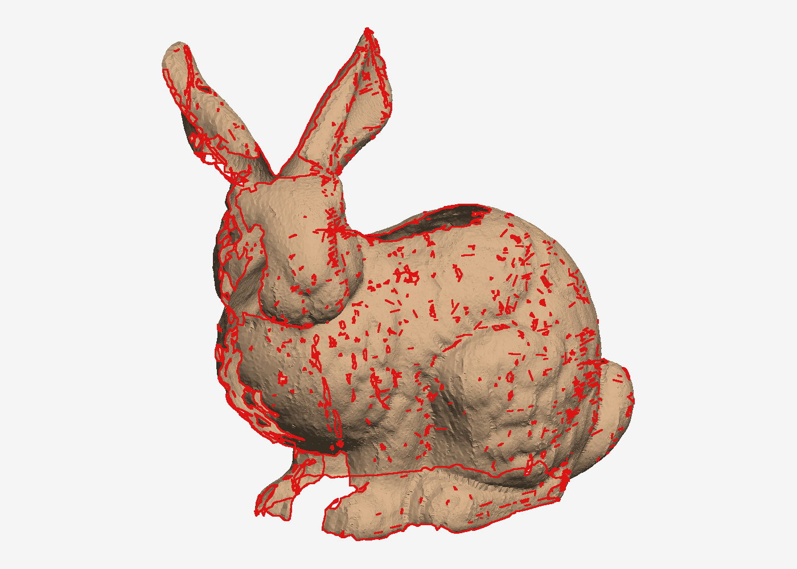 |  |  | 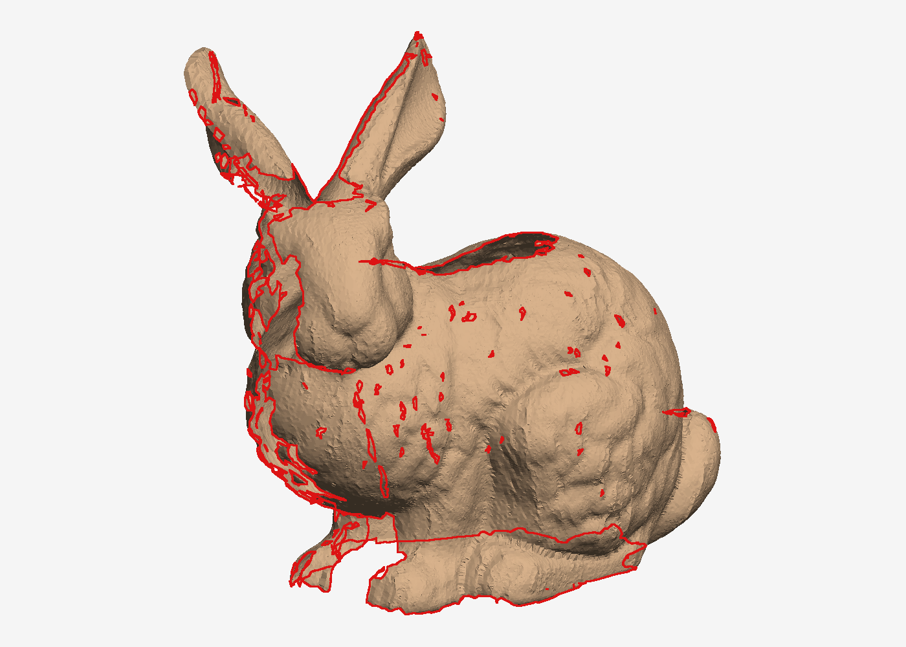 |  | 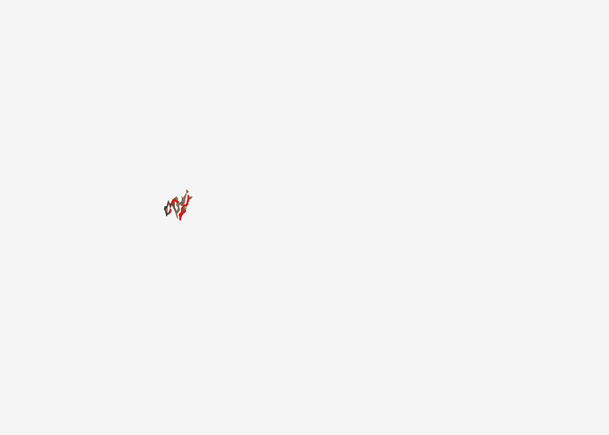 | 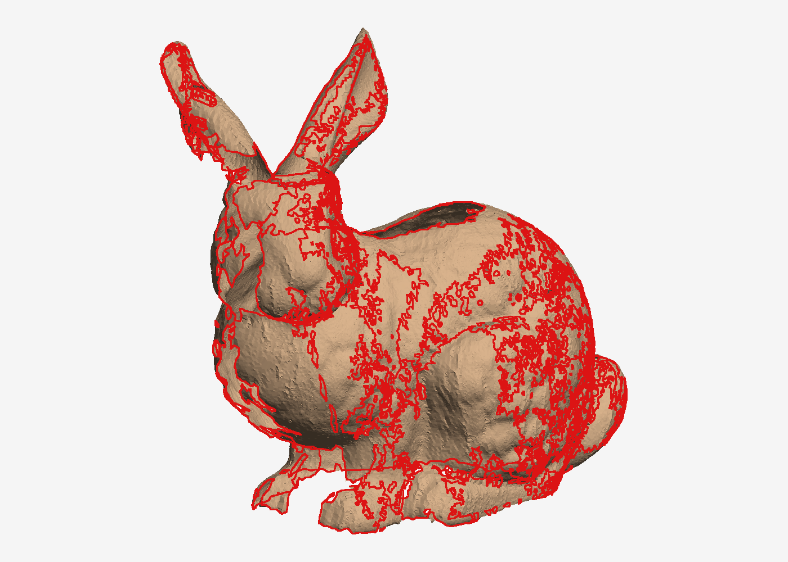 |  |
| triangles behind each pixel: warm = odd (a hole is seen through), cool = even |  |  |  |  |  |  |  |  |  | 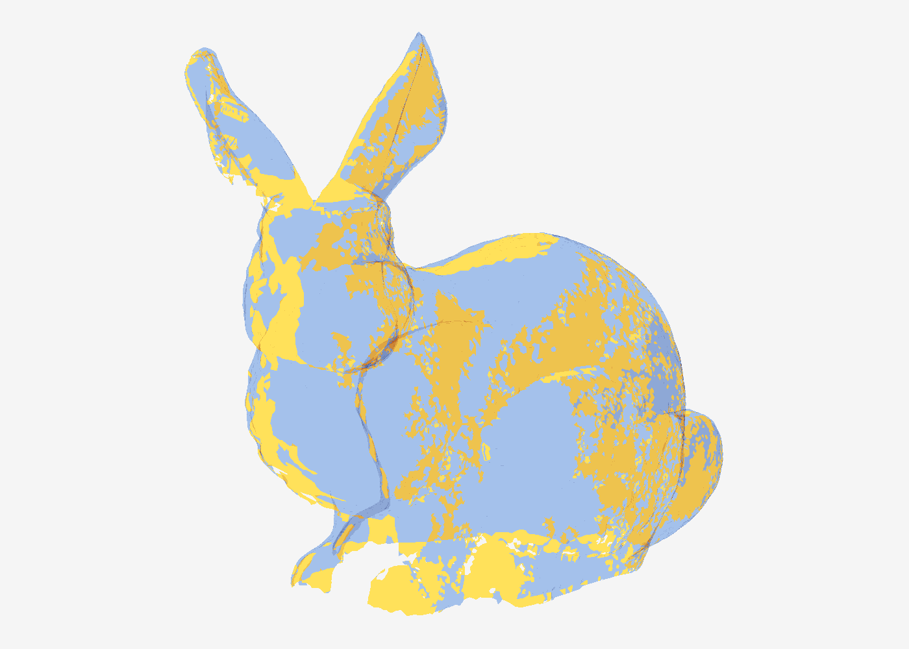 |  |
| front-facing minus back-facing: grey 0, blue +, red − |  |  |  |  |  |  |  |  |  | 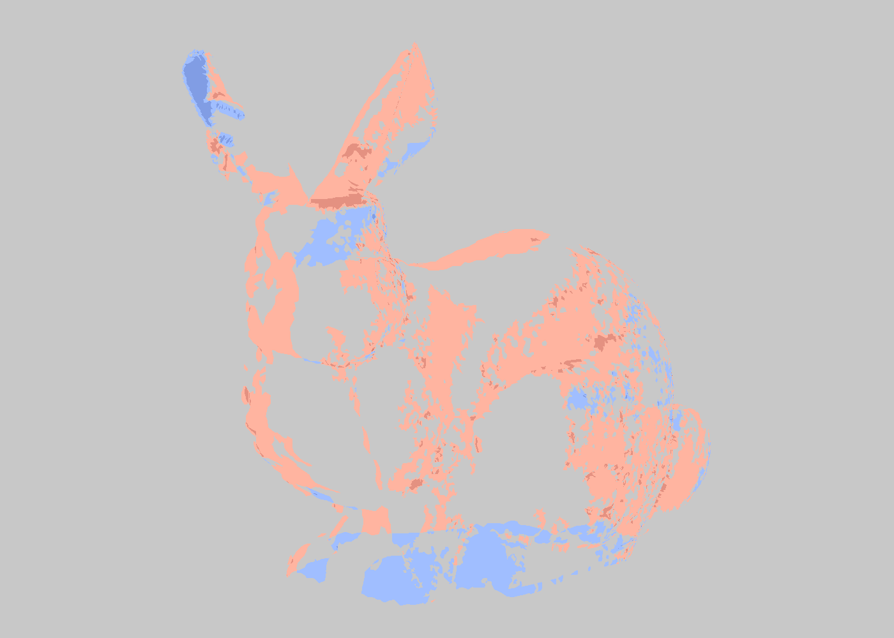 |  |

input scans: 

## bunny10_r0.00125

all ten bunny scans (362272 points), rho = 1.25 mm, the package's reference reconstruction.

input: `-l bun000,bun045,bun090,bun180,bun270,bun315,chin,ear_back,top2,top3 -d /Users/csilva/src/BPA.jl/data/bunny/data`, rho = 0.00125, 362272 points

|  | BPA.jl | Open3D | MeshLab | Digne | Digne -p | Gruber | Gruber reseeded | bpa_rs | Schmehla | Giaccari | bpa fork |
|---|---|---|---|---|---|---|---|---|---|---|---|
| triangles | 323934 | 317975 | 477737 | 323808 | 323783 | 323175 | 323224 | 323175 | 0 | 540947 | 323920 |
| reconstruction time (s) | 1.61 | 36.63 | 294.74 | 81.82 | 38.681 | 1.401 | 1.402 | 1.757 | 2.321 | 1.013 | 1.115 |
| vertices used | 162289 | 161945 | 253390 | 168141 | 168134 | 162226 | 162343 | 162226 | 0 | 283969 | 162289 |
| boundary edges | 806 | 8125 | 173875 | 10696 | 10733 | 1601 | 1718 | 1601 | 0 | 30293 | 856 |
| boundary loops | 107 | 938 | 715 | 2572 | 2578 | 157 | 191 | 157 | 0 | 1777 | 121 |
| components | 17 | 97 | 1 | 1899 | 1898 | 1 | 35 | 1 | 0 | 77 | 17 |
| largest component (triangles) | 323910 | 317864 | 477737 | 321686 | 321665 | 323175 | 323175 | 323175 | 0 | 540327 | 323896 |
| Euler characteristic | -81 | -1105 | -72416 | 889 | 876 | -162 | -128 | -162 | 0 | -1651 | -99 |
| orientable | yes | no | yes | no | yes | yes | yes | yes | yes | yes | yes |
| edge-manifold | yes | yes | yes | yes | yes | yes | yes | yes | yes | yes | yes |
| vertex-manifold | no | no | no | no | no | no | no | no | yes | yes | no |
| duplicate triangles | 0 | 0 | 0 | 0 | 0 | 0 | 0 | 0 | 0 | 0 | 0 |
| valid | 323934 | 317918 | 186867 | 321745 | 321731 | 323109 | 323155 | 323109 | 0 | 326730 | 323920 |
| valid_reversed_winding | 0 | 57 | 174 | 3 | 3 | 0 | 0 | 0 | 0 | 39 | 0 |
| ball_not_empty_tie | 0 | 0 | 12 | 0 | 0 | 15 | 15 | 15 | 0 | 0 | 0 |
| ball_not_empty | 0 | 0 | 290684 | 8 | 8 | 51 | 52 | 51 | 0 | 214178 | 0 |
| circumradius_too_large | 0 | 0 | 0 | 2052 | 2041 | 0 | 2 | 0 | 0 | 0 | 0 |
| degenerate | 0 | 0 | 0 | 0 | 0 | 0 | 0 | 0 | 0 | 0 | 0 |
| deepest intrusion / rho | 0.00e+00 | 0.00e+00 | 9.89e-01 | 3.53e-01 | 3.53e-01 | 1.17e-01 | 1.17e-01 | 1.17e-01 | 0.00e+00 | 9.91e-01 | 0.00e+00 |
| render: odd-parity pixels (holes seen through) | 3.92% | 8.84% | 48.21% | 6.12% | 6.13% | 4.54% | 4.59% | 4.54% | n/a | 36.85% | 3.95% |
| render: pixels with front ≠ back | 3.97% | 8.98% | 59.27% | 6.20% | 6.22% | 4.60% | 4.64% | 4.60% | n/a | 37.06% | 4.00% |

triangle sets against BPA.jl:

|  | common | same winding | only in BPA.jl | only in the other | edges of only-in-BPA.jl triangles present in the other (0/1/2/3) | edges of only-in-other triangles present in BPA.jl (0/1/2/3) |
|---|---|---|---|---|---|---|
| Open3D | 317668 | 317610 | 6266 | 307 | 533/4395/833/505 | 86/7/214/0 |
| MeshLab | 186593 | 186475 | 137341 | 291144 | 27109/86878/19718/3636 | 209283/55330/25063/1468 |
| Digne | 321444 | 321443 | 2490 | 2364 | 97/938/805/650 | 2104/31/229/0 |
| Digne -p | 321441 | 321440 | 2493 | 2342 | 95/944/796/658 | 2099/26/217/0 |
| Gruber | 322865 | 322864 | 1069 | 310 | 46/549/447/27 | 0/17/272/21 |
| Gruber reseeded | 322884 | 322883 | 1050 | 340 | 27/549/447/27 | 28/19/272/21 |
| bpa_rs | 322863 | 322862 | 1071 | 312 | 46/549/449/27 | 0/17/274/21 |
| Schmehla | 0 | 0 | 323934 | 0 | 323934/0/0/0 | 0/0/0/0 |
| Giaccari | 323189 | 323160 | 745 | 217758 | 136/332/270/7 | 217074/351/311/22 |
| bpa fork | 323724 | 323720 | 210 | 196 | 0/3/207/0 | 0/5/191/0 |

renderings (`bunny10_r0.00125/render/`, view 30.0°):

|  | BPA.jl | Open3D | MeshLab | Digne | Digne -p | Gruber | Gruber reseeded | bpa_rs | Schmehla | Giaccari | bpa fork |
|---|---|---|---|---|---|---|---|---|---|---|---|
| shaded, boundary edges in red |  |  |  |  | 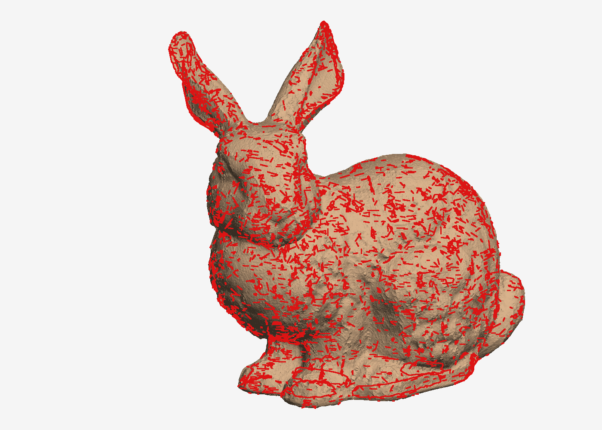 |  | 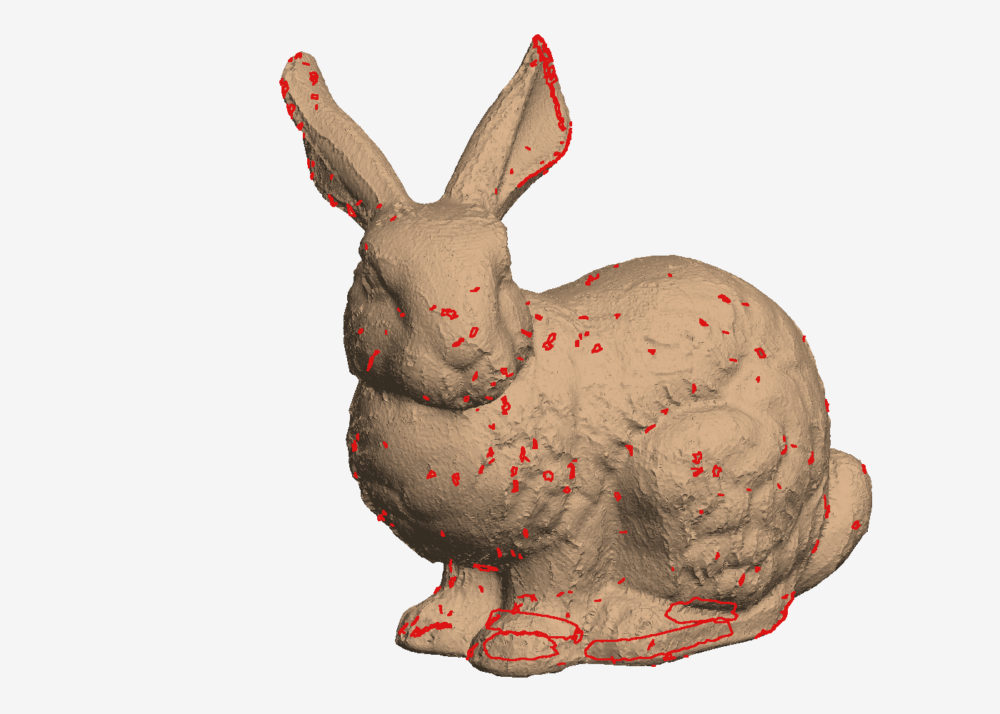 |  |  | 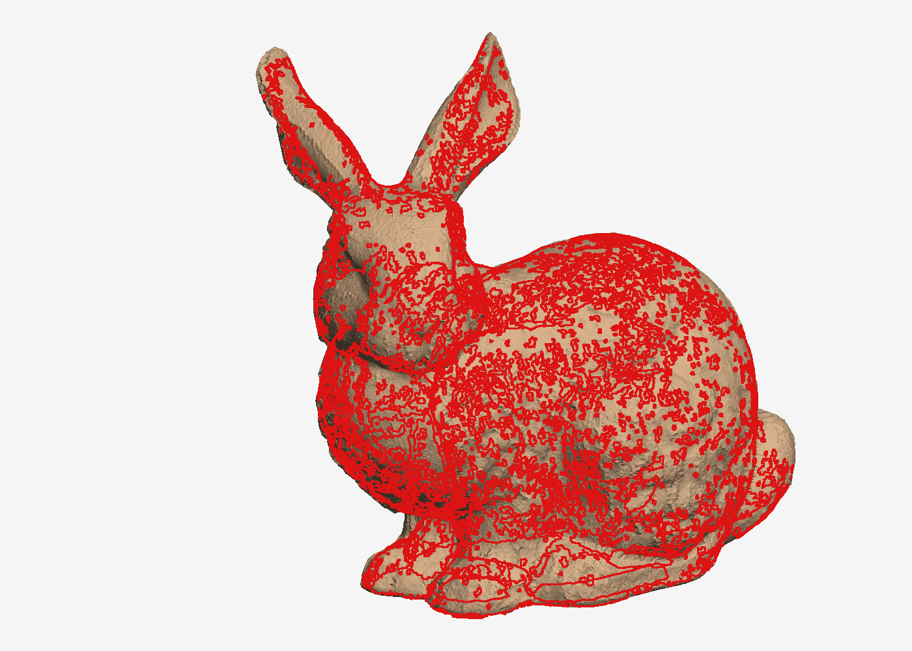 |  |
| triangles behind each pixel: warm = odd (a hole is seen through), cool = even |  |  |  | 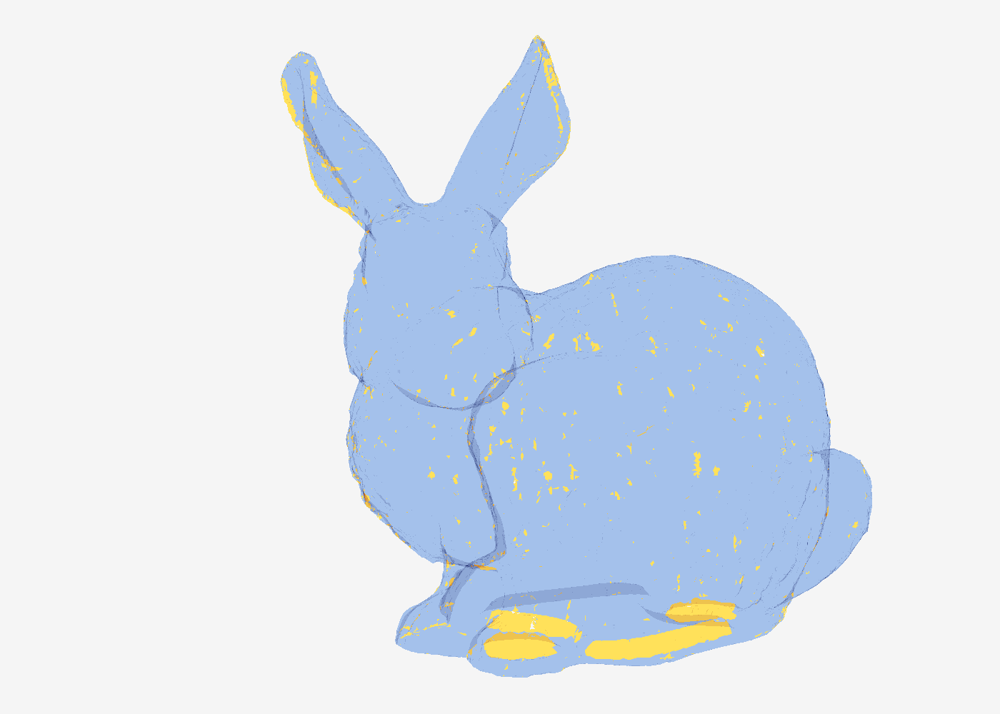 |  |  |  |  |  | 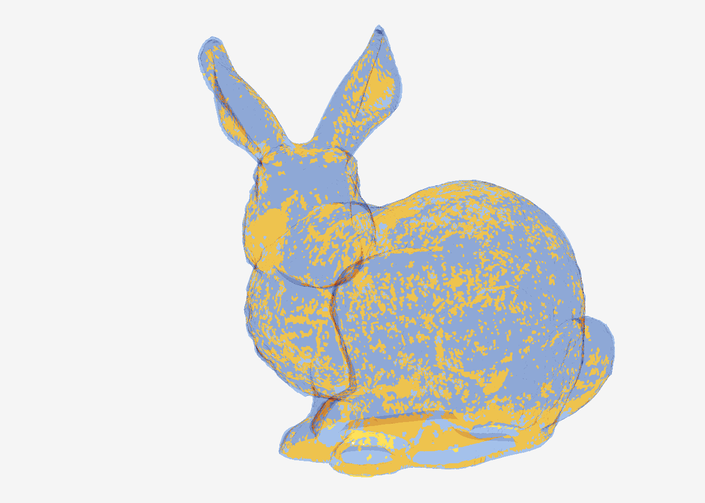 |  |
| front-facing minus back-facing: grey 0, blue +, red − |  |  |  |  | 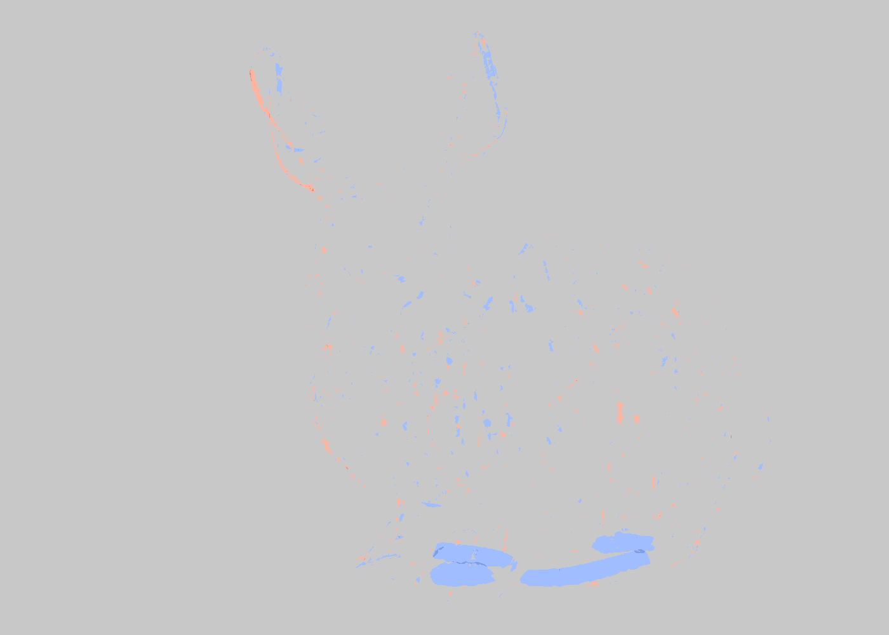 | 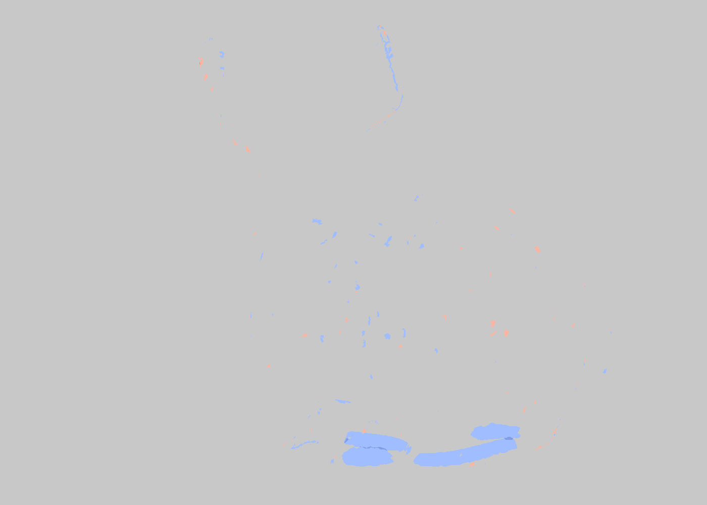 |  |  |  | 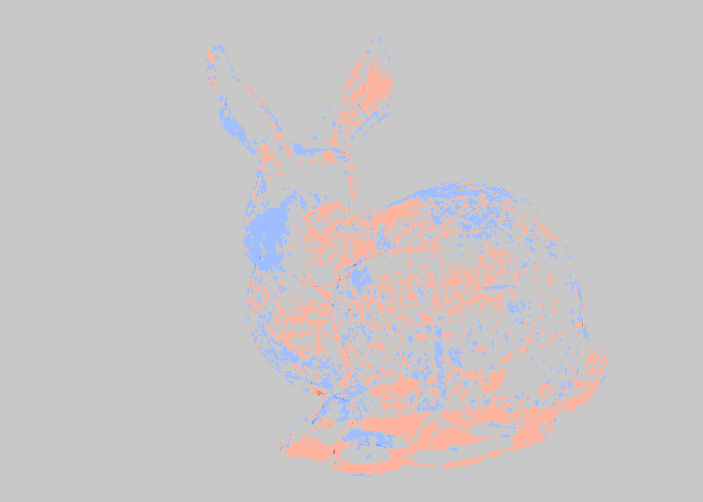 |  |

input scans: 

## dragon62_r0.0007

the 62 Stanford dragon surface scans (1.83 million points), rho = 0.7 mm: the largest input, with up to 98 overlapping layers.

input: `-l dragonBottomFill1_0,dragonBottomFill2_0,dragonKnee_0,dragonMouth1_0,dragonMouth2_0,dragonMouth3_0,dragonMouth4_0,dragonMouth5_0,dragonMouth6_0,dragonMouth7_0,dragonMouth8_0,dragonNook1_0,dragonNook2_0,dragonSideRight_0,dragonSideRight_120,dragonSideRight_144,dragonSideRight_168,dragonSideRight_192,dragonSideRight_216,dragonSideRight_24,dragonSideRight_240,dragonSideRight_264,dragonSideRight_288,dragonSideRight_312,dragonSideRight_336,dragonSideRight_48,dragonSideRight_72,dragonSideRight_96,dragonStandRight_0,dragonStandRight_120,dragonStandRight_144,dragonStandRight_168,dragonStandRight_192,dragonStandRight_216,dragonStandRight_24,dragonStandRight_240,dragonStandRight_264,dragonStandRight_288,dragonStandRight_312,dragonStandRight_336,dragonStandRight_48,dragonStandRight_72,dragonStandRight_96,dragonToes_0,dragonToes3_0,dragonTopFill1_0,dragonTopFill2_0,dragonUpRight_0,dragonUpRight_120,dragonUpRight_144,dragonUpRight_168,dragonUpRight_192,dragonUpRight_216,dragonUpRight_24,dragonUpRight_240,dragonUpRight_264,dragonUpRight_288,dragonUpRight_312,dragonUpRight_336,dragonUpRight_48,dragonUpRight_72,dragonUpRight_96 -d /Users/csilva/src/BPA.jl/data/dragon/scans`, rho = 0.0007, 1826038 points

|  | BPA.jl | Open3D | MeshLab | Digne | Digne -p | Gruber | Gruber reseeded | bpa_rs | Schmehla | Giaccari | bpa fork |
|---|---|---|---|---|---|---|---|---|---|---|---|
| triangles | 649518 | 624851 | 2545632 | 631174 | 631171 | 1 | 639668 | 1 | 5 | 1368343 | 649459 |
| reconstruction time (s) | 6.59 | 830.594 | 19355.382 | 1986.91 | 1382.47 | 0.086 | 4.906 | 0.48 | 9.38 | 4.315 | 4.51 |
| vertices used | 329013 | 328647 | 1376106 | 329732 | 329736 | 3 | 329247 | 3 | 6 | 690586 | 329005 |
| boundary edges | 13434 | 53205 | 1707330 | 47656 | 47687 | 3 | 24103 | 3 | 5 | 16195 | 13757 |
| boundary loops | 2257 | 6804 | 398 | 6459 | 6454 | 1 | 3011 | 1 | 1 | 1383 | 2320 |
| components | 101 | 536 | 34 | 549 | 550 | 1 | 291 | 1 | 1 | 69 | 103 |
| largest component (triangles) | 617351 | 592274 | 2513633 | 598551 | 598544 | 1 | 607187 | 1 | 5 | 1368184 | 617285 |
| Euler characteristic | -2463 | -10381 | -750375 | -9683 | -9693 | 1 | -2632 | 1 | 1 | -1683 | -2603 |
| orientable | yes | no | yes | no | no | yes | no | yes | yes | yes | yes |
| edge-manifold | yes | yes | yes | yes | yes | yes | no | yes | yes | yes | yes |
| vertex-manifold | no | no | no | no | no | yes | no | yes | yes | yes | no |
| duplicate triangles | 0 | 0 | 0 | 0 | 0 | 0 | 0 | 0 | 0 | 0 | 0 |
| valid | 649518 | 624774 | 112449 | 631160 | 631157 | 1 | 639164 | 1 | 5 | 611502 | 649459 |
| valid_reversed_winding | 0 | 77 | 20840 | 0 | 0 | 0 | 0 | 0 | 0 | 817 | 0 |
| ball_not_empty_tie | 0 | 0 | 6 | 0 | 0 | 0 | 19 | 0 | 0 | 7 | 0 |
| ball_not_empty | 0 | 0 | 2412337 | 0 | 0 | 0 | 485 | 0 | 0 | 755987 | 0 |
| circumradius_too_large | 0 | 0 | 0 | 14 | 14 | 0 | 0 | 0 | 0 | 30 | 0 |
| degenerate | 0 | 0 | 0 | 0 | 0 | 0 | 0 | 0 | 0 | 0 | 0 |
| deepest intrusion / rho | 0.00e+00 | 0.00e+00 | 9.97e-01 | 0.00e+00 | 0.00e+00 | 0.00e+00 | 8.81e-01 | 0.00e+00 | 0.00e+00 | 9.94e-01 | 0.00e+00 |
| render: odd-parity pixels (holes seen through) | 22.21% | 29.60% | 59.08% | 27.59% | 27.60% | 100.00% | 25.10% | 100.00% | 100.00% | 10.78% | 22.28% |
| render: pixels with front ≠ back | 22.31% | 30.04% | 83.89% | 27.94% | 27.94% | 100.00% | 25.30% | 100.00% | 100.00% | 11.12% | 22.39% |

triangle sets against BPA.jl:

|  | common | same winding | only in BPA.jl | only in the other | edges of only-in-BPA.jl triangles present in the other (0/1/2/3) | edges of only-in-other triangles present in BPA.jl (0/1/2/3) |
|---|---|---|---|---|---|---|
| Open3D | 623277 | 623198 | 26241 | 1574 | 2143/11582/6881/5635 | 509/198/847/20 |
| MeshLab | 131273 | 110512 | 518245 | 2414359 | 220005/217097/75491/5652 | 2186987/175392/51352/628 |
| Digne | 629747 | 629746 | 19771 | 1427 | 1208/5975/7011/5577 | 508/187/713/19 |
| Digne -p | 629703 | 629702 | 19815 | 1468 | 1205/5983/7021/5606 | 511/182/756/19 |
| Gruber | 1 | 1 | 649517 | 0 | 649517/0/0/0 | 0/0/0/0 |
| Gruber reseeded | 637819 | 637791 | 11699 | 1849 | 1147/6446/3559/547 | 270/294/1113/172 |
| bpa_rs | 1 | 1 | 649517 | 0 | 649517/0/0/0 | 0/0/0/0 |
| Schmehla | 5 | 5 | 649513 | 0 | 649513/0/0/0 | 0/0/0/0 |
| Giaccari | 603829 | 603041 | 45689 | 764514 | 35742/8317/1555/75 | 754865/5426/2943/1280 |
| bpa fork | 648371 | 648311 | 1147 | 1088 | 21/157/911/58 | 24/196/843/25 |

renderings (`dragon62_r0.0007/render/`, view 30.0°):

|  | BPA.jl | Open3D | MeshLab | Digne | Digne -p | Gruber | Gruber reseeded | bpa_rs | Schmehla | Giaccari | bpa fork |
|---|---|---|---|---|---|---|---|---|---|---|---|
| shaded, boundary edges in red |  |  |  | 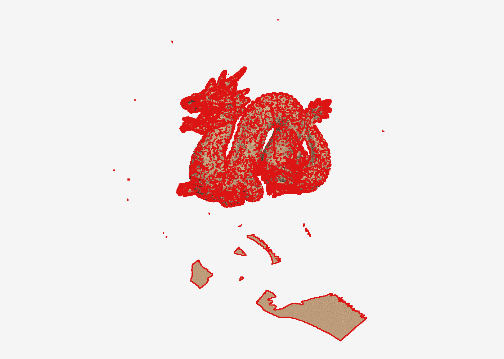 |  |  |  |  |  | 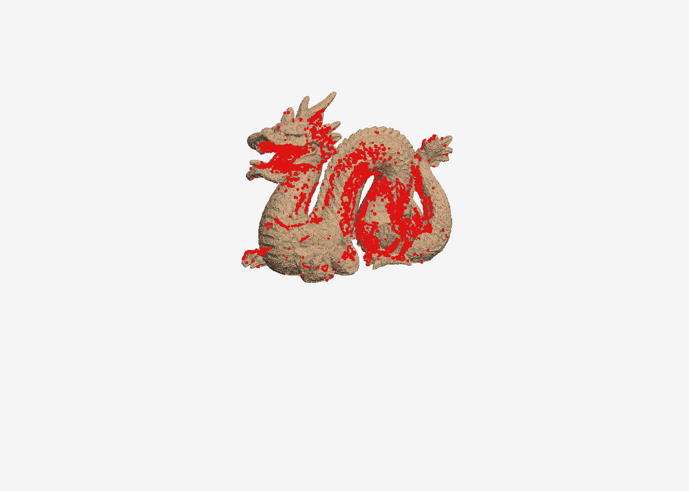 | 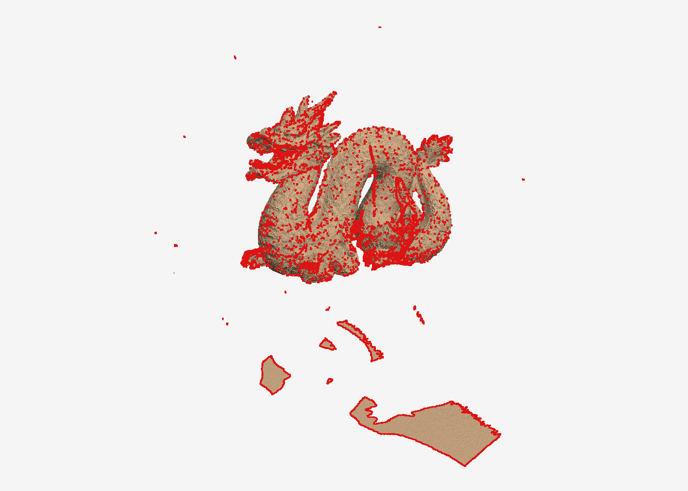 |
| triangles behind each pixel: warm = odd (a hole is seen through), cool = even |  |  |  |  |  |  |  |  |  | 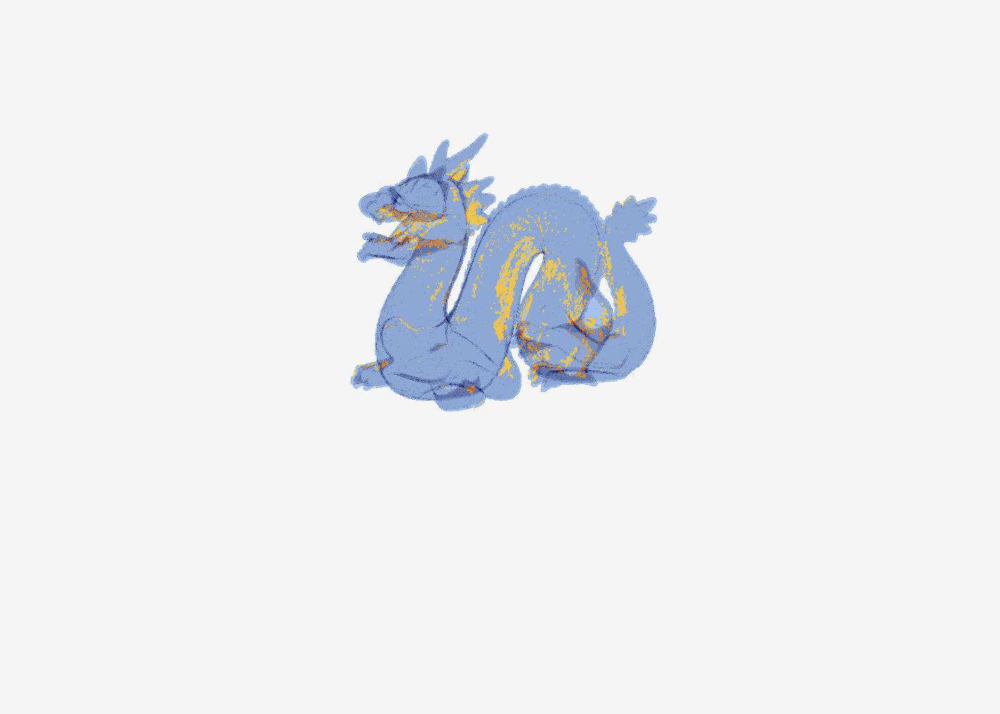 |  |
| front-facing minus back-facing: grey 0, blue +, red − |  |  |  | 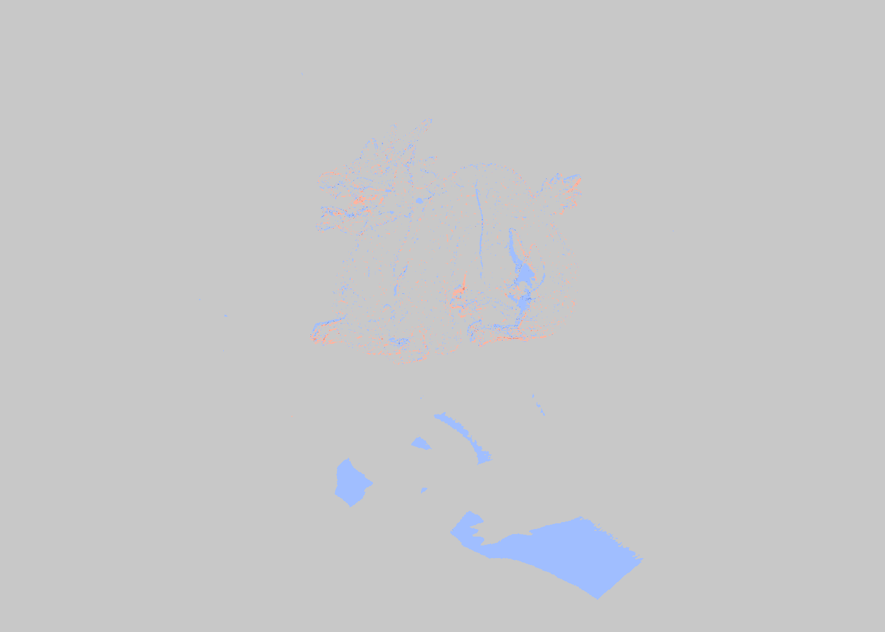 |  |  |  |  |  | 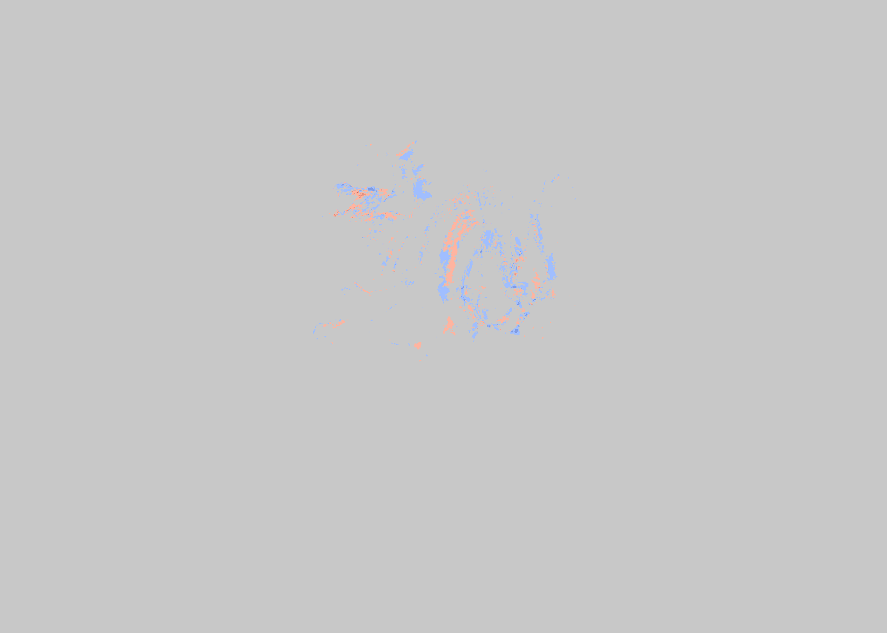 | 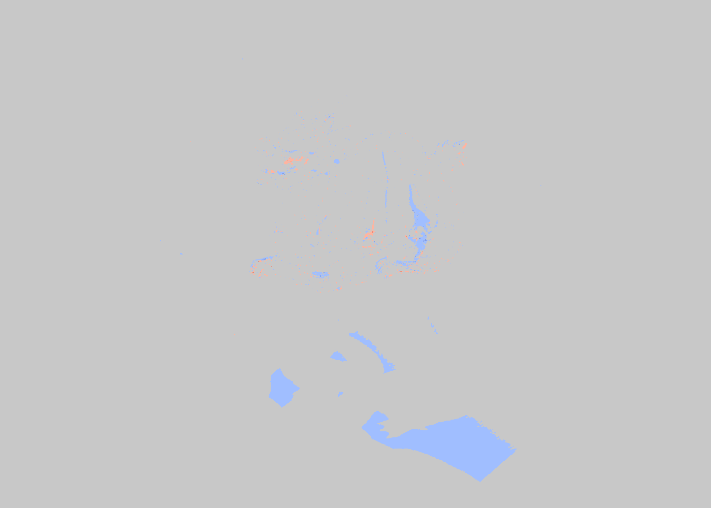 |

input scans: 

